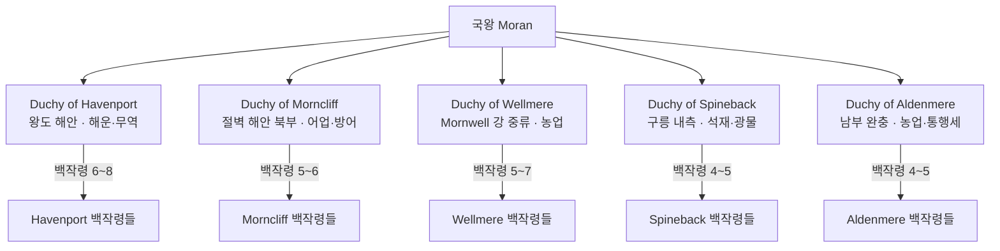

# 모란 왕국 (Kingdom of Moran) — 북서 해양 대왕국

## 원전 인용 증명

### [필독 1] brainstorm_2026-04-21_worldview_expansion.md — 발언 5
> "대륙윗쪽에서는 좌우 모두 물길이 너무험하고 작은 암초가 많아서 불가능, 몬스터도 많음"
— 북쪽 Veil Sea 항법 불가 → Moran 해안 항로의 전략 가치 근거

### [필독 2] political_divisions.md:54
> "모란 / Moran / 북서"
> "Havren / 하브렌 / 북서 해안 / 모란·바엘린 왕국"
— Moran 위치 + Havren 권역 소속 확정

### [필독 3] kingdom_moran_territories_2026-04-22.md:53
> "Moran 은 Elucia 북서부 해안 지대에 위치하는 대왕국(추정 220~280K km²)이다. Havren 권역을 Vaelin 과 공유하되, Moran 은 해안 쪽에 집중한다."
— 규모·지형 확정

### [필독 4] _shared_briefing.md:44
<!-- AGENT_MEMO: 원전 인용 증명 (에이전트 브리핑 전용 · 공개 렌더링 제외)
Q-CORE 2 참조 확인 완료 · 내용은 에이전트 내부 보관 · 위키 파일에 직접 기재 금지
-->
— 서민 일상 마법 네트워크 배치 원칙

### [필독 5] kingdom_moran_territories_2026-04-22.md (Wave2-Political-Cartographer)
> "Duchy of Havenport / Duchy of Morncliff / Duchy of Wellmere / Duchy of Spineback / Duchy of Aldenmere"
— 5 공작령 확정

---

## 요약

Elucia 북서 해안 Havren 권역에 자리잡은 **대왕국**. 면적 약 220~280K km², 인구 약 150~200만. 청어·대구 어업과 석재 채굴이 경제 기반이며, Mornheld 대항구를 통해 대륙 무역을 장악한다. 켈트·북유럽 해양 문화 특성을 지니며, 안개와 파도를 신성시하는 고유 신앙이 교황청 공식 신학과 병존한다.

---

## 왕국 기본 정보

| 항목 | 내용 |
|------|------|
| **영문명** | Kingdom of Moran |
| **왕도** | Mornheld (모른헬드) |
| **위치** | 북서 해안 · Havren 권역 |
| **면적** | ~220~280K km² (대왕국) |
| **인구** | 약 150~200만 (추정) |
| **주요 자원** | 청어·대구·석재·해운 |
| **정체** | 해양 왕국 · 해병·수군 보유 |
| **군제** | 모병제 |
| **종교** | 교황청 공식 교리 + 해신 신앙 혼재 |
| **문화 기원** | 켈트·북유럽 해양 |
| **언어** | 해양 켈트계 방언 (길고 유연한 발음) |
| **문장** | 청색·은색 / 파도·바다새 |

---

## 내부 행정 구조

---

## 주요 도시·마을

| 구분 | 이름 | 위치 | 특성 |
|------|------|------|------|
| **수도** | Mornheld | Havren 북서 내만 하구 | 최대 항구·왕궁 절벽 |
| **요새도시** | Greycliff | Morncliff Spine 북단 | Veil Sea 감시 |
| **어업도시** | Havenwick | Havren 내만 중부 | 청어 염장 수출 |
| **광물도시** | Stoneheld | Morncliff Spine 기슭 | 석재 채굴 |
| **온천도시** | Keldhaven | 남부 온천 지점 | 치유·순례 |

---

## 파일 인덱스

### royals/ — 왕족
| 파일 | 인물 |
|------|------|
| `king_calder_2026-04-22.md` | 현 국왕 Calder III (파도의 혈통) |
| `queen_sorwen_2026-04-22.md` | 왕비 Sorwen (Ilaris 혼인 전통) |
| `crown_prince_aldwin_2026-04-22.md` | 왕태자 Aldwin |
| `princess_maren_2026-04-22.md` | 공주 Maren |
| `prince_corvin_2026-04-22.md` | 왕자 Corvin |
| `previous_king_brann_2026-04-22.md` | 선왕 Brann II |

### nobles/ — 고위 귀족
| 파일 | 인물 |
|------|------|
| `duke_havenport_vael_2026-04-22.md` | Havenport 공작 Vael 가문 |
| `duke_morncliff_sorn_2026-04-22.md` | Morncliff 공작 Sorn 가문 |
| `duke_wellmere_ashfen_2026-04-22.md` | Wellmere 공작 Ashfen 가문 |
| `count_spineback_draven_2026-04-22.md` | Spineback 수석 백작 Draven 가문 |
| `count_aldenmere_lorne_2026-04-22.md` | Aldenmere 수석 백작 Lorne 가문 |

### houses/ — 가문
| 파일 | 가문 |
|------|------|
| `house_moran_royal_2026-04-22.md` | 왕가 (파도의 혈통) |
| `house_vael_2026-04-22.md` | Vael 공작 가문 |
| `house_sorn_2026-04-22.md` | Sorn 공작 가문 |
| `house_draven_2026-04-22.md` | Draven 백작 가문 |

### orders/ — 기사단
| 파일 | 기사단 |
|------|--------|
| `order_sea_wolves_2026-04-22.md` | 바다 늑대단 |
| `order_wave_knights_2026-04-22.md` | 파도 기사단 |

### 문화·체제
| 파일 | 주제 |
|------|------|
| `heraldry_2026-04-22.md` | 문장 체계 |
| `military_2026-04-22.md` | 군제 |
| `clothing_2026-04-22.md` | 의상 |
| `cuisine_2026-04-22.md` | 요리 |
| `architecture_2026-04-22.md` | 건축 |
| `dialect_2026-04-22.md` | 방언 |

### festivals/
| 파일 | 축제 |
|------|------|
| `festival_departure_2026-04-22.md` | 출어제 |
| `festival_wave_2026-04-22.md` | 파도제 |
| `festival_mist_2026-04-22.md` | 안개제 |
| `festival_winter_guard_2026-04-22.md` | 겨울 수호제 |

### roads/
| 파일 | 도로 |
|------|------|
| `road_mornheld_to_havenport_2026-04-22.md` | 왕도→Havenport 공작령 |
| `road_mornheld_to_stoneheld_2026-04-22.md` | 왕도→Stoneheld |
| `road_mornheld_to_keldhaven_2026-04-22.md` | 왕도→Keldhaven |
| `road_coast_military_north_2026-04-22.md` | 북부 해안 군사도로 |

---

## 대표님 미확정

- 현 왕조 연대·초대 국왕 이름
- 해군 함대 공식 규모
- 교황청과의 관계 공식 등급 (공식 복종 vs 실질 냉담)
- 모란 왕국 고유 해신 이름·신전 공식 위상

## 다음 Wave 의존

- **Chronicler (Wave 5)**: 건국사·해적 대토벌 문헌화
- **World-Integrator (Wave 5)**: Vaelin·Ilaris 관계 통합 그래프

<!-- auto-generated-related:start -->
## 🔗 관련 (auto-generated)

> `scripts/obsidian/build_backlinks.py` 로 자동 생성. 수정 금지 — 다음 실행 시 덮어쓰여집니다.

### ⬆️ 상위

- [[../../../../../MOC]] — wiki 루트
- [[../../MOC]] — Elucia 허브

<!-- auto-generated-related:end -->
