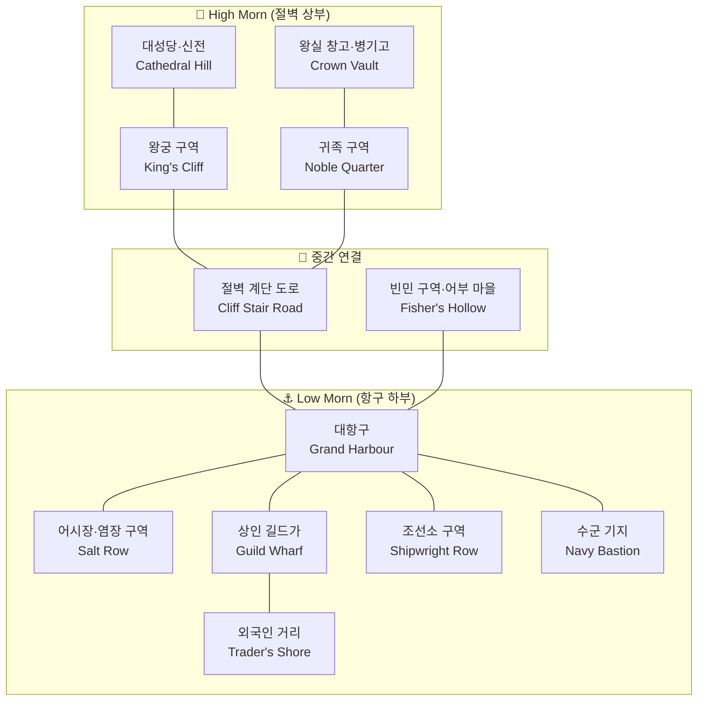

# Mornheld (모른헬드) — 왕도 상세 지도

## 원전 인용 증명

### [필독 1] city_mornheld_2026-04-22.md (Wave2-Toponymist)
> "절벽 위 도성 + 항구 하부 도시 이중 구조 / 해풍과 안개. 어부·상인·선원의 거친 활기. 왕궁은 절벽 위 위엄 있음"
— 왕도 기본 구조 확정

### [필독 2] kingdom_moran_territories_2026-04-22.md:53
> "Mornwell 강 하구와 인접하여 해상·강상 교역의 복합 거점"
— 하구 위치 확정

### [필독 3] _shared_briefing.md:113
> "왕국당 지방도시 5~8 · 중소도시 10~15 · 마을 15~25 / 총 지명 280~370 개 목표"

---

## 요약

Mornheld 는 Morncliff Spine 해안 절벽이 형성하는 천연 내만에 자리잡은 이중 구조 도시. 상부 절벽 도성(High Morn)과 하부 항구 구역(Low Morn)으로 구분되며, 인구 약 30,000~45,000. 왕국 최대 어항+군항.

---

## 도시 전체 구획 (12 구역)

---

## 구역별 상세

### 1. 왕궁 구역 (King's Cliff)
- 절벽 최정상. 해풍을 막는 석성 3중 구조
- 왕궁 본관 (Throne Hall of Waves) · 왕실 가족 거주탑 · 봉화대
- 바다 늑대단 근위대 주둔
- **안개가 짙은 날 왕궁 탑은 구름에 잠기는 것으로 유명**

### 2. 귀족 구역 (Noble Quarter)
- 절벽 상부 왕궁 하단. 유력 귀족 저택 20~30채
- Vael 공작 Mornheld 저택 (Havenport 공작령 정주는 아니나 궁중 임시 거처)
- 왕실 예식장 Morn Basilica 포함

### 3. 대성당·신전 구역 (Cathedral Hill)
- 교황청 공인 대성당 (규모 2급 · 소라리스보다 작음)
- 해신 Moranu 에게 바친 **해신 신전** (비공식 허용 상태 — 교황청과 미묘한 긴장)
- 성직자 학교 (신학 + 항해술 동시 교육)

### 4. 왕실 창고·병기고 (Crown Vault)
- 왕국 세수 창고 · 무기 보관
- 지하 통로가 왕궁 구역과 연결 (비상 탈출 경로 포함)

### 5. 대항구 (Grand Harbour)
- 동시 정박 가능 대형 선박 80~120척 (추정)
- 항구 입구 양쪽에 석조 등대 2기 (Moran 건축 상징)
- 군항 구역과 상업 구역 내부 방파제로 분리

### 6. 어시장·염장 구역 (Salt Row)
- 새벽 4시부터 어선 귀항 → 즉시 경매
- 청어·대구 대형 염장 창고 20동 이상
- 소금은 Ceren 왕국에서 수입 (분쟁 요소)

### 7. 상인 길드가 (Guild Wharf)
- 어업 길드 본부 · 조선 길드 · 해상 보험 공증소
- "안개 시장 (Mist Market)": 새벽 안개 속 소규모 야간 거래 관습 (반합법)

### 8. 조선소 구역 (Shipwright Row)
- 대형 조선소 3개 · 수리 선박 설비
- Spineback 공작령 석재 + Wellmere 공작령 목재 집결지

### 9. 수군 기지 (Navy Bastion)
- 항구 남단 격리 구역. 민간인 출입 제한
- 군함 30~50척 상시 배치 (추정 · 대표님 미확정)
- 바다 늑대단 해상 부대 본거지

### 10. 외국인 거리 (Trader's Shore)
- Vaelin·Ilaris·Nomen 섬 상인 집거
- 술집·환전소·여관 밀집
- **Q-CORE 2 간접 단서**: "안개 속 노인이 배에서 고장난 나침반을 직접 고쳐줬다는 소문" 수준의 이름 없는 노인 목격담 구전 (추정)

### 11. 절벽 계단 도로 (Cliff Stair Road)
- 절벽 상하부 연결하는 경사로+계단 복합
- 아침마다 짐마차·어부·귀족 뒤섞이는 왕도 핵심 동맥
- **왕도의 상징 풍경**: 안개 속 계단을 오르는 어부와 수군

### 12. 빈민 구역·어부 마을 (Fisher's Hollow)
- 내만 해안가 북단 저지대
- 대를 이은 어부 가족 공동 창고
- 바다 늑대단 신병 주요 모집처

---

## 방어 구조

| 방어선 | 구성 |
|-------|------|
| **제1선** | 절벽 자체 (자연 방벽 · 서쪽) |
| **제2선** | 왕궁 석성 3중 + 절벽 포대 |
| **제3선** | 항구 방파제 포대 · 항구 봉쇄 사슬 |
| **제4선** | 수군 함대 (공격적 방어) |

---

## 도시 분위기

> 해풍이 골목마다 스며들고, 새벽마다 짙은 안개가 절벽 도성을 삼킨다. 어시장에서는 청어 비린내와 소금 냄새가 뒤섞이고, 절벽 계단을 오르는 짐마차 바퀴 소리가 왕도를 깨운다. 왕궁 탑은 안개 위로 솟아 떠 있는 것처럼 보이는 날이 많다.

---

## 대표님 미확정

- 왕궁 공식 이름 확정
- 해신 Moranu 신전의 교황청 공식 인정 여부
- 수군 기지 규모 (함선 수)

## 다음 Wave 의존

- **Chronicler**: 왕도 창건 일화 · "최초 등대" 전설 문헌화
- **World-Integrator**: 대항구 ↔ Nomen 섬 교역로 지도 통합

<!-- auto-generated-related:start -->
## 🔗 관련 (auto-generated)

> `scripts/obsidian/build_backlinks.py` 로 자동 생성. 수정 금지 — 다음 실행 시 덮어쓰여집니다.

### ⬆️ 상위

- [[../../../../../MOC]] — wiki 루트
- [[../../MOC]] — Elucia 허브

<!-- auto-generated-related:end -->
