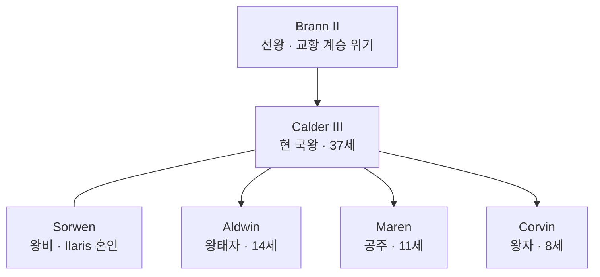

# House Moran — 파도의 혈통 (Wave-Born)

## 원전 인용 증명

### [필독 1] 담당 에이전트 지시문
> "왕족: 해양 왕·파도의 혈통·왕비 Ilaris 혼인 전통 (서해안 동맹)"

### [필독 2] history/founding_2026-04-22.md:38
> "창건 왕가는 당시 최대 교역 도시 Mornheld 의 항구 도시 연합 의장에서 유래 (추정)"

---

## 요약

Moran 왕국 창건 이래 지속된 왕조. 스스로를 "파도의 혈통 (Wave-Born)"이라 칭하며 해신 Moranu 의 축복을 받은 가문임을 강조. 대를 이어 Ilaris 왕가와 혼인하는 전통을 유지.

---

## 가문 기본 정보

| 항목 | 내용 |
|------|------|
| **가문명** | House Moran (모란 왕가) |
| **별칭** | 파도의 혈통 (Wave-Born) |
| **문장** | 청색 방패 위 은색 파도 3중선 + 정상에 흰 바다새 |
| **색** | 청색 · 은색 |
| **창건** | 미확정 (대표님 미확정) |
| **현 수장** | Calder III |
| **혼인 전통** | Ilaris 왕가와 교번 혼인 (대를 이어 반복) |

---

## 왕조 계보 (현재 확인 가능 부분)

---

## 가문 특기·경제 기반

- 해군 통수권 (대를 이어 해군 총사령관 직접 겸직)
- Grand Harbour 상업 구역 왕실 통행세 수취권
- 해신 신전 후원 독점권

---

## 혼인 정치

| 혼인 | 상대 가문 | 목적 |
|------|---------|------|
| Calder III ↔ Sorwen | House Ilaris (서해안) | 서해안 동맹 강화 |
| 이전 세대 (추정) | Vaelin 왕가 혈통 포함 | 북부 동맹 강화 |

---

## 대표님 미확정

- 왕조 초대 왕 이름·창건 시기
- Calder III 이후 Aldwin 의 혼인 예정 상대

## 다음 Wave 의존

- **Chronicler**: 왕조 계보서 문헌화
