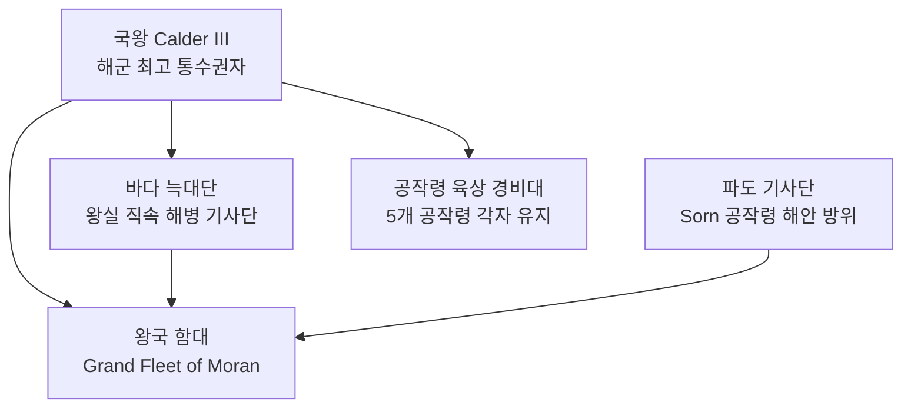

# Moran 왕국 군제 — 해병·수군·함대 모병제

## 원전 인용 증명

### [필독 1] 담당 에이전트 지시문
> "군제: 모병제 · 해병·수군·함대"

### [필독 2] _shared_briefing.md:112
> "대왕국 200~300K km² (프랑스 근사)"
— 군사력 스케일 기준

### [필독 3] history/founding_2026-04-22.md:44
> "해적 대토벌 (시기 미확정): 북쪽 항로 해적 세력을 일시 제압 → 교역 전성기"
— 해군 중심 군사 전통 확인

---

## 요약

Moran 왕국은 Elucia 11 왕국 중 해군력 1위 (추정). 모병제 기반으로 해병·수군·함대를 운용하며, 육군은 귀족 기사단 + 공작령 경비대 수준에 머문다. 군사 지출의 70% 이상이 해군 관련.

---

## 군제 구조

---

## 병력 규모 (추정 · 대표님 미확정)

| 군종 | 병력 수 | 비고 |
|------|---------|------|
| **바다 늑대단 (해병)** | 800~1,200명 | 왕실 직속 |
| **파도 기사단 (해안)** | 300~500명 | Sorn 공작 후원 |
| **함대 수군** | 5,000~8,000명 | 함선 승무원 포함 |
| **공작령 육군** | 8,000~15,000명 | 5개 공작령 합계 |
| **예비 모병 잠재력** | 3만+ | 어부·선원 출신 |

---

## 함대 구성 (추정)

| 함종 | 수량 | 역할 |
|------|------|------|
| 대형 전함 | 10~15척 | 해전 주력 |
| 중형 순양함 | 30~50척 | 순찰·호위 |
| 경비 소함 | 100+ | 해안 순찰·밀수 단속 |
| 보급 수송선 | 50~80척 | 군수 지원 |

---

## 모병제 운용

| 항목 | 내용 |
|------|------|
| **지원 연령** | 15~35세 (해군) · 18~40세 (육군) |
| **복무 기간** | 해군 5년 기본 + 갱신 / 육군 3년 기본 |
| **급여** | 해군이 육군 대비 1.5배 (위험 수당) |
| **주요 모집처** | Fisher's Hollow (Mornheld) · 해안 어촌 |
| **귀족 특례** | 공작·백작 가문 차남 이하 장교 임관 우선권 |

---

## 주요 병종

| 병종 | 특징 |
|------|------|
| **해병 (Sea Marine)** | 선상 전투·적 선박 제압 특화 |
| **수군 (Sailor-Soldier)** | 항해+전투 겸임 · 함포 운용 |
| **절벽 경비대** | 해안 절벽 등반·수직 하강 전술 |
| **등대 수비대** | Greycliff·소형 등대 경비 |
| **창기병 (Lance)** | 소수 · 내륙 방어·의전 용도 |

---

## 군사 약점

- 육군 전력 상대적 열세 (해군 집중 투자)
- 내륙 평원 전투 경험 부족
- 장기 포위전 취약 (해양 보급 의존)

---

## 대표님 미확정

- 함대 공식 규모
- 교황청 군사 지원 의무 이행 수준

## 다음 Wave 의존

- **Chronicler**: 해적 대토벌 전투 기록
- **World-Integrator**: Vaelin·Thaloss 군사 동맹 병력 통합 분석

<!-- auto-generated-related:start -->
## 🔗 관련 (auto-generated)

> `scripts/obsidian/build_backlinks.py` 로 자동 생성. 수정 금지 — 다음 실행 시 덮어쓰여집니다.

### ⬆️ 상위

- [[../../../../../MOC]] — wiki 루트
- [[../../MOC]] — Elucia 허브

<!-- auto-generated-related:end -->
