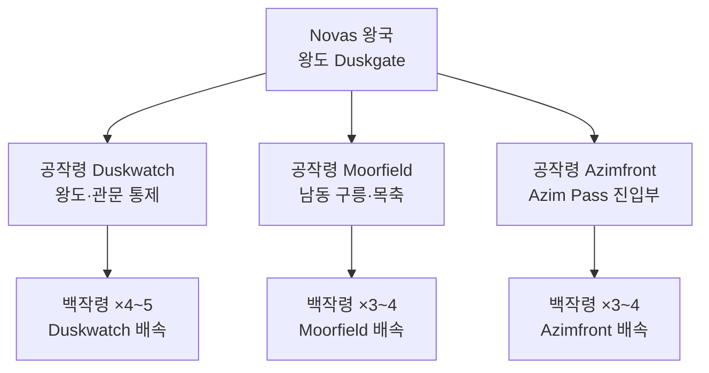

# Kingdom of Novas — 관문 왕국 전체 개요

## 원전 인용 증명

### [필독 1] political_divisions.md:61
> "노바스 / Novas / 남동 국경"
— 위치·공식 명칭 확정

### [필독 2] political_divisions.md:115
> "Duskmoor / 더스크무어 / 남동 국경 구릉 / 노바스 왕국"
— 소속 권역 Duskmoor 확정 (권역명 Duskmoor 유지 · 수도명은 Q-FIX-7 로 Duskgate 확정)

### [필독 3] brainstorm_2026-04-21_worldview_expansion.md:176 (발언 5)
> "하단 주황식은 이어진길이다."
— Azim Pass = 두 대륙 연결 유일 육로. Novas 왕국의 전략 핵심.

### [필독 4] brainstorm_2026-04-21_worldview_expansion.md:261 (발언 7)
> "좌우 대륙은 같은 신을 믿지만 서로 해석을 달리한다. 서로 적대적이긴하나"
— 동서 대륙 기본 적대 기조 → Novas 의 외교 완충 역할 정당성

### [필독 5] relations/marriage_ties/marriage_novas_karzor_sabin_2026-04-22.md
> "Novas 왕가 ↔ Karzor Sabin 자치구 총독 가문 혼인 협약 ... 대륙 간 유일한 왕조 혼인"
— 반공식 왕비 체계의 근거

### [필독 6] relations/conflicts/conflict_azim_pass_toll_2026-04-22.md
> "Elucia 측 8% vs Karzor 측 10% 로 비대칭 이중 통행세 분쟁"
— 통행세 분쟁 = 왕국 최대 갈등 동인

### [필독 7] .claude/failures/FAILURES.md — FAIL-002
> "원문에 없는 서술은 (추정) 표기"
— 전체 적용

---

## 요약

**Novas** 는 Elucia 남동 국경 Duskmoor 권역 소왕국이다. 면적 추정 55~75K km². 왕도 Duskgate (더스크게이트). Azim Pass 북문 통제권이 왕국 존재 이유이자 최대 자산이다. 라틴 서구 중세 문화에 Karzor 사막 문화가 혼합된 독특한 **변경 혼합 문명**이며, 대륙 간 유일 혼인 관계를 보유한 외교 요충이다.

---

## 왕국 기본 정보

| 항목 | 내용 |
|------|------|
| **영문명** | Kingdom of Novas |
| **한글명** | 노바스 왕국 |
| **슬러그** | kingdom_novas |
| **권역** | Duskmoor (더스크무어) |
| **위치** | Elucia 남동 국경 · Azim Pass 북단 |
| **규모** | 소왕국 · 추정 55~75K km² |
| **왕도** | Duskgate (더스크게이트) |
| **인구** | 추정 80~120만 (대표님 미확정) |
| **정체** | 세습 왕국 · 관문 왕조 |
| **경제 클러스터** | C6 남부 복합 |
| **문명 성격** | 라틴 + Karzor 혼합 변경 문화 |
| **외교 특이점** | 대륙 간 유일 왕조 혼인 (Karzor Sabin) |

---

## 내부 행정 구조

---

## 경제 구조

| 수입원 | 비중 (추정) | 비고 |
|--------|-----------|------|
| Azim Pass 통행세 | ~50% | 핵심 수입 · 성좌국과 분배 |
| 남동 어업 (해안) | ~20% | Duskway 강 하구·연안 |
| 목축·암반 채굴 | ~15% | Moorfield 공작령 |
| 상업세 (Dusthaven) | ~10% | Karzor 상단 체류세 |
| 기타 | ~5% | — |

---

## 파일 인덱스

### 개요·지도
- `00_overview.md` (이 파일)
- `capital_map_2026-04-22.md`

### 왕족 `royals/`
| 파일명 | 인물 | 역할 |
|--------|------|------|
| `king_aldaron_voss_2026-04-22.md` | Aldaron Voss | 현 왕 |
| `queen_ilena_sabin_voss_2026-04-22.md` | Ilena Sabin-Voss | 반공식 왕비 (Karzor 출신) |
| `crown_prince_davan_voss_2026-04-22.md` | Davan Voss | 왕세자 |
| `princess_serael_voss_2026-04-22.md` | Serael Voss | 왕녀 |
| `prince_coras_voss_2026-04-22.md` | Coras Voss | 왕자 (차남) |
| `previous_king_veron_voss_2026-04-22.md` | Veron Voss | 선왕 (사망) |

### 귀족 `nobles/`
| 파일명 | 인물 | 영지 |
|--------|------|------|
| `duke_duskwatch_torven_2026-04-22.md` | Torven Hael | Duskwatch 공작 |
| `duke_moorfield_calris_2026-04-22.md` | Calris Morn | Moorfield 공작 |
| `duke_azimfront_sevar_2026-04-22.md` | Sevar Aldun | Azimfront 공작 |
| `count_duskgate_fishing_rael_2026-04-22.md` | Rael Ossyn | 남동 어업 백작 |
| `count_sandwatch_border_veth_2026-04-22.md` | Veth Duras | 국경 수비 백작 |

### 가문 `houses/`
| 파일명 | 가문 |
|--------|------|
| `house_voss_2026-04-22.md` | Voss 왕가 (관문 왕조) |
| `house_hael_2026-04-22.md` | Hael 가 (Duskwatch) |
| `house_morn_2026-04-22.md` | Morn 가 (Moorfield) |
| `house_aldun_2026-04-22.md` | Aldun 가 (Azimfront) |

### 기사단 `orders/`
| 파일명 | 기사단 |
|--------|--------|
| `order_gatewarden_2026-04-22.md` | 관문 수호단 (Gatewarden Order) |
| `order_desert_scout_2026-04-22.md` | 사막 척후단 (Desert Scout Corps) |

### 왕국 고유 문화·체제
| 파일명 | 주제 |
|--------|------|
| `heraldry_2026-04-22.md` | 문장 체계 |
| `military_2026-04-22.md` | 군제 |
| `clothing_2026-04-22.md` | 의상 |
| `cuisine_2026-04-22.md` | 음식 |
| `architecture_2026-04-22.md` | 건축 |
| `dialect_2026-04-22.md` | 방언 |

### 축제 `festivals/`
| 파일명 | 축제명 |
|--------|--------|
| `festival_gateway_2026-04-22.md` | 관문제 |
| `festival_harvest_duskgate_2026-04-22.md` | 더스크게이트 수확 축제 |
| `festival_red_moon_2026-04-22.md` | 붉은 달 축제 |
| `festival_first_king_2026-04-22.md` | 초대 왕 기념일 |

### 도시 `cities/` (Toponymist 기존 + 심화)
| 파일명 | 도시 |
|--------|------|
| `city_duskgate_2026-04-22.md` | Duskgate (왕도·Q-FIX-7 개칭 확정) |
| `city_sandwatch_2026-04-22.md` | Sandwatch (요새·심화) |
| `city_thornheld_2026-04-22.md` | Thornheld (북동·심화) |
| `city_redstone_2026-04-22.md` | Redstone (채석·심화) |
| `city_dusthaven_2026-04-22.md` | Dusthaven (무역·심화) |

### 마을 `villages/` (기존 3 + 추가)
| 파일명 | 마을 |
|--------|------|
| `village_drysand_2026-04-22.md` | Drysand (기존) |
| `village_oasholm_2026-04-22.md` | Oasholm (기존) |
| `village_moorend_2026-04-22.md` | Moorend (기존) |
| `village_duskford_2026-04-22.md` | Duskford |
| `village_salthallow_2026-04-22.md` | Salthallow |
| `village_ironbell_2026-04-22.md` | Ironbell |
| `village_coppervane_2026-04-22.md` | Coppervane |
| `village_thornwick_2026-04-22.md` | Thornwick |
| `village_ashridge_2026-04-22.md` | Ashridge |
| `village_dawnpost_2026-04-22.md` | Dawnpost |
| `village_redmere_2026-04-22.md` | Redmere |
| `village_dustfall_2026-04-22.md` | Dustfall |
| `village_passwatch_2026-04-22.md` | Passwatch |
| `village_gritstone_2026-04-22.md` | Gritstone |
| `village_havenford_2026-04-22.md` | Havenford |

### 내부 도로 `roads/`
| 파일명 | 도로 |
|--------|------|
| `road_duskgate_to_duskwatch_2026-04-22.md` | 왕도 → 서부 공작령 |
| `road_duskgate_to_azimfront_2026-04-22.md` | 왕도 → 관문 공작령 |
| `road_duskgate_to_moorfield_2026-04-22.md` | 왕도 → 구릉 공작령 |
| `road_duskgate_to_thornheld_2026-04-22.md` | 왕도 → 북동 요새 |
| `road_dusthaven_to_azim_pass_2026-04-22.md` | 무역 도시 → Azim Pass |

---

## 대표님 미확정 사항
- 왕국 정확 인구 수치
- Azim Pass 통행세 정확 배분율
- 현재 Karzor 혼인 왕비의 공식 지위 확정 여부
- 노예 무역 암묵 허용 조항 실체

## 다음 Wave 의존 포인트
- **Wave 5 Chronicler**: Azim Pass 통행 연대기 · 관문 왕조 역사 서술
- **Wave 5 World-Integrator**: Novas 와 타 왕국 관계도 통합

<!-- auto-generated-related:start -->
## 🔗 관련 (auto-generated)

> `scripts/obsidian/build_backlinks.py` 로 자동 생성. 수정 금지 — 다음 실행 시 덮어쓰여집니다.

### ⬆️ 상위

- [[../../../../../MOC]] — wiki 루트
- [[../../MOC]] — Elucia 허브

<!-- auto-generated-related:end -->
