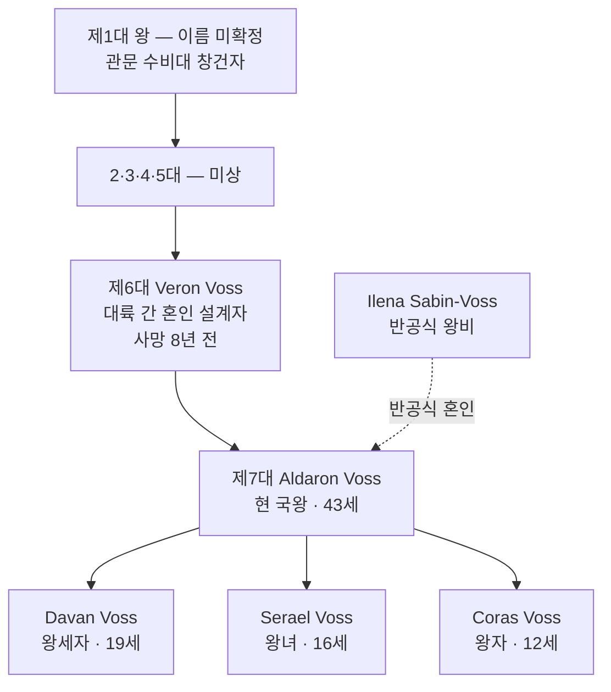

# House Voss — 관문 왕조

## 원전 인용 증명

### [필독 1] kingdoms/kingdom_novas/history/founding_2026-04-22.md
> "Duskmoor 구릉 일대의 변경 수비대·요새 도시들이 연합하여 형성된 왕국. 창건 왕가는 아짐 관문 수비 가문에서 유래한 것으로 추정."
— Voss 가 기원

### [필독 2] relations/marriage_ties/marriage_novas_karzor_sabin_2026-04-22.md:49
> "Elucia 11 왕국 중 유일한 대륙 간 왕조 혼인"
— Voss 가 외교 독자성

---

## 요약

**House Voss** 는 Novas 왕국 창건 가문이자 현 왕조이다. Azim Pass 수비에서 시작한 군사 가문이 점차 관문 경제를 장악하며 왕위에 오른 독특한 왕가다. "관문이 열려있는 한 우리도 살아있다" 는 가훈이 왕가 철학을 압축한다.

---

## 가문 기본 정보

| 항목 | 내용 |
|------|------|
| **가문명** | House Voss |
| **별칭** | 관문 왕조 (Gate-Dynasty) |
| **문장** | 갈색 바탕 · 붉은 관문 아치 + 모래시계 + 전갈 |
| **가훈** | "관문이 열려있는 한, 우리도 살아있다" |
| **기원** | 아짐 관문 수비 군사 가문 (추정) |
| **왕도** | Duskgate |
| **경제 기반** | Azim Pass 통행세 (왕조 핵심 수입원) |
| **동맹 혼인** | Karzor Sabin 자치구 총독 가문 (반공식) |

---

## 왕가 계보

---

## 가문 특기·경제 기반

| 분야 | 내용 |
|------|------|
| **외교** | 동서 대륙 경계인 외교 특화. 양 언어 교육 전통 |
| **경제** | 통행세 수익 관리·회계 능력 |
| **군사** | 관문 수비·사막 작전 기초 훈련 |
| **약점** | 성좌국 공식 지지 기반 부족. 타 왕국 귀족 혼인 네트워크 제한 |

---

## 가문 문장 상세

| 요소 | 색 | 의미 |
|------|-----|------|
| 바탕 | 갈색 | Duskmoor 황야·구릉 |
| 관문 아치 | 붉은 사암색 | Duskgate 성문 |
| 모래시계 | 금색 | 시간=통행세=부 |
| 전갈 | 검정 | Karzor 혼합 문화 채용·경계 |

---

## 대표님 미확정
- 초대 왕 이름·건국 연대
- 2~5대 왕 이름·업적

## 다음 Wave 의존
- **Chronicler**: Voss 왕조 완전 계보 서사화
