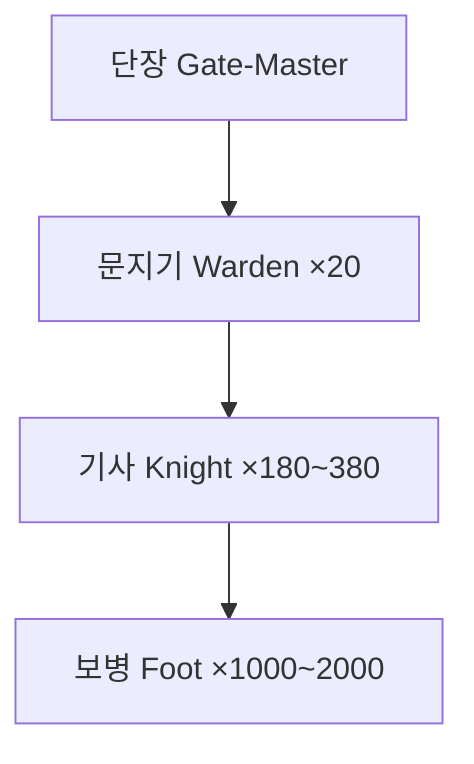

# Gatewarden Order — 관문 수호단

## 원전 인용 증명

### [필독 1] conflict_azim_pass_toll_2026-04-22.md:57
> "Elucia 측 북문 (Duskgate) / Novas + 성좌국 감독관 / 물자 가액 5~8%"
— 관문 통제 기관 필요성

### [필독 2] kingdoms/kingdom_novas/history/founding_2026-04-22.md
> "변경 수비대·요새 도시들이 연합하여 형성된 왕국. 군사 기원이 강하며"
— 기사단 군사적 전통 근거

---

## 요약

**관문 수호단 (Gatewarden Order)** 는 Novas 왕국 정규 기사단. Azim Pass 북문 경비·통행세 징수 보호·Duskgate 방어를 주 임무로 한다. 왕도 Pass Gate 구역에 본부를 두며 Duskwatch 공작과 협력 관계이나 왕에게 직속한다.

---

## 기본 정보

| 항목 | 내용 |
|------|------|
| **영문명** | Gatewarden Order |
| **한글명** | 관문 수호단 |
| **설립** | Novas 왕국 건국과 동시 (추정) |
| **색** | 갈색 + 붉은 테두리 |
| **상징** | 닫힌 관문 아치 위에 창 교차 |
| **본부** | Duskgate Pass Gate 구역 |
| **규모** | 기사 200~400명 + 보병 1,000~2,000명 (추정) |
| **충성** | 국왕 직속 |

---

## 임무 분류

| 임무 | 내용 |
|------|------|
| **1순위** | Azim Pass 북문 경비·통행 통제 |
| **2순위** | Duskgate 왕도 방어 |
| **3순위** | 통행세 징수 보호 (무장 호위) |
| **특수 임무** | Karzor 정보 수집 협력 (사막 척후단과 연계) |

---

## 입단 조건

| 조건 | 내용 |
|------|------|
| **출신** | Elucia 출생 필수 (Karzor 계 혼혈 허용 여부 논란 중) |
| **나이** | 16~30세 |
| **시험** | 관문 수비 실기 + 기본 교리 이해 |
| **서약** | "관문이 열린 동안 나는 서 있겠다" |

---

## 내부 계층

---

## 서사 접점

- **Act 1**: 주인공이 Pass Gate 통과 시 관문 수호단 기사가 검문 실시자
- **Act 2**: 성좌국 명령 vs 왕명 충돌 시 단장의 선택이 관문 개폐 결정

---

## 대표님 미확정
- 현 단장 이름·성향
- Karzor 혼혈 기사 허용 여부 결정

## 다음 Wave 의존
- **Chronicler**: 관문 수호단 역사 · 주요 전투 기록
