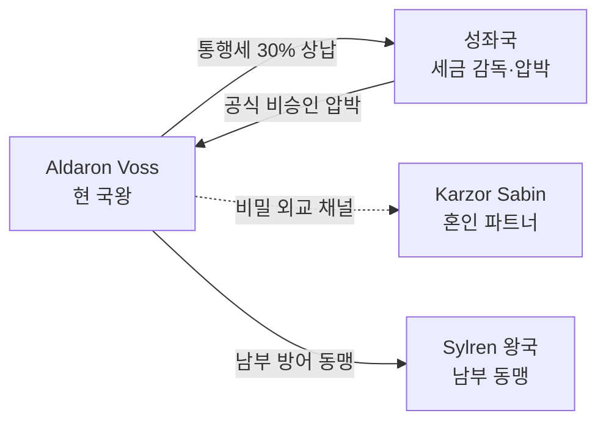

# Aldaron Voss — 제7대 관문 왕 (현 국왕)

## 원전 인용 증명

### [필독 1] political_divisions.md:61
> "노바스 / Novas / 남동 국경"
— 왕국 위치 확정

### [필독 2] relations/marriage_ties/marriage_novas_karzor_sabin_2026-04-22.md:57
> "혼인 당사자: Novas 방계 왕족 ↔ Karzor Sabin 총독 차녀 (추정) / 공식도: 반공식"
— 현 왕의 왕비가 Karzor 출신임의 배경

### [필독 3] relations/conflicts/conflict_azim_pass_toll_2026-04-22.md:69
> "Novas 가 통행세 인상 → Karzor 상인 항의 → Sabin 자치구가 보복 인상 / 보복 인상의 악순환 구조"
— 왕의 외교적 딜레마

---

## 요약

Aldaron Voss. 43세. Novas 왕국 제7대 국왕. 선왕 Veron Voss 의 장남. Karzor Sabin 출신 Ilena 와 반공식 혼인 관계를 유지하며 성좌국과 Karzor 사이에서 균형 외교를 추구한다. 현실주의자이며 감정보다 실리를 우선하는 냉정한 통치자다.

---

## 기본 정보

| 항목 | 내용 |
|------|------|
| **전체 이름** | Aldaron Caelen Voss |
| **칭호** | 관문 왕 (Gate-King) · Novas 의 방패 |
| **나이** | 43세 (추정) |
| **재위** | 8년차 |
| **왕비** | Ilena Sabin-Voss (반공식 · Karzor Sabin 출신) |
| **자녀** | Davan Voss (왕세자·19세) · Serael Voss (왕녀·16세) · Coras Voss (왕자·12세) |
| **외모** | 검게 탄 피부·짧은 흑갈색 머리·수염. 후드 달린 라틴 망토 즐겨 착용 |
| **무기** | 외교 협상·통행세 조정. 검술보다 언변 뛰어남 |

---

## 성격·야망

| 측면 | 내용 |
|------|------|
| **핵심 성격** | 냉정한 현실주의자. 감정 드러내지 않음 |
| **통치 철학** | "관문이 열려 있는 한 왕국은 살아있다" |
| **야망** | Azim Pass 이중 통행세 해소 → 단일 관리 체계로 수익 극대화 |
| **두려움** | 성좌국이 Novas 를 직할령으로 흡수하는 것 |
| **내심 갈등** | Ilena 와의 혼인이 성좌국 압박으로 공식화될 수 없다는 현실 |

---

## 외교 포지션

---

## Rev.3 서사 접점

- **Act 1**: Aldaron 이 성좌국 수배령 하에서 주인공 통행을 눈감아줄 가능성 — 조건: 정보 제공
- **Act 2**: Azim Pass 봉쇄 압박 → 왕이 성좌국과 Karzor 사이에서 선택 강요

---

## 대표님 미확정
- 정확 나이·재위 연수
- 선왕 Veron 사망 원인
- 성좌국과의 통행세 분쟁 현재 단계

## 다음 Wave 의존
- **Chronicler**: Voss 왕조 계보 서사화
