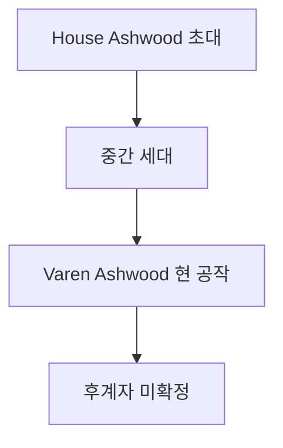

# House Ashwood (애시우드 가문) — Deepwald 深林 귀족

## 원전 인용 증명

### [필독 1] nobles/duke_deepwald_varen_2026-04-22.md
> "Varen Ashwood / Duke of Deepwald / 타종족과 비공식 약초 교환 루트 운영 추정"

### [필독 2] brainstorm_2026-04-21_worldview_expansion.md (발언 8)
> "타종족은 주변 작은 섬들이나 대륙의 가장자리의 밀림이나 숲, 사막한가운데서 숨어서 생활한다."

---

## 요약

House Ashwood 는 Orenwald 남부 深林을 세습 지배하는 가문으로, 왕국에서 가장 신비로운 귀족 가문이다. 숲의 지식을 가문 자산으로 삼으며, 여러 세대에 걸쳐 Deep林 탐사와 약초 수집을 가문 전통으로 유지했다. 일부 가문 구성원이 타종족과 접촉한 기록이 구전으로 전해진다.

---

## 가문 기본 정보

| 항목 | 내용 |
|------|------|
| **가문명** | House Ashwood |
| **별칭** | 어둠 숲의 주인 · Deep林 공작 |
| **문장** | 회백색 물푸레나무(Ash) + 어두운 숲 배경 · 검은 바탕 |
| **가훈** | "숲은 숨기고, 숲은 드러낸다" |
| **근거지** | Deepwald 성채 (위치 반공개) |
| **특기** | 희귀 약초 지식 · Deep林 길 안내 · 비공식 정보 |

---

## 가문 계보

---

## 경제 기반

| 수입원 | 내용 |
|--------|------|
| 희귀 약초 독점 수집 | Deepwald 深部만 자생 약초 수종 |
| 사냥 모피 | 희귀 수종 동물 |
| 숲 안내인 수수료 | 외래 탐사자 안내 독점 |
| (비공식) 타종족 약초 교환 | 추정 · Q-CORE 간접 단서 범위 |

---

## 가문 특이 전통

- **Deep林 입문 의식**: 가문 구성원은 성인이 될 때 Deep林 3일 단독 입문 의식 치름
- **약초 기록서**: 가문 비전 약초 필사본 (수세대 누적) — 비공개
- **이름 모를 학자 마법 흔적**: 약초 기록서 중 "이름 모를 약초학자" 가 가르쳐 준 처방 일부 포함 (간접 단서)

---

## 대표님 미확정 사항

- 타종족 접촉 서사 활용 범위
- 가문 비전 약초 기록서 서사 접점 여부

---

## 다음 Wave 의존 포인트

- **Wave 5 Chronicler**: House Ashwood 약초 기록서 인-월드 파편 문헌
