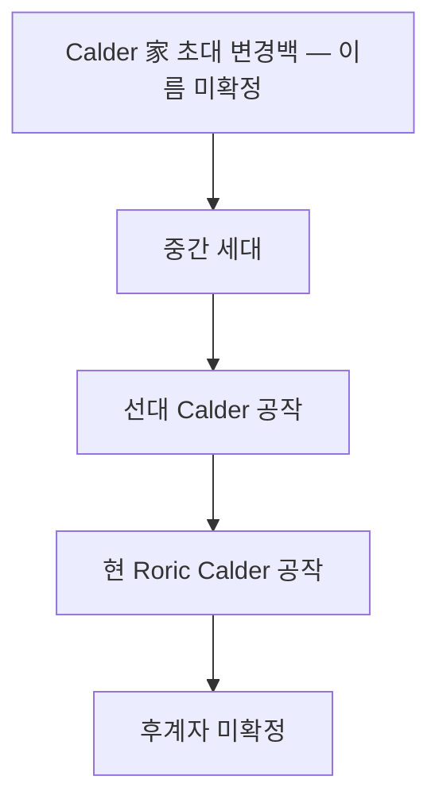

# House Calder (칼더 가문) — Veilorn March 변경 귀족

## 원전 인용 증명

### [필독 1] nobles/duke_veilorn_march_calder_2026-04-22.md
> "Roric Calder / Duke of Veilorn March · Warden of the Eastern Ridge"

### [필독 2] kingdom_oryn_territories_2026-04-22.md
> "Duchy of Veilorn March / Veilorn Ridge 서사면 / 군사·통행 통제 / 동부 경계 방위"

---

## 요약

House Calder 는 Veilorn March 를 세습으로 지배하는 동부 변경 귀족 가문이다. 왕실 충성도는 형식적 수준이며, 실질적으로 변경 자치에 가까운 독립성을 유지한다. Karzor 방면 정보망을 독자 운영한다는 소문이 있다.

---

## 가문 기본 정보

| 항목 | 내용 |
|------|------|
| **가문명** | House Calder |
| **별칭** | 릉의 파수꾼 · Veilorn 의 칼 |
| **문장** | 은빛 칼 + Veilorn Ridge 산악 형상 · 회색 바탕 |
| **가훈** | "동쪽을 등지지 마라" |
| **근거지** | Veilorngate 요새 |
| **특기** | 군사 방위 · 동부 교역 통제 · 독자 정보망 |

---

## 가문 계보

---

## 경제 기반

| 수입원 | 내용 |
|--------|------|
| Karzor 진입 통행세 | 최대 수입원 |
| 동부 사냥 독점권 | Veilorn Ridge 동사면 |
| 소형 광산 수입 | Ridge 서사면 석재·소량 구리 |

---

## 동맹·갈등 관계

| 대상 | 관계 | 내용 |
|------|------|------|
| House Erevorn | 형식적 충성 | 실질 자치 |
| House Ironbark | 신뢰 | Ridgewatch 백작 = Calder 수하 |
| Karzor 상단 | 비공식 협력 | 통행세 인하 대신 정보 교환 (추정) |

---

## 대표님 미확정 사항

- House Calder 초대 설립 시기
- Karzor 상단과의 비공식 협력 공식화 여부

---

## 다음 Wave 의존 포인트

- **Wave 5 Chronicler**: Calder 가문 변경 방위 전투 기록
