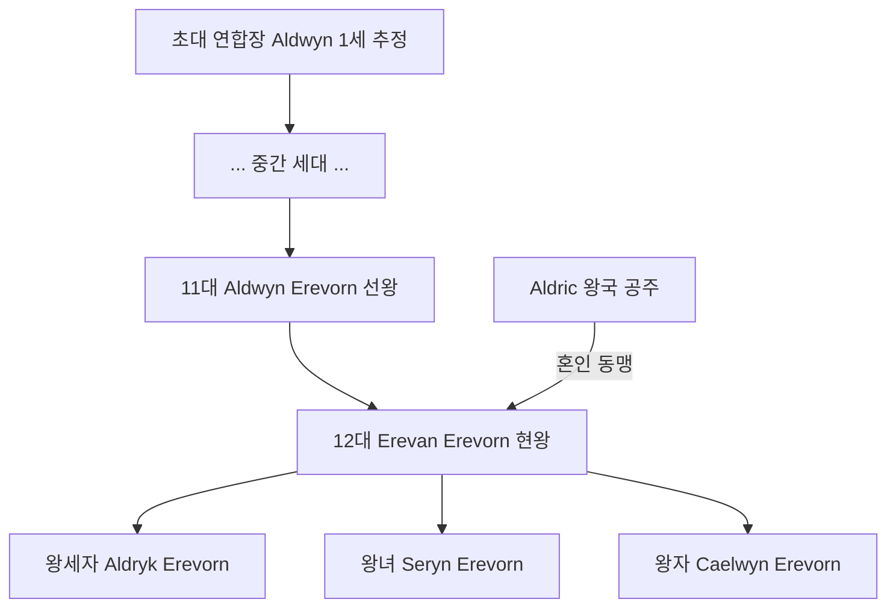

# House Erevorn (에레본 왕가) — Oryn 왕국 왕실 가문

## 원전 인용 증명

### [필독 1] kingdom_oryn_territories_2026-04-22.md
> "왕가·군주 이름 (Wave 4 확정 대상)"

### [필독 2] 에이전트 지시
> "왕족: 숲의 왕조 · 숲의 정령 믿음 전통 · 왕비 Aldric 또는 Sylren 혼인"

### [필독 3] history/founding_2026-04-22.md
> "삼림 연합 형성: 개척 집단들의 단계적 통합"

---

## 요약

House Erevorn 은 Oryn 왕국의 왕실 가문으로, 삼림 연합 형성기부터 지도자 가문으로 자리 잡았다. 숲의 정령 신앙을 왕실 전통으로 삼으며, "숲의 왕조" 라 불린다. 현재 12대 군주 Erevan Erevorn 이 재위 중이다.

---

## 가문 기본 정보

| 항목 | 내용 |
|------|------|
| **가문명** | House Erevorn |
| **별칭** | 숲의 왕조 · Orenwald 의 수호자 |
| **문장** | 금빛 사슴 + 참나무 · 녹색 바탕 |
| **가훈** | "숲이 살면 왕국이 산다" (켈트어 원문 미확정) |
| **근거지** | Thornkeep 왕궁 · Orynthil |
| **왕조 시작** | 삼림 연합 형성기 (정확 연대 미확정) |
| **현 세대** | 12대 Erevan Erevorn |

---

## 가문 계보도

---

## 가문 전통

| 전통 | 내용 |
|------|------|
| **정령 신앙** | 왕실 안마당 3그루 고대 참나무 — 정령 신앙 성지로 유지 |
| **사냥 의식** | 왕위 계승 선언 시 사냥 축일 거행 필수 |
| **가을 수확제** | 왕실 주재로 Hartmarket 에서 공개 거행 |
| **왕비 혼인** | 남부 왕국 (Aldric·Sylren)과 교대 혼인 동맹 관례 |

---

## 경제 기반

| 항목 | 내용 |
|------|------|
| **왕실 직할 채취구** | Orenwald 外林 5km 내 왕실 직할 채취권 |
| **왕실 목재 공방** | Thornkeep 내 왕실 전용 목공 공방 |
| **외교 수입** | Karzor 상인 왕실 접견세 (간접 수입) |

---

## 혼인 동맹 현황

| 세대 | 혼인 상대국 |
|------|-----------|
| 11대 Aldwyn | 미확정 (추정: Sylren 출신) |
| 12대 Erevan | Aldric 왕국 |
| 왕세자 Aldryk | 미확정 (Sylren 유력 · 대표님 미확정) |

---

## 대표님 미확정 사항

- 가문명 House Erevorn 최종 확정
- 가훈 켈트어 원문
- 왕세자 혼인 후보국 확정

---

## 다음 Wave 의존 포인트

- **Wave 5 Chronicler**: 가문 창건 연대기 문헌 인-월드 기록

<!-- auto-generated-related:start -->
## 🔗 관련 (auto-generated)

> `scripts/obsidian/build_backlinks.py` 로 자동 생성. 수정 금지 — 다음 실행 시 덮어쓰여집니다.

### ⬆️ 상위

- [[../../../../../../MOC]] — wiki 루트
- [[../../../MOC]] — Elucia 허브

<!-- auto-generated-related:end -->
