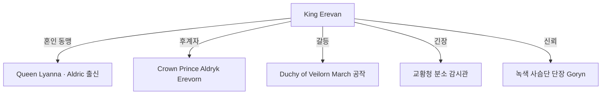

# Erevan Erevorn (에레반 에레본) — Oryn 왕국 현 국왕

## 원전 인용 증명

### [필독 1] kingdom_oryn_territories_2026-04-22.md
> "왕가·군주 이름 (Wave 4 확정)"
— Wave 2 미확정 사항 → Wave 4 작업 가설로 설정

### [필독 2] political_divisions.md:58
> "오린 / Oryn / 동부 숲"
— Oryn = 동부 숲 왕국 확정

### [필독 3] 에이전트 지시 (Wave 4 Kingdom-Detailer 지침)
> "왕족: 숲의 왕조 · 숲의 정령 믿음 전통 · 왕비 Aldric 또는 Sylren 혼인"

---

## 요약

Erevan Erevorn 은 Oryn 왕국의 현 국왕으로, House Erevorn 12대 군주이다. 45세. 냉정하고 실용적인 성격으로 Orenwald 임업권 보호와 교황청 과세 저항에 주력한다. 숲의 정령 신앙을 내심 중시하나, 교황청과의 마찰을 최소화하기 위해 공식 석상에서는 양립 노선을 취한다.

---

## 기본 정보

| 항목 | 내용 |
|------|------|
| **성명** | Erevan Erevorn |
| **칭호** | King of Oryn · Lord of the Orenwald |
| **나이** | 45세 (추정) |
| **가문** | House Erevorn (에레본 왕가) |
| **왕비** | Lyanna of Aldric (알드릭 출신 · 혼인 동맹) |
| **거처** | Thornkeep 왕궁 · Orynthil |
| **특기** | 임업·수렵 행정 · 외교 |
| **외형** | 어두운 갈색 머리 · 굵은 체구 · 수염 · 상록수 잎 문양 반지 |

---

## 성격·야망

| 항목 | 내용 |
|------|------|
| **강점** | 냉철한 판단력 · 숲 지리 완전 파악 · 상인·귀족 균형 외교 |
| **약점** | 성격이 폐쇄적 · 정보 독점 성향 · 왕비에게 감정적으로 의존 |
| **야망** | Orenwald 채취권의 완전한 왕실 독점 · 교황청 과세 삭감 |
| **공포** | 교황청이 Orenwald 심부에 이단 심문단을 파견하는 것 |
| **비밀** | 왕실 내부적으로 Deepwald 公과 타종족 비공식 접촉 사실을 알고 있으나 묵인 중 (추정 · 대표님 미확정) |

---

## 주요 관계

---

## Rev.3 서사 접점

- Act 1~2: 직접 등장 없음. 왕실 칙령·포고문 형태로 세계관 규정 역할
- Act 2: 나이트가 Oryn 통과 시 왕실 추적 가능성 (타종족 관련 소문 때문)
- Act 3: Oryn 왕국의 최종 선택(교황청 vs 타종족 공존) 결정권자

---

## 대표님 미확정 사항

- 가문명 House Erevorn 최종 확정 여부
- 왕비 출신국 (Aldric 확정 or Sylren 대체)
- Deepwald 公과의 타종족 묵인 관계 공식화 여부

---

## 다음 Wave 의존 포인트

- **Wave 5 Chronicler**: Erevan 즉위 과정·전왕 사망 원인 연대기
