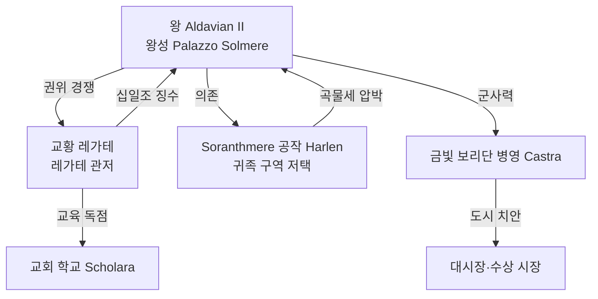

# Sylvenmere (실벤미어) — 왕도 상세 지도

## 원전 인용 증명

### [필독 1] brainstorm_2026-04-21_worldview_expansion.md:176 (발언 5)
> "좌측은 강이 많고 풍요로움"
— 발언 5, brainstorm_2026-04-21_worldview_expansion.md:176 (수도 입지 수계 기반 확정)

### [필독 2] kingdom_sylren_territories_2026-04-22.md:75
> "Duchy of Soranthmere | 평원 중심 · Soranth 강 중류 | ~30K km² | 곡물·목축 | 왕도 공작령 (추정)"
— kingdom_sylren_territories_2026-04-22.md:75

### [필독 3] city_sylvenmere_2026-04-22.md (Wave 2 Toponymist)
> "Soranth 강 중류 · 큰 자연 호수 연안 / 인구 약 30,000~50,000 / 수상 시장 유명"
— city_sylvenmere_2026-04-22.md

---

## 요약

Sylvenmere 는 Soranth 강 중류에 형성된 **자연 호수 Solmere** 를 중심으로 발달한 왕도. 호수 남안이 구왕궁 및 귀족 구역, 북안이 상업 지구, 서안이 항구·창고 지구다. 수상 가옥과 육상 건물이 공존하며 운하망이 내부 교통을 담당한다.

---

## 1. 도시 기본 수치

| 항목 | 내용 |
|------|------|
| 정식 명칭 | City of Sylvenmere |
| 별칭 | "호수의 왕관 (Crown of the Mere)" |
| 인구 | ~35,000~50,000 (평시) · 수확 대축제 기간 2~3배 유입 |
| 중심 수계 | Solmere 호수 (길이 ~8km·폭 ~4km·추정) |
| 성벽 | 육상 3면 석조 성벽 + 호수변 목책·수문 |
| 성문 | 4방향 — 북문(상업로)·남문(왕궁로)·동문(Oryn 방면)·서문(항구로) |

---

## 2. 지구 구획 (10개 구역)

```
         [북문 — 성좌국·Plainhold 방면]
              |
    ┌─────────┼─────────┐
    │  [귀족 상업가]    │
    │     (북안)        │
    ├──────[운하]───────┤
    │                   │
[서문]  [Solmere 호수]  [동문]
항구     (도시 심장)     Oryn
창고                     방면
    │                   │
    ├──────[운하]───────┤
    │   [왕궁 구역]     │
    │   [성당 광장]     │
    └─────────┼─────────┘
              │
         [남문 — Soranthhaven 방면]
```

| # | 구역명 | 위치 | 기능 | 규모 |
|---|--------|------|------|------|
| 1 | **왕궁 구역 (Palacia)** | 호수 남안 고지 | 왕성·왕실 정원·근위 병영 | 소구역 |
| 2 | **성당 광장 (Plaza Solaris)** | 왕궁 바로 북쪽 | 대성당·교황 레가테 관저·종탑 | 중구역 |
| 3 | **귀족 구역 (Nobile Quarter)** | 호수 서남안 | 공작·백작 저택·연회장 | 중구역 |
| 4 | **대시장 (Gran Mercato)** | 호수 북안 | 곡물·포도주·직물 대거래소 | 대구역 |
| 5 | **수상 시장 (Mere Market)** | Solmere 수면 | 수상 가옥·수상 점포·곤돌라 정류장 | 대구역 |
| 6 | **항구·창고 구역 (Porto)** | 호수 서안 | 수출입 창고·선적장·세관 | 대구역 |
| 7 | **장인 거리 (Via Artigiana)** | 동부 내륙 | 도기·직물·금세공 공방 | 중구역 |
| 8 | **교회 학교 구역 (Scholara)** | 성당 광장 동쪽 | 교회 학교·필사실·약초원 | 소구역 |
| 9 | **서민·어촌 구역 (Borgo)** | 북안 외곽 | 어민·하역 노동자·서민 주거 | 대구역 |
| 10 | **군사 구역 (Castra)** | 남문 안쪽 | 금빛 보리단 병영·무기고·훈련장 | 중구역 |

---

## 3. 주요 건물·랜드마크

| 건물 | 위치 | 설명 |
|------|------|------|
| **왕성 Palazzo Solmere** | 왕궁 구역 최고지 | 테라코타 지붕·포치·분수 중정. 왕실 집무실·알현실 |
| **대성당 Cathedra Solaris** | 성당 광장 | Elucia 남부 최대 성당. 교황 레가테 상주 |
| **수확 탑 (Harvest Tower)** | 대시장 중심 | 수확 대축제 때 횃불 점화. 왕도 최고 건물 |
| **곤돌라 다리 (Ponte Mere)** | Solmere 중간 | 수상 시장 연결 목조 부교. 상시 이용 |
| **레가테 관저** | 성당 광장 옆 | 교황청 대리인 상주처. 왕궁과 미묘한 거리 유지 |
| **수출 창고군** | 항구 구역 | 3층 석조 창고 12동. 곡물·포도주 출하 |
| **황금 보리 병영** | 군사 구역 | 금빛 보리단 약 800명 주둔 |
| **Solmere 분수 광장** | 귀족 구역 내 | 왕국 외교 연회 개최 주요 야외 장소 |

---

## 4. 운하망

| 운하 | 경로 | 기능 |
|------|------|------|
| **왕실 운하** | 왕궁 → 항구 구역 | 왕실 물자·외교 사절 전용 |
| **대시장 운하** | 대시장 → Solmere | 화물 직반입 수로 |
| **북부 운하** | 북안 → Soranth 강 상류 | 내륙 농산물 반입 |
| **어촌 운하** | 서민 구역 → 호수 | 어획물·일용품 운반 |

---

## 5. 수도 핵심 갈등 구조



---

## 대표님 미확정

- Solmere 호수 크기·수심 세부 (현재 추정치)
- 왕성 Palazzo Solmere 층수·내부 구조 상세
- 레가테와 왕 간 공식 프로토콜 (알현 순서·좌석 배치 등 정치 의식)

## 다음 Wave 의존

- Wave 5 Chronicler: 수확 대축제 기간 수도 묘사 서사
- Wave 5 World-Integrator: 수도 지도와 대륙 교역망 연결 포인트
