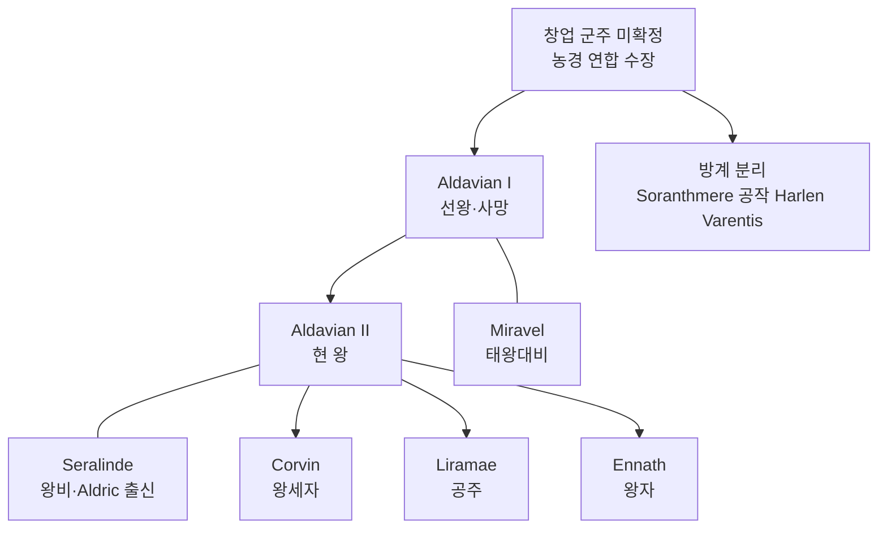

# House Varentis (바렌티스 가문) — 농경 왕조

## 원전 인용 증명

### [필독 1] brainstorm_2026-04-21_worldview_expansion.md:176 (발언 5)
> "좌측은 강이 많고 풍요로움"
— 발언 5, brainstorm_2026-04-21_worldview_expansion.md:176

### [필독 2] political_divisions.md:60
> "실렌 / Sylren / 남중앙"
— political_divisions.md:60

### [필독 3] founding_2026-04-22.md:38–41
> "Soranth 평원의 농경 집단들이 관개 시설 공유와 수확 분배를 위해 연합을 형성한 것이 기원"
— founding_2026-04-22.md:38–41

---

## 요약

Sylren 왕국을 수백 년간 통치해온 농경 왕조. 가문 이름 Varentis 는 라틴계 어근으로 "비옥한 땅의 수호자"를 의미한다 (추정). 왕가와 Soranthmere 공작 가문이 동일 성씨를 공유하는데, 이는 수 세기 전 왕가 방계 분리에서 기인한다. 금빛 밀 다발을 가문 문장으로 삼는다.

---

## 가문 기본 정보

| 항목 | 내용 |
|------|------|
| 가문명 | House Varentis |
| 분류 | 왕가 (Royal House) |
| 본거지 | Sylvenmere 왕성 Palazzo Solmere |
| 문장 | 금빛 배경에 황금 밀 다발 3묶음 · 하단에 진홍 강물 물결 |
| 표어 | *"Serit qui recolligit"* ("심은 자가 거둔다" · 라틴계 추정) |
| 특기 | 관개 농업 운영·수확 축제 주최·외교 혼인 |
| 동맹 혼인 | Aldric 왕국 왕가 (대대로 왕비 수혈) |

---

## 계보 (추정·대표님 미확정 다수)

---

## 가문 전통

| 전통 | 내용 |
|------|------|
| **Aldric 혼인** | 왕비를 반드시 Aldric 왕국 왕녀에서 선발 (최소 3대 지속) |
| **수확 대축제 주최** | 국왕이 직접 첫 이삭을 베는 의식 집전 |
| **관개 왕** | 새 왕은 즉위 첫 해에 왕국 내 관개 수로 순시 의무 |
| **포도주 봉헌** | 교황청 연례 봉헌에 Auravale 포도주 동봉 |

---

## 경제 기반

| 자산 | 규모 |
|------|------|
| 왕실 직할 영지 | Sylvenmere 시 + 주변 10km 반경 (추정) |
| 곡물세 징수 | 왕국 전체 곡물 생산의 20% 직수취 (추정) |
| 수상 시장 통제 | Sylvenmere 수상 시장 특허·수수료 |
| Azim Pass 관세 일부 | Southvale 영지 통해 수취 |

---

## 대표님 미확정

- 창업 군주 이름·건국 연대
- Soranthmere 공작 Varentis 방계 분리 시점
- 표어·가훈 공식 확정

## 다음 Wave 의존

- Wave 5 Chronicler: House Varentis 왕조 역사 연대기

<!-- auto-generated-related:start -->
## 🔗 관련 (auto-generated)

> `scripts/obsidian/build_backlinks.py` 로 자동 생성. 수정 금지 — 다음 실행 시 덮어쓰여집니다.

### ⬆️ 상위

- [[../../../../../../MOC]] — wiki 루트
- [[../../../MOC]] — Elucia 허브

<!-- auto-generated-related:end -->
