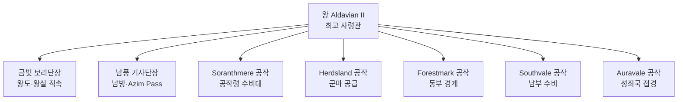

# Sylren 왕국 군제

## 원전 인용 증명

### [필독 1] Wave 4 에이전트 지시문 — 군제 항목
> "군제: 모병제 · 창병·궁수·남방 수비대"
— Wave 4 Kingdom-Detailer-sylren 지시문

### [필독 2] brainstorm_2026-04-21_worldview_expansion.md:176 (발언 5)
> "좌측은 강이 많고 풍요로움"
— 발언 5, brainstorm_2026-04-21_worldview_expansion.md:176

### [필독 3] kingdom_sylren_territories_2026-04-22.md:62–66
> "접경: 북 성좌국 / 동 Oryn / 남 Novas / 서 Ceren ... 평지 지형 — 방어 취약 — 기동 군사력 필요"
— kingdom_sylren_territories_2026-04-22.md:62–66

---

## 요약

Sylren 왕국은 징병제를 채택하지 않는 모병제 국가다. 풍요로운 경제를 기반으로 용병·자원병을 고용하며, 농민을 군사 의무에서 해방해 농업 생산성을 최대화한다. 왕립 기사단(금빛 보리단)과 남방 전문 기사단(남풍 기사단)이 핵심 전력이며, 공작령별 수비대가 보조한다.

---

## 1. 군제 기본 구조

| 구분 | 방식 | 규모 (추정) |
|------|------|-----------|
| **징병제** | 미채택 | — |
| **모병제** | 전국 모집 (자유민 대상) | 총 ~6,000~8,000명 |
| **왕립 기사단** | 금빛 보리단 | ~800명 |
| **남방 기사단** | 남풍 기사단 | ~500명 |
| **공작령 수비대** | 각 공작령 독자 유지 | 공작령당 ~500~1,000명 |
| **도시 민병대** | 비상 소집 예비 | (대표님 미확정) |

---

## 2. 병종 구성

| 병종 | 역할 | 특기 |
|------|------|------|
| **창병 (Spearmen)** | 평원 진형 전투 주력 | Soranth 평원 밀집 대형 |
| **궁수 (Archers)** | 원거리 지원·성벽 방어 | Forestmark 출신 장궁 전통 |
| **경기병 (Light Cavalry)** | 기동·정찰·추격 | Herdsland 군마 사용 |
| **남방 수비대** | Azim Pass·남부 국경 전담 | 남풍 기사단 지원 |
| **수군 (River Guard)** | Soranth 강·운하 방어 | 소규모·보조 전력 |

---

## 3. 지휘 계통

---

## 4. 모병 조건 및 급여 (추정)

| 항목 | 내용 |
|------|------|
| 입대 자격 | 자유민 · 만 16세 이상 · 신체 건강 |
| 복무 기간 | 3년 계약제 (추정) |
| 급여 | 곡물·화폐 혼합 지급 (추정) |
| 전투 포상 | 전공에 따른 토지·화폐 포상 |
| 기사 승급 | 탁월한 전공자 왕명 기사 작위 수여 |

---

## 5. 군사 전략

- **평원 방어 약점 보완**: 성벽·수로망을 이용한 거점 방어
- **기동 우선**: 경기병으로 침입군 포착·지연
- **외교 병행**: 군사력보다 동맹 외교로 전쟁 예방 (Aldric·Ceren 동맹 유지)
- **교황청 의존 전략**: 대규모 전쟁 시 성좌국 지원 요청 기정사실화

---

## 대표님 미확정

- 최근 실제 전투 경험 (수십 년 평화 유지 여부)
- 교황청 상주 기사단과의 관할 경계

## 다음 Wave 의존

- Wave 5 Chronicler: 주요 전쟁 기록·모병 제도 도입 역사
