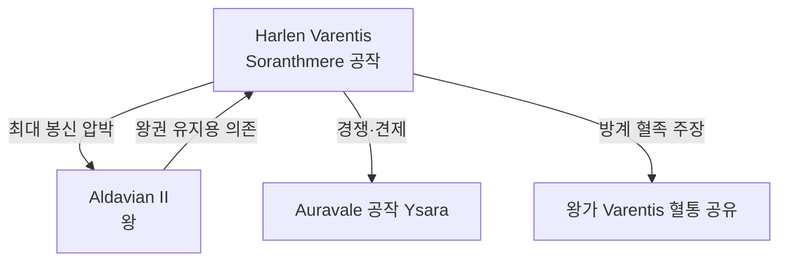

# Harlen Varentis — Soranthmere 공작

## 원전 인용 증명

### [필독 1] brainstorm_2026-04-21_worldview_expansion.md:176 (발언 5)
> "좌측은 강이 많고 풍요로움"
— 발언 5, brainstorm_2026-04-21_worldview_expansion.md:176

### [필독 2] kingdom_sylren_territories_2026-04-22.md:74–75
> "Duchy of Soranthmere | 평원 중심 · Soranth 강 중류 | ~30K km² | 곡물·목축 | 왕도 공작령"
— kingdom_sylren_territories_2026-04-22.md:74–75

### [필독 3] agriculture_2026-04-22.md:92–95
> "Soranth Plain | 남중앙 | ~160,000 km² | Sylren 왕국 | 대륙 공급 비중 25–30%"
— agriculture_2026-04-22.md:92–95

---

## 요약

Sylren 왕국 최대 공작령 Soranthmere 영주. 왕가와 동일 성씨 Varentis 를 공유하는 방계 혈족으로, 왕도 Sylvenmere 와 그 주변 비옥한 평원을 지배한다. 왕국 곡물 세수의 30% 이상을 담당하는 사실상 최강 봉신. 왕에 대해 겉으로는 충성하나, 세수 협상에서 강하게 자기 이익을 관철한다.

---

## 인물 기본 정보

| 항목 | 내용 |
|------|------|
| 이름 | Harlen Varentis |
| 칭호 | Duke of Soranthmere |
| 나이 | ~55세 (추정·대표님 미확정) |
| 외모 | 넓은 어깨·짧게 다듬은 백발·붉은 기운의 얼굴·권력자의 풍채 |
| 성격 | 오만하나 유능·정치 감각 예리·왕실에 대한 묵시적 경쟁심 |
| 영지 | Soranthmere Duchy·수도 Sylvenmere 인접 |
| 경제 기반 | 곡물 세수·목축업·Soranth 강 수운 통행세 |

---

## 정치적 위치

---

## 야망 및 갈등

- **세수 재분배 압박**: 왕국 총 곡물 세수에서 Soranthmere 공작령 몫 확대 요구
- **왕위 방계 혈족 의식**: Varentis 가문 동일 성씨를 이용해 왕실과의 거리를 의도적으로 좁힘
- **교황청과의 관계**: 교황청에는 협력적 — 십일조를 내며 레가테와 정기 연회 개최 (왕을 우회해 직접 교황청과 외교)

---

## 영지 특산

| 특산 | 내용 |
|------|------|
| **밀·보리·귀리** | Soranth 강 중류 비옥한 충적토 생산 |
| **대형 목장** | 소·말 복합 목축 — 군마 일부 왕국 공급 |
| **Soranth 수운 세관** | 강을 오가는 화물선에 통행세 징수 |

---

## 대표님 미확정

- 부인·자녀 상세
- 레가테와의 구체적 협력 사건

## 다음 Wave 의존

- Wave 5 World-Integrator: Harlen Varentis — 왕 — 레가테 3각 긴장 관계도

<!-- auto-generated-related:start -->
## 🔗 관련 (auto-generated)

> `scripts/obsidian/build_backlinks.py` 로 자동 생성. 수정 금지 — 다음 실행 시 덮어쓰여집니다.

### ⬆️ 상위

- [[../../../../../../MOC]] — wiki 루트
- [[../../../MOC]] — Elucia 허브

<!-- auto-generated-related:end -->
