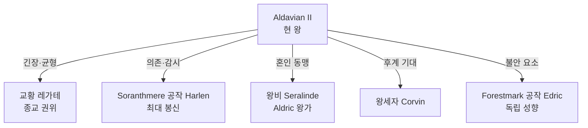

# Aldavian II (알다비안 2세) — Sylren 현 왕

## 원전 인용 증명

### [필독 1] brainstorm_2026-04-21_worldview_expansion.md:176 (발언 5)
> "좌측은 강이 많고 풍요로움"
— 발언 5, brainstorm_2026-04-21_worldview_expansion.md:176

### [필독 2] kingdom_sylren_territories_2026-04-22.md:62–66
> "접경: 북 성좌국 / 동 Oryn / 남 Novas / 서 Ceren ... 성좌국 남부 완충국으로서의 역사"
— kingdom_sylren_territories_2026-04-22.md:62–66

### [필독 3] founding_2026-04-22.md:68–70
> "왕권 vs 교황 대리인 권한 충돌이 내정 주요 갈등"
— founding_2026-04-22.md:68–70

---

## 요약

Sylren 왕국 현 군주. 가문 이름 Varentis. 교황청 레가테의 압박과 공작 귀족들의 세력 균형 사이에서 외교적 수완으로 왕권을 유지하는 중년 군주. 선왕 Aldavian I 의 치세를 이어 농업 경제와 대외 외교를 두 축으로 삼는다.

---

## 인물 기본 정보

| 항목 | 내용 |
|------|------|
| 이름 | Aldavian II Varentis |
| 칭호 | King of Sylren, Lord of Soranth, Warden of the Mere |
| 나이 | ~47세 (추정·대표님 미확정) |
| 외모 | 키 중간·다부진 체형·짧은 갈색 머리에 회색 섞임·올리브 피부·진중한 눈빛 |
| 성격 | 신중·외교적·인내심 강함·내면 분노 잘 감춤 |
| 배우자 | 왕비 Seralinde (Aldric 왕가 출신) |
| 자녀 | 왕세자 Corvin · 공주 Liramae · 왕자 Ennath |

---

## 통치 철학

- **"평원의 왕은 홍수가 아닌 관개로 다스린다"** — 왕 개인 좌우명 (추정)
- 무력보다 외교·경제 압박을 우선시
- 수확 대축제를 외교 무대로 적극 활용 (주변국 귀족 초청)
- 교황청 레가테에게 표면상 복종하되 세수 흐름은 직접 통제

---

## 주요 정치 관계

---

## Rev.3 서사 접점

- 성좌국과의 십일조 협상 — 매 5년마다 갱신되는 세율을 놓고 외교전
- 수확 대축제 초청 외교: Oryn·Aldric·Ceren 귀족 동시 유치 → 성좌국 견제 연합 시도
- Q-CORE 2 간접: "이름 없는 학자"를 마을 순회로 인식 → 왕실 파견 조사단 검토 (공식 마법사 길드 반발 있음)

---

## 대표님 미확정

- 왕위 계승 연도·즉위 나이
- 교황청 레가테와의 구체적 갈등 사건 (대형 충돌 있었는지)
- 개인적 종교 신앙 깊이 (교회 의식 형식적 참여 vs 진심)

## 다음 Wave 의존

- Wave 5 Chronicler: Aldavian II 통치기 주요 외교 사건 연대기

<!-- auto-generated-related:start -->
## 🔗 관련 (auto-generated)

> `scripts/obsidian/build_backlinks.py` 로 자동 생성. 수정 금지 — 다음 실행 시 덮어쓰여집니다.

### ⬆️ 상위

- [[../../../../../../MOC]] — wiki 루트
- [[../../../MOC]] — Elucia 허브

<!-- auto-generated-related:end -->
