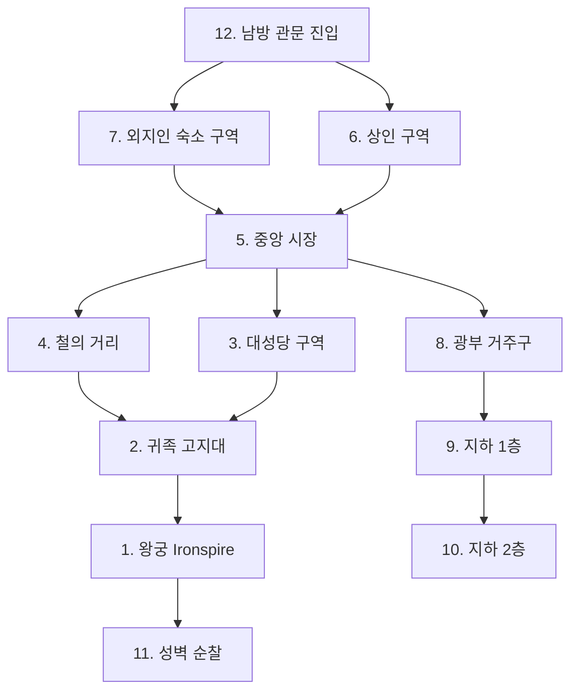

# Icehelm (아이스헬름) 왕도 상세 지도

## 원전 인용 증명

### [필독 1] city_icehelm_2026-04-22.md (Wave2 Toponymist)
> "Norvend Range 남쪽 기슭, Greygate Pass 남방 도로와 Eloryn 강 상류 사이의 천혜 요새 지형 / 인구 약 20,000~30,000 / 협곡 안 자연 요새 지형 · 3면 절벽 1면 관문 / 겨울 반년 · 눈과 얼음의 도시"
— city_icehelm_2026-04-22.md (왕도 기본 정보 확정)

### [필독 2] kingdom_thaloss_territories_2026-04-22.md:71-76
> "Duchy of Icehelm / Norvend 중심부 · 최고봉 인근 / ~45K km² / 희귀 광석·성지 / 왕실 직할 · 최고봉 성지 수호"
— territories 파일 (Icehelm 공작령 = 왕실 직할)

### [필독 3] mining_metals_2026-04-22.md:124-126
> "'Icehelm 인근 광맥의 돌은 밤에 희미하게 빛난다. 교회는 이것을 악마의 돌이라 부르고 접근을 금지한다.' (Thaloss 광부 구전)"
— Q-CORE 간접 단서 (공식 서술 금지)

---

## 요약

Icehelm 은 Norvend Range 남사면 협곡 안에 자리한 자연 요새 도시. 3면이 절벽, 1면만 관문으로 열려 있는 천혜 방어 지형. 도시 내부는 지하 층이 발달하여 지상 3층·지하 2층 구조로 이루어져 있다. 인구 약 25,000명 (평시). 겨울 6개월간 설원에 묻히며, 봄이 오면 외부 상인들이 몰린다.

---

## 도시 구획 (12개 구역)

```
                    [ ↑ Norvend 산맥 북벽 ]
    ┌──────────────────────────────────────────────┐
    │  11. 성벽·감시탑 (Ramparts)                   │
    │  ━━━━━━━━━━━━━━━━━━━━━━━━━━━━━━━━━━━━━━━━━━  │
    │  ┌──────────────┐  ┌──────────────────────┐  │
    │  │ 1. 왕궁구역  │  │  2. 귀족 고지대       │  │
    │  │ (Ironspire)  │  │  (Noble Quarter)      │  │
    │  │ 왕궁·왕실    │  │  3대 공작가 저택      │  │
    │  │ 근위대 막사  │  │  기사단 본부           │  │
    │  └──────────────┘  └──────────────────────┘  │
    │  ┌──────────────┐  ┌──────────────────────┐  │
    │  │ 3. 대성당 구역│  │  4. 철의 거리          │  │
    │  │ (Cathedral   │  │  (Iron Row)           │  │
    │  │ of the First │  │  대장장이·무기상       │  │
    │  │ Hammer)      │  │  광부 조합 청사        │  │
    │  └──────────────┘  └──────────────────────┘  │
    │  ┌──────────────────────────────────────────┐ │
    │  │   5. 중앙 시장 (Ironmarket)               │ │
    │  │   주 2회 장시 · 금속·모피·식량 교역        │ │
    │  └──────────────────────────────────────────┘ │
    │  ┌──────────────┐  ┌──────────────────────┐  │
    │  │ 6. 상인 구역  │  │  7. 외지인 숙소 구역  │  │
    │  │ (Merchant    │  │  (Outsider Quarter)   │  │
    │  │ Quarter)     │  │  여관·환전소·창고      │  │
    │  └──────────────┘  └──────────────────────┘  │
    │  ┌──────────────────────────────────────────┐ │
    │  │   8. 광부 거주구 (Miner's Borough)         │ │
    │  │   갱도 입구 인접 · 조합원 가족 거주        │ │
    │  └──────────────────────────────────────────┘ │
    │  ┌──────────────┐  ┌──────────────────────┐  │
    │  │ 9. 지하 층 1F │  │  10. 지하 층 2F       │  │
    │  │ 식량 창고·    │  │  광석 원석 보관고     │  │
    │  │ 동절기 피난처  │  │  · 비상 식수원        │  │
    │  └──────────────┘  └──────────────────────┘  │
    │  ┌──────────────────────────────────────────┐ │
    │  │   12. 관문 구역 (Irongate District)       │ │
    │  │   남쪽 유일 출입 · 세관·경비대 본부        │ │
    │  └──────────────────────────────────────────┘ │
    └──────────────────────────────────────────────┘
                    [ ↓ Greygate Pass 남방 도로 ]
```

---

## 구역별 상세

### 1. 왕궁 구역 (Ironspire Palace)
| 항목 | 내용 |
|------|------|
| 위치 | 도시 북서 고지 · 절벽 직하 |
| 건물 | 철광석 석재 4층 요새 궁전 · 탑 2기 |
| 역할 | 왕실 거처·집무·왕국 회의 |
| 특징 | 지하 2층 왕실 광석 보관고 ("왕의 보고") |
| 근위대 | Krauss 가문 직속 50명 상주 |
| 분위기 | 화려함보다 견고함 우선 — 방문자에게 위압적 |

### 2. 귀족 고지대 (Noble Quarter)
| 항목 | 내용 |
|------|------|
| 위치 | 왕궁 동쪽 사면 · 고지 |
| 거주자 | 왕도 주재 공작·백작 저택·기사단 본부 |
| 건물 | 석성 저택 · 가문 문장 외벽 조각 |
| 특징 | Greygate 공작 저택이 왕궁 다음으로 크고 웅장 |
| 분위기 | 절제되고 무거운 권위 — 과시보다 실용 |

### 3. 대성당 구역 (Cathedral of the First Hammer)
| 항목 | 내용 |
|------|------|
| 위치 | 도시 중북부 · 왕궁과 시장 사이 |
| 건물 | 첫 번째 신 신앙 대성당 · 망치 모양 십자 첨탑 |
| 역할 | 종교 의례·왕위 계승식·기사단 서약식 |
| 특징 | 교황청 파견 주교 상주 — 왕과 암묵적 긴장 |
| Q-CORE 단서 | 지하 필사본 보관실에 "이름 없는 학자" 언급 파편 기록 (비공개) |

### 4. 철의 거리 (Iron Row)
| 항목 | 내용 |
|------|------|
| 위치 | 도시 중부 |
| 기능 | 무기·갑옷·도구 제조 및 판매 |
| 특징 | 광부 조합 청사 — 사실상 왕국 실권 중 하나 |
| 소음 | 24시간 망치소리·쇳소리 |
| 외지인 입장 | 제한적 — 상업 거래만 허용 |

### 5. 중앙 시장 (Ironmarket)
| 항목 | 내용 |
|------|------|
| 위치 | 도시 중심부 광장 |
| 개장 | 봄~가을 주 2회 · 겨울 월 1회 실내 |
| 주요 품목 | 광석·무기·모피·수입 식량·향신료 (소량 Karzor 산) |
| 분위기 | 냉담하지만 공정 — 상인들은 과장 금지 관습 |

### 6. 상인 구역 (Merchant Quarter)
| 항목 | 내용 |
|------|------|
| 위치 | 시장 남서쪽 |
| 거주자 | 주재 상인·환전상·창고업자 |
| 특징 | 성좌국·Vaelin 상인들이 계절 체류 |
| 규제 | 외지 상인은 조합 등록 필수 |

### 7. 외지인 숙소 구역 (Outsider Quarter)
| 항목 | 내용 |
|------|------|
| 위치 | 도시 남부 관문 인근 |
| 기능 | 외지 방문자 숙박·식사 |
| 분위기 | 탈로스인들이 냉담하게 대하는 구역 — 감시 많음 |
| 특이사항 | "이름 없는 노인"이 자주 목격된다는 소문 (Q-CORE 간접 — 대표님 미확정) |

### 8. 광부 거주구 (Miner's Borough)
| 항목 | 내용 |
|------|------|
| 위치 | 도시 북동 · 갱도 입구 인접 |
| 거주자 | 광부 및 가족 ~8,000명 |
| 분위기 | 조용하고 강인한 공동체 — 외부인 배척 |
| 특징 | 광부 조합이 자치 규율 운영 |

### 9~10. 지하 층 (Underground Floors)
| 층 | 기능 | 비고 |
|----|------|------|
| 지하 1층 | 식량 창고·동절기 피난처·비상 거주 | 인구 일부 겨울 지하 이주 |
| 지하 2층 | 광석 원석 보관고·비상 식수원 | 왕실·군 통제 |

### 11. 성벽·감시탑 (Ramparts)
| 항목 | 내용 |
|------|------|
| 구조 | 자연 절벽 보완 인공 성벽 · 감시탑 8기 |
| 재료 | 철 강화 석재 |
| 수비대 | Greygate 기사단 순환 배치 200명 |

### 12. 관문 구역 (South Gate District)
| 항목 | 내용 |
|------|------|
| 위치 | 도시 남쪽 유일 진입로 |
| 기능 | 세관·통행세·검문 |
| 수비 | 관문 기사 50명 상시 |
| 통관 시간 | 평균 1~3시간 (외지인은 더 오래) |

---

## 도시 동선 흐름



---

## 계절별 도시 변화

| 계절 | 인구 변화 | 주요 활동 |
|------|----------|---------|
| 봄 (해빙기) | +20~30% 외지 상인 유입 | 철 수출 개시·식량 수입 |
| 여름 (단 3개월) | 최대 인구 | 광산 최대 가동·시장 성수기 |
| 가을 | 외지인 철수 시작 | 월동 물자 비축 |
| 겨울 (6개월) | 도시 봉쇄 | 지하 생활·금속 가공·맥주·구술 전통 |

---

## 대표님 미확정

- 왕궁 정식 명칭 (Ironspire Palace 는 작업 가설)
- 대성당 공식 명칭
- 광부 조합 공식 명칭
- 도시 정확한 인구

## 다음 Wave 의존

- Wave 5 Chronicler: Icehelm 정복 시도 기록 (15년 전쟁 중 미시도 여부)
- Wave 5 World-Integrator: 왕도 경제 허브 그래프 통합
