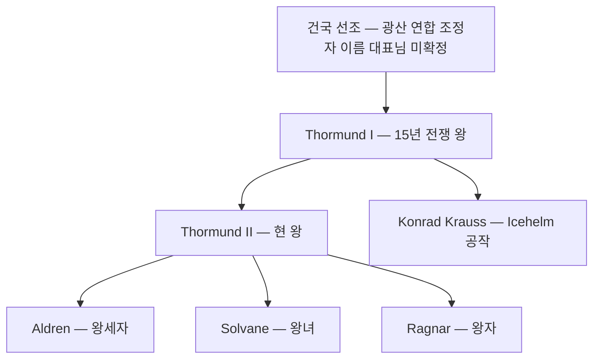

# House Krauss (크라우스 가문) — 탈로스 왕가

## 원전 인용 증명

### [필독 1] founding_2026-04-22.md:33-38
> "Norvend 산맥 일대 광산 채굴 집단들이 자원 분쟁을 조율하기 위해 연합체를 형성한 것이 기원 / 산악 지형 특성상 기마 전투보다 요새 방어·보병 전술이 발달"
— Krauss 왕조 광부 출신 기원

### [필독 2] war_thaloss_vaelin_perspective_2026-04-22.md:50-54
> "12년차 바엘린 주력 기사단 매복 섬멸 — '노르벤드의 기적' / 후대 기사단 훈련 교범 수록"
— Krauss 왕조 최대 군사 공적

---

## 요약

Krauss 가문은 탈로스 왕국 광부 출신 왕조. 광산 연합 조정자에서 시작해 전쟁과 통치를 거치며 왕가로 격상됐다. "망치와 땀이 왕관을 만든다"는 건국 철학이 가문 전통의 핵심. 화려함보다 실용을 추구하며, 왕이라도 광산을 직접 시찰하는 전통이 있다.

---

## 가문 계보도

---

## 가문 특성

| 항목 | 내용 |
|------|------|
| 문장 | 검정 바탕 · 은 망치 3자루 · 왕관 |
| 색깔 | 검정·은 |
| 모토 | "Stein und Schweiß" (돌과 땀 — 게르만어 계열) |
| 전통 | 왕위 계승자는 반드시 광산 1일 노동 수행 |
| 혼인 | Vaelin·Maerith 와 교차 정략혼 |
| 약점 | 타 왕국 귀족들이 "촌스러운 광부 왕족"이라 낮춤 |

---

## 경제 기반

| 자산 | 내용 |
|------|------|
| Icehelm 직할 광맥 | 희귀 광석 채굴 구역 |
| 왕도 Ironmarket 수입 | 시장 세금 |
| 왕실 무기 특허세 | Embervane 무기 수출 일부 |

---

## 대표님 미확정

- 건국 선조 이름
- 왕조 정확한 계승 순서

## 다음 Wave 의존

- Wave 5 Chronicler: Krauss 왕조 공식 연대기
