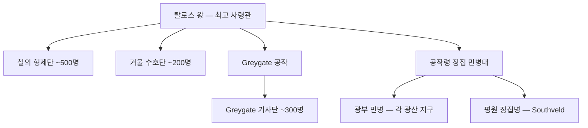

# 탈로스 왕국 군제

## 원전 인용 증명

### [필독 1] CLAUDE.md (시스템 프롬프트)
> "군제: 징병제 · 중장 보병·광부 민병·Greygate 수비대"
— 탈로스 군제 핵심 3요소 직접 명시

### [필독 2] war_thaloss_vaelin_perspective_2026-04-22.md:50-54
> "12년차 바엘린 주력 기사단 매복 섬멸 — '노르벤드의 기적' / 후대 탈로스 기사단 훈련 교범에 수록"
— 탈로스 핵심 전술 교리

### [필독 3] founding_2026-04-22.md:37-39
> "산악 지형 특성상 기마 전투보다 요새 방어·보병 전술이 발달 / 광산 수익을 기반으로 용병 고용 능력이 뛰어나다"
— 탈로스 군사 특성 확정

---

## 요약

탈로스 왕국은 징병제 기반의 산악 방어 전문 군사 체계를 보유한다. 기마 왕국들이 우세한 평원 전투와 달리, Norvend 협곡 지형을 활용한 매복·요새 전술이 핵심 교리. 광부 출신 병사들의 체력과 산악 생존력이 탈로스 군의 강점이다.

---

## 군사 구조

---

## 병종별 상세

### 1. 중장 보병 (Heavy Infantry)
| 항목 | 내용 |
|------|------|
| 구성 | 기사단 정규 + 귀족 직속 중무장 병사 |
| 무장 | 철제 판갑 · 대방패 · 전쟁도끼·철퇴 |
| 전술 | 협곡 차단·돌격·요새 수비 |
| 강점 | 협곡 전투 최강 |
| 약점 | 평원 기동전 불리 |

### 2. 광부 민병 (Miner Militia)
| 항목 | 내용 |
|------|------|
| 구성 | 광부 조합 소속 성인 남성 |
| 무장 | 곡괭이·철망치·경갑옷 |
| 소집 | 전시 1주일 내 |
| 강점 | 지하 전투·갱도 방어 탁월 |
| 규모 | 약 5,000~8,000명 (추정) |

### 3. Greygate 수비대 (Greygate Garrison)
| 항목 | 내용 |
|------|------|
| 구성 | Greygate 기사단 + 공작령 징집 |
| 규모 | 약 600~800명 상시 |
| 임무 | Pass 봉쇄·통행 통제·관문 방어 |

### 4. 산악 척후대 (Mountain Scouts)
| 항목 | 내용 |
|------|------|
| 구성 | 겨울 수호단 전위대 |
| 무장 | 경갑·단검·활 |
| 특기 | 설원 은폐·적 포착·봉화 연락 |

---

## 핵심 전술 교리 — 산악 매복

"노르벤드의 기적" 이후 공식 교범화된 탈로스 전술:

1. **협곡 유인**: 소수 부대로 적을 협곡 입구로 유인
2. **절벽 낙석**: 상단 부대가 낙석·투석 개시
3. **측면 차단**: 중장 보병이 협곡 출구 봉쇄
4. **섬멸**: 포위 완성 후 광부 민병 투입 근접전

---

## 징병제 구조

| 항목 | 내용 |
|------|------|
| 징병 연령 | 17~45세 남성 |
| 의무 복무 | 2년 (광부 지구 면제 조건: 광산 세수 납부) |
| 전시 동원 | 전 성인 남성 소집 가능 |
| 예외 | 유일 아들·광부 장인 일부 면제 |

---

## 군사력 평가 (대륙 기준)

| 항목 | 평가 |
|------|------|
| 산악 방어 | 대륙 최강 수준 |
| 평원 전투 | 하위 — 기마 전력 부재 |
| 해전 | 없음 |
| 공성 | 미숙 — 공격보다 방어 특화 |
| 용병 고용 능력 | 높음 (광산 수익 기반) |

---

## 대표님 미확정

- 징병제 상세 규정
- 여성 병역 존재 여부
- 드워프 협력 관계 (비공개 협약 가능성)

## 다음 Wave 의존

- Wave 5 Chronicler: 15년 전쟁 전투 상세 기록
