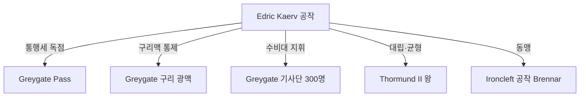

# Edric Kaerv (에드리크 바른) — Greygate 공작

## 원전 인용 증명

### [필독 1] CLAUDE.md (시스템 프롬프트)
> "귀족: Greygate 요새 공작·제련소 공작·Icehelm Peak 공작 (최고봉)"
— Greygate 공작 명시 확정

### [필독 2] kingdom_thaloss_territories_2026-04-22.md:76
> "Duchy of Greygate / Greygate Pass 통제 구역 / ~40K km² / 통행세·군사 방어 / 서쪽 관문 · 최중요 전략 거점"
— Greygate 공작령 핵심 가치

### [필독 3] mining_metals_2026-04-22.md:71-72
> "Greygate 구리맥 / Greygate 서사면 / 구리 / Greygate Pass (1,600m)"
— Greygate 공작의 경제 기반

---

## 요약

Edric Kaerv 은 Greygate 공작. 탈로스 최대의 봉건 세력으로, Greygate Pass 통행세 독점권과 구리 광맥을 보유한다. 왕가 Krauss 와의 권력 균형이 현 탈로스 내정의 핵심 축. 왕에게 충성하지만 독립성을 호시탐탐 확대하려 한다. 15년 전쟁에서 Greygate 수비대를 이끌었으며 "노르벤드의 기적"에 간접 기여한 공로가 있다.

---

## 기본 정보

| 항목 | 내용 |
|------|------|
| 이름 | Edric Kaerv (에드리크 바른) |
| 칭호 | Greygate 공작 · "관문의 주인" |
| 나이 | 약 55세 (추정 · 대표님 미확정) |
| 외형 | 거대한 체구 · 은발 · 왼손에 전쟁 흉터 |
| 성격 | 실용적·탐욕적·장기 계획형 |
| 야망 | Greygate 통행세 독립 징수권 확보 |
| 거점 | Irongate 시 Kaerv 저택 + Greygate Pass 요새 |

---

## 권력 구조

---

## 내정 역학

| 항목 | 내용 |
|------|------|
| 왕과의 관계 | 표면 충성 · 내면 경쟁 |
| 교황청과의 관계 | 통행세 분쟁 — 공작은 독립 징수 주장 |
| 바엘린과의 관계 | 15년 전쟁 강경파 — 지금도 불신 |
| 광부 조합과의 관계 | 통행세 협상 파트너 |
| 약점 | 식량 생산 없음 → 왕도 식량 의존 |

---

## Rev.3 서사 접점

- Greygate Pass 봉쇄 협박으로 교황청 압박 가능 — Act 2 외교 갈등 시 등장
- 왕세자 Aldren 과의 갈등: 온건 외교 vs 강경 고개 봉쇄

---

## 대표님 미확정

- 실제 이름
- 왕위 찬탈 야망 수준
- 아들·후계자 존재 여부

## 다음 Wave 의존

- Wave 5 Chronicler: Greygate 공작 계보 기록
