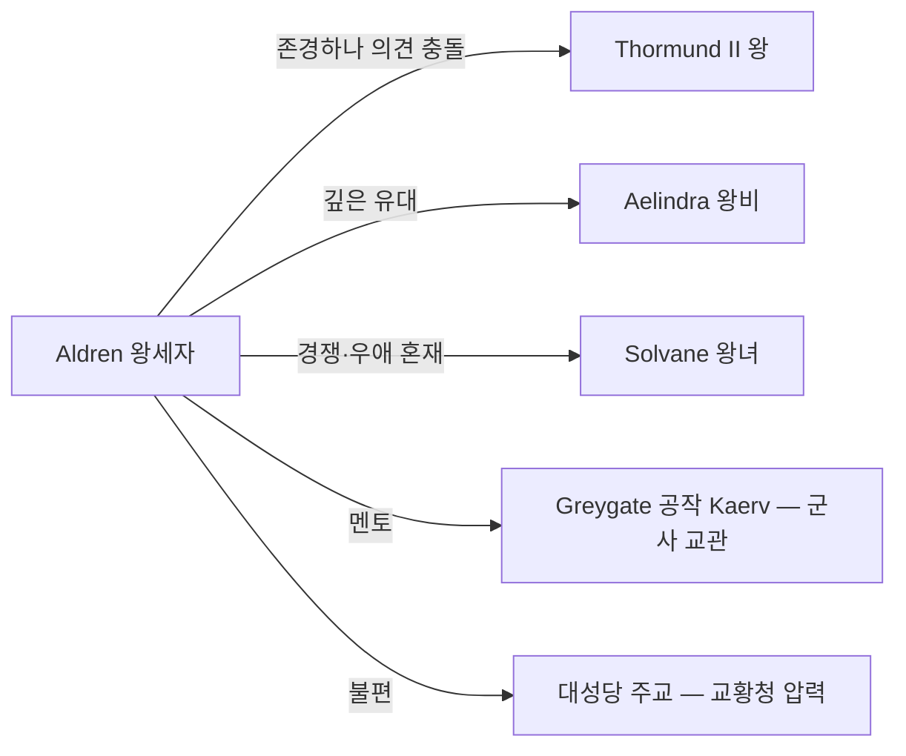

# Aldren (알드리크) — 탈로스 왕세자

## 원전 인용 증명

### [필독 1] founding_2026-04-22.md:56-60
> "광산 수익 덕분에 군사력 유지 / 교황청 세금 납부량이 광산 생산량과 연동 — 내정 핵심 갈등"
— 왕세자가 물려받을 내정 구조

### [필독 2] war_thaloss_vaelin_perspective_2026-04-22.md:51-54
> "12년차 바엘린 주력 기사단 매복 섬멸은 탈로스 군사 역사에서 '노르벤드의 기적'으로 불린다 / 이 전투는 후대 탈로스 기사단 훈련 교범에 수록"
— 왕세자 군사 교육의 역사적 기반

---

## 요약

Aldren 은 탈로스 왕세자. 아버지 Thormund II 의 냉철함과 어머니 Aelindra 의 세련됨을 반씩 물려받았다. 탈로스 귀족들은 그가 "지나치게 바엘린스럽다"고 경계하고, 바엘린계 세력은 그를 "탈로스에 오염됐다"고 여긴다. 양쪽에서 온전히 받아들여지지 않는 경계인의 정체성을 가졌다. 광산을 좋아하지 않으나 철의 형제단 훈련은 성실히 이수했다.

---

## 기본 정보

| 항목 | 내용 |
|------|------|
| 이름 | Aldren (알드리크) |
| 나이 | 약 22세 (추정 · 대표님 미확정) |
| 외형 | 아버지보다 날렵한 체형 · 어머니 쪽 눈 색 |
| 성격 | 분석적·타협 지향·이중 문화 소양 |
| 야망 | 탈로스-바엘린 화해·교황청과의 새 협약 |
| 능력 | 외교 언어 3개 · 산악 전투 이론 우수 · 실전 경험 부족 |
| 갈등 | 아버지의 강경 노선 vs 자신의 온건 비전 |

---

## 내부 관계

---

## Rev.3 서사 접점

- 주인공과 나이대 유사 — 동반자 가능성
- 종족 갈등 해결 과정에서 "탈로스-바엘린 중재" 역할 가능
- Act 3 화합 선택 시 왕위 계승 후 새 탈로스 방향 제시 역할

---

## 대표님 미확정

- 실제 역할 (주요 NPC vs 동료 캐릭터)
- 광산·전쟁에 대한 개인적 입장
- 종족 공존에 대한 인식

## 다음 Wave 의존

- Wave 5 Chronicler: 왕세자 공식 교육 기록

<!-- auto-generated-related:start -->
## 🔗 관련 (auto-generated)

> `scripts/obsidian/build_backlinks.py` 로 자동 생성. 수정 금지 — 다음 실행 시 덮어쓰여집니다.

### ⬆️ 상위

- [[../../../../../../MOC]] — wiki 루트
- [[../../../MOC]] — Elucia 허브

<!-- auto-generated-related:end -->
