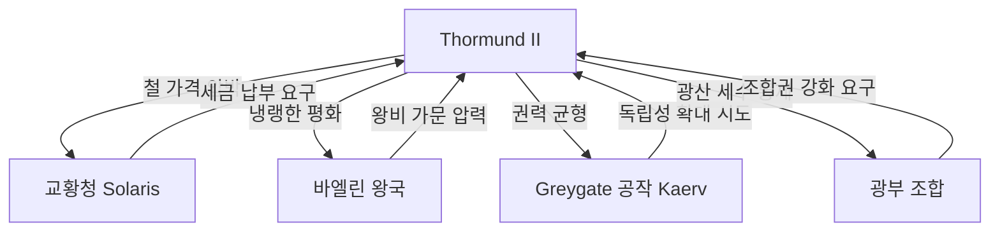

# Thormund II (소르문드 2세) — 현 탈로스 왕

## 원전 인용 증명

### [필독 1] founding_2026-04-22.md:58-60
> "광산 수익 덕분에 군사력 유지 — 대왕국 규모에 걸맞은 독립성 유지 / 바엘린과의 경계 분쟁은 공식 해결됐으나 암묵적 긴장 지속 / 교황청 세금 납부량이 광산 생산량과 연동 — 내정 핵심 갈등"
— founding (현 왕이 직면한 내정 구조)

### [필독 2] power_hierarchy_2026-04-22.md:84-87
> "Thaloss (북부 산맥) / 철·구리 광산 독점 / 철 공급 레버리지로 반독립적 태도 / 1위 (자원 최강)"
— Thaloss 권력 위상 = 현 왕의 외교 기조

### [필독 3] war_thaloss_vaelin_perspective_2026-04-22.md:62-65
> "광산 지대 확보 — 전쟁 전 탈로스 영역 재확인 / 통행권 보장 — 바엘린에 양보한 것이 아닌 평화의 선물 / 교황청 헌납 — 부당한 강요 — 탈로스 내부 불만"
— 15년 전쟁 결과에 대한 탈로스 평가 (왕의 역사 인식 기반)

---

## 요약

Thormund II 는 탈로스 왕국의 현 군주. "철왕 (Iron King)"이라 불리며, 냉철하고 과묵하다. 선왕 Thormund I 의 15년 전쟁 유산을 이어받아, 바엘린과의 암묵적 긴장 속에서 광산 패권을 지키는 것이 최우선 과제. 교황청의 세금 압박에는 철 가격 조정으로 응수하는 실용 외교를 구사한다.

---

## 기본 정보

| 항목 | 내용 |
|------|------|
| 이름 | Thormund II (소르문드 2세) |
| 칭호 | 철왕 (Iron King) · Eisenkönig |
| 나이 | 약 48세 (추정 · 대표님 미확정) |
| 체형 | 광부 체형 — 넓은 어깨·두꺼운 손 · 왕이지만 직접 광산 시찰 |
| 성격 | 냉철·실용·과묵 · 허례허식 혐오 |
| 가문 | Krauss 가 (광부 왕조) |
| 왕비 | Aelindra (바엘린 왕가 출신 — 정략혼) |
| 자녀 | 왕세자 Aldren · 왕녀 Solvane · 왕자 Ragnar |

---

## 성격·통치 스타일

| 항목 | 내용 |
|------|------|
| 통치 철학 | "광맥이 마르면 왕국도 마른다" — 자원 관리 최우선 |
| 외교 방침 | 철 가격을 외교 무기로 활용 · 공개 갈등 회피 |
| 교황청 관계 | 표면상 순종 · 실질 저항 (세금 납부 지연·철 가격 조정) |
| 바엘린 관계 | 냉랭한 평화 · 왕비 Aelindra 를 통한 상징적 연결 유지 |
| 귀족 통제 | Greygate 공작 Varn 과의 권력 균형이 핵심 내정 축 |
| 군사 방침 | 방어 우선 · 먼저 공격 안 함 · 고개 봉쇄로 협박 |

---

## 현재 핵심 갈등

---

## 외형·복장

- 왕관: 철 망치 4개를 형상화한 철제 왕관 — 금왕관 사용 안 함
- 복장: 두꺼운 모피 코트 + 철 장식 혁대 · 예식 시에만 은색 갑옷
- 손: 항상 두터운 장갑 착용 (광산 시찰 습관)
- 특이점: 식사 중에도 회의 진행 — 시간 낭비 혐오

---

## Rev.3 서사 접점

- Act 1: 주인공이 탈로스 왕국 통과 시 철문 앞에서 신분 확인 — "이 나라는 쓸모 없는 자를 환영하지 않는다"
- Act 2: 교황청 vs 탈로스 철 공급 위기 시 왕의 결정이 서사에 영향
- Act 3: 종족 갈등 구도에서 Thormund 의 선택 (인간 연합 vs 중립 vs 종족 공존) — 대표님 미확정

---

## 대표님 미확정

- 정확한 나이·통치 기간
- 바엘린 왕과의 개인적 관계 (적대적 vs 냉담한 존중)
- 마족 문제에 대한 인식 수준
- 종국적으로 서사 어느 편에 서는지

## 다음 Wave 의존

- Wave 5 Chronicler: 즉위 연대기 기록
