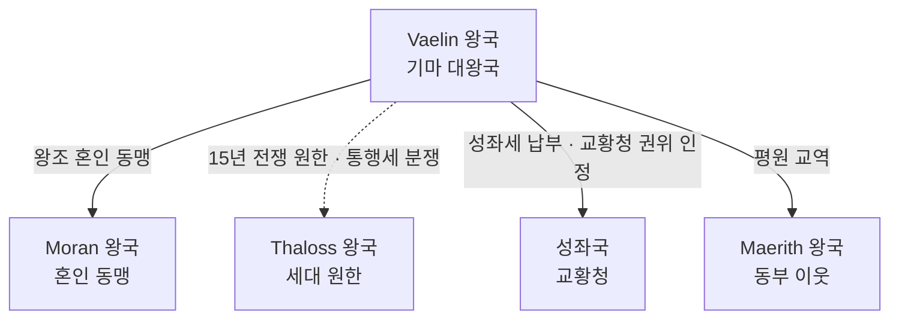

# Kingdom of Vaelin (바엘린 왕국) — 전체 개요 인덱스

## 원전 인용 증명

### [필독 1] political_divisions.md:53
> "바엘린 / Vaelin / 북부 평원"
— 위치 확정

### [필독 2] political_divisions.md:109
> "Havren / 하브렌 / 북서 해안 / 모란·바엘린 왕국"
— Vaelin 소속 권역 확정

### [필독 3] economic_clusters_2026-04-22.md (C3 항목)
> "C3 북서 해양 클러스터 / Havren / Moran·Vaelin / 해안 어업·북부 곡물·군마 / 군마 공급 (Vaelin) + 해안 방어항"
— Vaelin 경제 클러스터 확정

### [필독 4] kingdom_vaelin_territories_2026-04-22.md:71 (공작령 5개)
> "Duchy of Vaelmark / 왕도 인근 중앙 평원 / Duchy of Greyford / Greygate Pass 남부 진입로 / Duchy of Mornhaven / Mornwell 강 상류 / Duchy of Elorfeld / Eloryn 강 상류 유역 / Duchy of Plainwatch / 북부 대초원 동쪽"
— 공작령 5개 확정

### [필독 5] founding_2026-04-22.md:37
> "*초원의 늑대가 한 전사를 왕으로 인정했을 때, 그의 이름이 바엘린이 되었다.*"
— 건국 전설 원문

### [필독 6] war_northern_vaelin_thaloss_2026-04-22.md:25
> "바엘린과 탈로스 간의 가장 길고 격렬했던 국경 전쟁. Norvend 산맥 동쪽 광산 지대와 북방 광산로 통제권을 둘러싸고 15년간 지속되었다."
— 대 Thaloss 15년 전쟁 확정

### [필독 7] _shared_briefing.md:86–89
> "세계관 철학 3조 — 불완전성·한결같음·영혼 평등"
— 전체 설계 철학 적용

---

## 요약

**Kingdom of Vaelin (바엘린 왕국)**은 Elucia 북부 평원 Havren 권역 전역을 장악하는 **대왕국** (~200~270K km²)이다. 기마 기사 문화·게르만·스칸디 풍 전통을 기반으로 하며, 대륙 최대 군마 공급처이자 북부 방어 기지다. Thaloss 와의 15년 전쟁 이후 세대 원한이 지속되고, Moran 과 긴밀한 혼인 동맹을 유지한다.

---

## 1. 왕국 기본 정보

| 항목 | 내용 |
|------|------|
| 영문명 | Kingdom of Vaelin |
| 한글명 | 바엘린 왕국 |
| 위치 | 북부 평원 · Havren 권역 |
| 규모 | 대왕국 (~200~270K km²) |
| 왕도 | **Vaelthorn (바엘손)** |
| 현 왕 | **Aldric Vaen** (알드릭 바엔) |
| 현 왕비 | **Selene Vaen née Moran** (셀렌 바엔, 출신 Moran) |
| 왕조 | **House Vaen** (바엔 왕가) — 건국 왕조 연속 (추정) |
| 접경 | 북 Thaloss / 서 Moran / 남 성좌국 / 동 Maerith |
| 경제 클러스터 | C3 북서 해양 (군마·북부 곡물) |
| 문명 성격 | 게르만·스칸디 기마 문화 + 중세 기사도 |
| 군제 | 징병제 + 기마 기사 (엘리트) · 기마 궁수 · 창병 |
| 문장 | 은색 바탕 · 청색 군마 + 창 교차 |

---

## 2. 왕국 핵심 구조

### 공작령 5개

| # | 공작령 | 위치 | 지배 가문 |
|---|--------|------|----------|
| 1 | **Duchy of Vaelmark** | 왕도 인근 중앙 평원 | House Vaen (왕가 직할) |
| 2 | **Duchy of Greyford** | Greygate Pass 남부 | House Greyfen |
| 3 | **Duchy of Mornhaven** | Mornwell 강 상류 | House Mornael |
| 4 | **Duchy of Elorfeld** | Eloryn 강 상류 | House Eloryn |
| 5 | **Duchy of Plainwatch** | 북부 대초원 동쪽 | House Brann |

### 백작령 총수 (추정)
24~30개 — Wave 4 상세 설계 반영

---

## 3. 파일 인덱스

### 개요 & 지도
- `00_overview.md` (이 파일)
- `capital_map_2026-04-22.md`

### 왕족 `royals/`
| 파일 | 인물 |
|------|------|
| `king_aldric_vaen_2026-04-22.md` | 현 왕 알드릭 바엔 |
| `queen_selene_vaen_2026-04-22.md` | 왕비 셀렌 바엔 |
| `crown_prince_edric_vaen_2026-04-22.md` | 왕세자 에드릭 바엔 |
| `prince_corvin_vaen_2026-04-22.md` | 왕자 코르빈 바엔 |
| `princess_lyra_vaen_2026-04-22.md` | 공주 리라 바엔 |
| `previous_king_halvard_vaen_2026-04-22.md` | 선왕 할바르드 바엔 |

### 고위 귀족 `nobles/`
| 파일 | 인물 |
|------|------|
| `duke_greyford_greyfen_2026-04-22.md` | Greyford 공작 |
| `duke_plainwatch_brann_2026-04-22.md` | Plainwatch 공작 |
| `duke_mornhaven_mornael_2026-04-22.md` | Mornhaven 공작 |
| `count_elorfeld_eloryn_2026-04-22.md` | Elorfeld 백작 |
| `count_vaelmark_vethric_2026-04-22.md` | Vaelmark 백작 |

### 가문 `houses/`
| 파일 | 가문 |
|------|------|
| `house_vaen_2026-04-22.md` | 바엔 왕가 |
| `house_greyfen_2026-04-22.md` | 그레이펜 공작 가문 |
| `house_brann_2026-04-22.md` | 브란 공작 가문 |
| `house_mornael_2026-04-22.md` | 모른아엘 공작 가문 |

### 기사단 `orders/`
| 파일 | 기사단 |
|------|--------|
| `order_silver_steed_2026-04-22.md` | 은빛 군마단 |
| `order_northwind_2026-04-22.md` | 북풍 기사단 |
| `order_ironlance_2026-04-22.md` | 철창 기사단 |

### 문화·체제
- `heraldry_2026-04-22.md` · `military_2026-04-22.md` · `clothing_2026-04-22.md`
- `cuisine_2026-04-22.md` · `architecture_2026-04-22.md` · `dialect_2026-04-22.md`

### 축제 `festivals/`
- 춘계 군마 점검제 · 북풍제 · 수확 감사제 · 초대 왕 기념일

### 도로 `roads/`
- 왕도→Greyford · 왕도→Mornhaven · 왕도→Plainwatch · 왕도→Elorfeld · 국경 순찰로

### 마을 `villages/`
- Toponymist 기존 3개 + Wave 4 신규 15개 = 총 18개

---

## 4. 주요 관계 (외교)

---

## 대표님 미확정 사항

- 백작령 24~30개 개별 이름 (Wave 4 작업 가설)
- 왕도·공작령 정확 인구 통계
- 현 왕의 성향 (강경파 vs 온건파) 최종 확정

## 다음 Wave 의존 포인트

- **Wave 5 Chronicler**: 건국 전설 문헌화 · 15년 전쟁 서사 편년
- **Wave 5 World-Integrator**: Vaelin-Moran-Thaloss 삼각 관계 전체 그래프 통합

<!-- auto-generated-related:start -->
## 🔗 관련 (auto-generated)

> `scripts/obsidian/build_backlinks.py` 로 자동 생성. 수정 금지 — 다음 실행 시 덮어쓰여집니다.

### ⬆️ 상위

- [[../../../../../MOC]] — wiki 루트
- [[../../MOC]] — Elucia 허브

<!-- auto-generated-related:end -->
