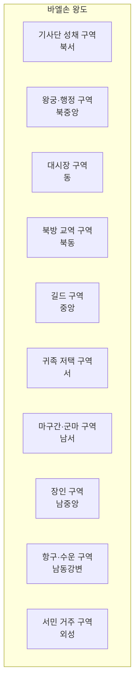

# Vaelthorn (바엘손) — 왕도 상세 지도

## 원전 인용 증명

### [필독 1] city_vaelthorn_2026-04-22.md (Toponymist Wave 2)
> "북부 Vaelin 평원 중앙에 위치한 기마 왕국의 수도. Mornwell 강 상류와 Eloryn 강 지류가 만나는 지점. 광활한 평원에 어울리는 개방적이고 강인한 도시."
— Toponymist 확정 위치

### [필독 2] city_vaelthorn_2026-04-22.md (랜드마크)
> "기사단 성채 / 왕궁 (기마 광장 면함) — 왕이 기마로 접견 전통 / 북방 교역소 / 말 시장 — 대륙 최대 규모 (추정)"
— 주요 랜드마크 확정

### [필독 3] economic_clusters_2026-04-22.md:C3항목
> "군마 공급 (Vaelin) + 해안 방어항 / 경제 약점: 북방 한기 → 농업 생산성 제한"
— 경제 특화 반영

---

## 요약

**Vaelthorn (바엘손)**은 Vaelin 왕국의 수도. 인구 약 38,000~52,000. Mornwell 강과 Eloryn 지류의 합류점 완만한 구릉 위에 위치한다. 도시 전체가 기마 문화 중심으로 설계되어 있으며, 넓은 기마 광장·말 시장·기사단 성채가 핵심 랜드마크다. 방어형 요새 성벽 + 실용성 중심의 도시 구획이 특징.

---

## 1. 도시 기본 정보

| 항목 | 내용 |
|------|------|
| 위치 | Vaelin 평원 중앙 구릉 · 두 강 합류점 |
| 인구 | 약 38,000~52,000 (추정) |
| 둘레 | 성벽 외주 약 12km (추정) |
| 입지 | 완만한 구릉 위 도성 + 강 방어 남측 |
| 기후 | 북부 한대 온대 · 겨울 혹독 · 여름 짧고 강건 |
| 분위기 | 화려함보다 강건함 · 기사단 행진이 일상 · 말 냄새와 쇠 소리 |

---

## 2. 지구 구획 (10개 지구)

| # | 지구명 | 위치 | 주요 기능 | 분위기 |
|---|--------|------|---------|--------|
| 1 | **기사단 성채 구역** (Steelward) | 북서 내성 | 은빛 군마단 본부 · 훈련장 | 철갑 병사들의 거주 공간 · 엄격하고 조용 |
| 2 | **왕궁·행정 구역** (Thornkeep) | 북중앙 고지 | 왕궁 · 의회당 · 왕실 마구간 | 장대한 석조 · 기마 광장 면함 |
| 3 | **대시장 구역** (Ironmarket) | 동쪽 | 대상 집결 · 북방 교역품 거래 | 분주 · 다국적 상인 · 소음 |
| 4 | **북방 교역 구역** (Nordgate Row) | 북동 성문 인근 | Thaloss·Norvend 방향 대상 | 모피·광석 창고 즐비 |
| 5 | **길드 구역** (Guildward) | 중앙 | 대장장이·안장공·마제사 길드 | 쇠 두드리는 소리 종일 |
| 6 | **귀족 저택 구역** (Noblecroft) | 서쪽 | 공작·백작 상경 저택 | 석조 저택 · 내정 정원 작음 |
| 7 | **마구간·군마 구역** (Stableyard) | 남서 | 말 시장 · 대규모 마구간 | 대륙 최대 말 거래 · 분주 |
| 8 | **장인 구역** (Craftholm) | 남중앙 | 가죽 갑옷·모피 가공 | 가죽 냄새 강함 · 실용적 |
| 9 | **항구·수운 구역** (Rivergate) | 남동 강변 | Eloryn 지류 수운 창고 | 물화 하역 · 소금·곡물 이동 |
| 10 | **서민 거주 구역** (Outerwall) | 외성 전체 | 평민 주거 · 소규모 상점 | 목조 주택 · 난방 연기 |

---

## 3. 주요 랜드마크 상세

### 3-1. 왕궁 — Thornkeep Palace
- 석조 + 목조 혼합 · 방어 성채 겸 거주 궁
- **기마 광장 (Stallion Square)**: 왕이 기마로 귀족·신하를 접견하는 전통 공간. 분수 대신 말 조각상
- 왕실 마구간 — 왕가 직속 명마 50두 이상 상시 보유 (추정)

### 3-2. 은빛 군마단 성채 — Silverstead Citadel
- 내성 북서 · 독립 성벽 보유
- 기사단 훈련장 · 의식장 · 무기고 통합
- 기사 서임식 장소 — 왕이 직접 기마로 입장해 검을 수여

### 3-3. 말 시장 — Grand Stableyard
- 남서 구역 전체 · 대륙 최대 규모 군마 거래 (추정)
- 춘계 군마 점검제 (왕국 최대 축제) 중심지
- 주요 수출 품목: 전투마 · 경주마 · 짐마

### 3-4. 대성당 — Cathedral of the Veilward
- 왕궁 옆 · 교황청 감독 소속 · 규모 중간 (제국 대성당 대비 소형)
- Vaelin 왕국의 교황청 종속 형식 유지 공간
- 양심파 사제 1~2명 은밀 주재 (추정 · Q-CORE 2 간접 단서)

### 3-5. 북방 교역소 — Nordgate Emporium
- 북동 성문 인근 · Thaloss·Norvend 대상 거점
- 광석·모피·약초·주조 철기 교역
- 통행세 분쟁 시 봉쇄 1순위 거점

---

## 4. 성벽 체계

| 층 | 명칭 | 특징 |
|----|------|------|
| 내성 (1층) | Thornwall | 왕궁·성채 보호 · 두께 4~5m 석조 |
| 외성 (2층) | Ironwall | 시가지 전체 포함 · 이중 문루 |
| 북문 | Nordgate | Greygate·Norngard 방면 주관문 |
| 남문 | Rivergate | 성좌국·Elorfeld 방면 |
| 서문 | Morngate | Moran·Mornhaven 방면 |
| 동문 | Plaingate | Maerith·초원 방면 |

---

## 5. 도시 경제

| 산업 | 규모 | 비고 |
|------|------|------|
| 군마 거래 | 대륙 최대 (추정) | 연 수천 두 · 성좌국·남부 수출 |
| 북방 교역 허브 | 중상 | 광석·모피·곡물 |
| 기사단 장비 제조 | 중 | 안장·갑옷·마제 |
| 서민 농업 | 소 | 외성 텃밭·소규모 축산 |

---

## 대표님 미확정 사항

- 대성당 이름 최종 확정
- 기마 광장 규모 (조각상 수·배치)
- 인구 정확치

## 다음 Wave 의존 포인트

- **Wave 5 Chronicler**: 왕도 건국 연대기 · 도시 성장 역사
- **Wave 5 World-Integrator**: 대륙 교역망 지도에서 Vaelthorn 허브 기능 통합
