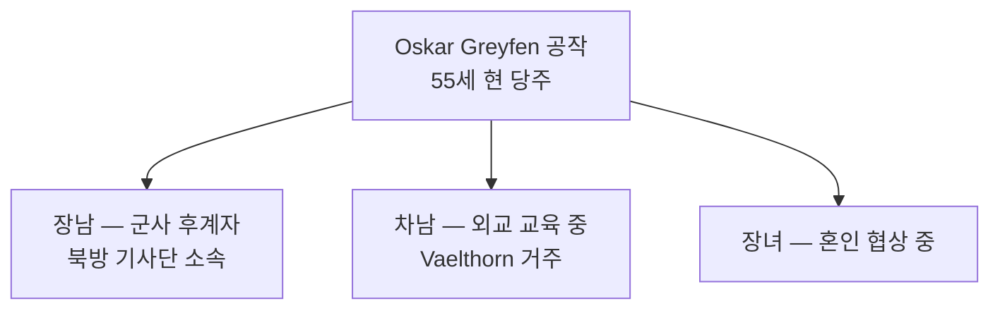

# House Greyfen (그레이펜 가문) — Greygate 방어 명문

## 원전 인용 증명

### [필독 1] historical_enmity_thaloss_vaelin_greygate_2026-04-22.md:54
> "~300년 전: 제1차 Greygate 전쟁 (Vaelin 돌파 시도) → Thaloss 요새 방어 성공, Vaelin 다수 사상"
— 그레이펜 선조가 이 전투를 지휘했다는 배경 (추정)

### [필독 2] war_northern_vaelin_thaloss_2026-04-22.md:50
> "12년차: 바엘린 주력 기사단 산악 매복으로 큰 피해"
— 그레이펜 가문 전사자 배경

---

## 요약

그레이펜 가문은 Greygate Pass 수비 300년 역사를 가진 Vaelin 최고 명문 귀족. Thaloss 와의 모든 전쟁에서 최전방을 담당했으며, 가문 묘역이 Norngard 성채 내에 있다. 15년 전쟁에서 큰 피해를 입어 현재 병력이 절반 수준으로 줄었지만 자존심만큼은 왕가에 뒤지지 않는다.

---

## 가문 기본 정보

| 항목 | 내용 |
|------|------|
| 가문명 | House Greyfen |
| 문장 | 회색 바탕 · 검은 늑대 + 장성 벽 |
| 가훈 | *"Stein und Blut" — "돌과 피"* (추정 · 게르만풍) |
| 본거지 | Greyford 성채 (Greygate Pass 남부 주요 요새) |
| 경제 기반 | Greygate 통행세 (Vaelin 몫) · 군사 지원금 |
| 현 당주 | Oskar Greyfen (55세) |
| 혼인 정책 | 주로 Vaelin 북부 귀족 간 혼인 · Thaloss 거부 |

---

## 가문 역사 핵심 사건

| 시기 | 사건 |
|------|------|
| 약 300년 전 | 선조 Greyfen 1세, 제1차 Greygate 전쟁 최전선 지휘 → 돌파 실패, 전사 |
| 약 80년 전 | Thaloss 봉쇄 대기근 → 그레이펜 영지 아사자 발생 · 가문 원한 극점 |
| 15년 전쟁 | 주력 기사단 파견 → 산악 매복으로 가문 병력 40% 손실 |
| 현재 | 병력 재건 중 · 전쟁파 귀족 연합의 실질 중심 |

---

## 가문 인물 관계

---

## 대표님 미확정 사항

- 장남·차남·장녀 이름
- 전사자 구체 수

## 다음 Wave 의존 포인트

- **Wave 5 Chronicler**: 그레이펜 가문 전쟁 기록 편년

<!-- auto-generated-related:start -->
## 🔗 관련 (auto-generated)

> `scripts/obsidian/build_backlinks.py` 로 자동 생성. 수정 금지 — 다음 실행 시 덮어쓰여집니다.

### ⬆️ 상위

- [[../../../../../../MOC]] — wiki 루트
- [[../../../MOC]] — Elucia 허브

<!-- auto-generated-related:end -->
