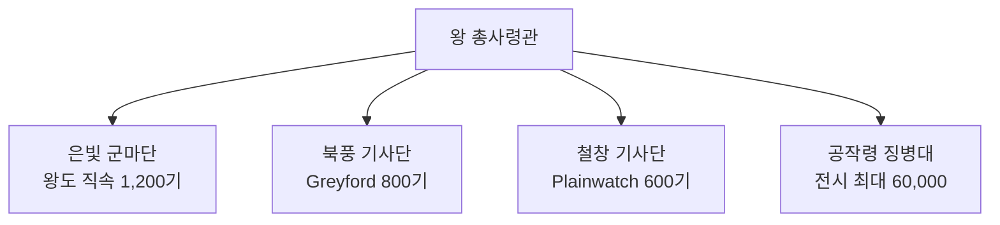

# Vaelin 왕국 군제 (Military System)

## 원전 인용 증명

### [필독 1] brainstorm_2026-04-21_worldview_expansion.md (발언 5)
> "서쪽은 징병제가 발달한 중세 유럽 스타일 봉건국가들 ... 대규모 보병 · 기사 엘리트 장교"
— 징병제 + 기사 엘리트 구조 확정

### [필독 2] founding_2026-04-22.md:75
> "Vaelin 은 현재 10 왕국 중 군사력이 가장 강한 왕국 중 하나로 평가된다."
— 군사력 위상 확정

---

## 요약

Vaelin 군제는 **징병제(봉건 의무) + 기마 엘리트 기사** 이중 구조. 전쟁 시 각 공작·백작령이 의무 병력을 징집해 왕국 본진에 합류한다. 평시에는 기사단 3개와 상비 보병이 왕도·요새를 지킨다.

---

## 1. 군사 조직 구조

---

## 2. 병종 구성

| 병종 | 비율 | 특성 |
|------|------|------|
| 기마 중창병 (Heavy Lance) | 15% | 돌파·충격 핵심 |
| 기마 궁수 (Horse Archer) | 20% | 전장 이동 사격 |
| 기마 경기병 (Light Cavalry) | 10% | 정찰·추격 |
| 중장 보병 창병 (Spear Levy) | 35% | 징집 주력 |
| 경보병 활병 (Archer Levy) | 20% | 징집 보조 |

---

## 3. 징병제 운용

| 단계 | 내용 |
|------|------|
| 평시 | 기사단 3개 + 왕도·요새 상비 5,000 |
| 경계 | 공작령 의무 1/4 징집 (약 15,000) |
| 전시 | 전면 징집 (약 50,000~70,000, 추정) |

**징집 의무**: 18~40세 남성 · 평민 6개월 훈련 의무

---

## 4. 기마 병종 강점

Vaelin 군마가 대륙 최고 품질이기 때문에 기마 부대 유지 비용 대비 효율이 최고. 타 왕국 대비 기마 병종 비율 약 1.5배.

---

## 5. 군사 약점

| 약점 | 내용 |
|------|------|
| 산악 전투 | 15년 전쟁 매복 = 약점 증명됨 |
| 해상 전투 | 해군 없음 · Moran 의존 |
| 공성 능력 | 요새 공격보다 야전 특화 |

---

## 6. 15년 전쟁 이후 개혁 (현재 진행 중)

- 산악 기동 훈련 교범 도입
- 기마 궁수 비율 확대
- 북풍 기사단 정찰 반경 확장

---

## 대표님 미확정 사항

- 전시 총 병력 확정
- 타 왕국 대비 군사 순위 확정

## 다음 Wave 의존 포인트

- **Wave 5 Chronicler**: 군사 개혁 편년
