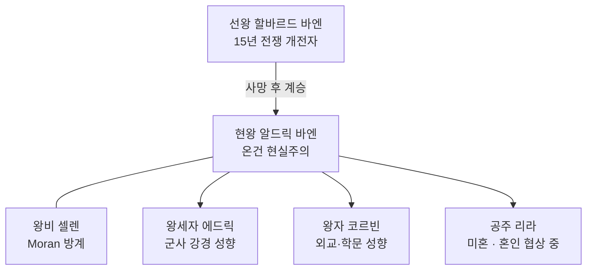

# King Aldric Vaen (알드릭 바엔) — Vaelin 현 왕

## 원전 인용 증명

### [필독 1] founding_2026-04-22.md:37
> "*초원의 늑대가 한 전사를 왕으로 인정했을 때, 그의 이름이 바엘린이 되었다.*"
— 건국 전설 · 왕가 정체성 기반

### [필독 2] war_northern_vaelin_thaloss_2026-04-22.md:36
> "바엘린 왕이 군사력을 믿고 강경 대응을 선택했다는 분석."
— 선왕 치세 군사 강경 전통 → 알드릭 현재 온건 전환 동기

### [필독 3] marriage_vaelin_moran_2026-04-22.md:37
> "Vaelin·Moran 혼인 동맹은 북부 3국 동맹에서 가장 긴밀한 양자 축이다(추정). ... 현재 왕대에도 방계 왕족 간 혼인이 진행 중이다(추정)."
— 현 왕 혼인 정책 배경

---

## 요약

알드릭 바엔은 Vaelin 왕국 제17대 왕 (추정). 나이 48세 (추정). 선왕 할바르드의 군사 강경 노선에서 벗어나 실용 외교를 중시하나, 기사 전통과 왕국 자존심을 포기하지 않는다. 탈로스와의 세대 원한을 마음에 품으면서도 현재는 교황청 중재 조약을 유지하는 현실주의자.

---

## 인물 기본 정보

| 항목 | 내용 |
|------|------|
| 이름 | Aldric Vaen (알드릭 바엔) |
| 호칭 | "기마왕 (The Stallion King)" (비공식) |
| 나이 | 48세 (추정) |
| 외모 | 장신 · 근육질 · 회갈색 머리 · 전장 흉터 왼쪽 뺨 · 회색빛 눈 |
| 성격 | 냉정한 현실주의자 · 공개석상 과묵 · 기사 앞 카리스마 · 내심 깊은 세대 원한 보유 |
| 관심사 | 군마 사육 · 기사 훈련 교범 작성 · 북부 동맹 외교 |
| 즉위 연도 | 본편 22년 전 (추정) · 나이 26세 즉위 |
| 배우자 | Selene Vaen (출신 Moran 왕가 방계) |

---

## 통치 기조

| 영역 | 기조 |
|------|------|
| 대 Thaloss | 교황청 중재 조약 유지 · 통행세 재협상 시도 중 |
| 대 Moran | 혼인 동맹 강화 · 북부 3국 동맹 중심축 유지 |
| 대 성좌국 | 성좌세 납부 유지 · 교황청 간섭 최소화 외교 |
| 군사 | 기사단 현대화 · 기마 궁수 병종 강화 |
| 국내 | 대영주 자율 보장 · 중앙 집권보다 협력 통치 |

---

## 역사적 부담 — 선왕의 전쟁 유산

선왕 할바르드가 Thaloss 와의 15년 전쟁을 일으켰고 결국 영토 손실로 끝난 사실이 알드릭의 정치적 원죄처럼 작용한다. 즉위 초 온건파 귀족들의 지지를 받았으나, 전쟁파 강경 귀족들이 "약한 왕"이라 비판. 내부 권력 균형이 현재도 진행 중.

---

## Rev.3 서사 접점

- Act 1: 주인공이 Vaelthorn 방문 시 기마 광장 접견 — 왕의 위용과 피로 동시 묘사 가능
- Act 2: Thaloss 통행세 위기 → 알드릭의 선택 (전쟁 재개 vs 굴욕적 협상) = 정치 서브플롯
- Act 3: 북부 동맹 붕괴 시 알드릭이 성좌국 편으로 기울 가능성 (왕국 생존 우선)

---

## 왕족 관계도

---

## 대표님 미확정 사항

- 즉위 연도·나이 최종 확정
- 교황청과의 충성 관계 세부
- 전쟁파 귀족 대표 인물

## 다음 Wave 의존 포인트

- **Wave 5 Chronicler**: 즉위 과정·선왕 전쟁 유산 편년
- **Wave 5 World-Integrator**: 북부 3국 동맹 균열 그래프 연동

<!-- auto-generated-related:start -->
## 🔗 관련 (auto-generated)

> `scripts/obsidian/build_backlinks.py` 로 자동 생성. 수정 금지 — 다음 실행 시 덮어쓰여집니다.

### ⬆️ 상위

- [[../../../../../../MOC]] — wiki 루트
- [[../../../MOC]] — Elucia 허브

<!-- auto-generated-related:end -->
