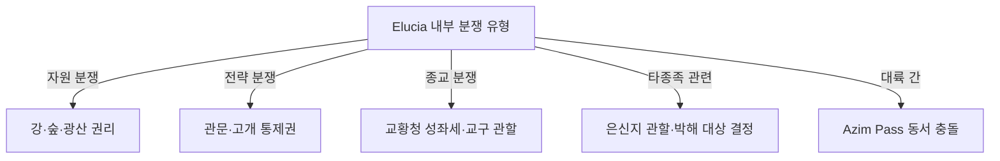

# Elucia 국경 분쟁 지역·완충지대

## 원전 인용 증명

### [필독 1] brainstorm_2026-04-21_worldview_expansion.md:176 (발언 5)
> "이 섬을 놓고 자주싸운다. 좌우대륙이."
— 발언 5, brainstorm_2026-04-21_worldview_expansion.md:176 (Elucia 내부도 왕국 간 분쟁 가능성 직접 시사)

### [필독 2] brainstorm_2026-04-21_worldview_expansion.md:237 (발언 6)
> "북쪽에는 초고대문명의 유산과 응축된 마석이 매우 많이 매장되어있어 동서대륙간 중앙 작은섬을 차지하려 전쟁중"
— 발언 6, brainstorm_2026-04-21_worldview_expansion.md:237 (자원 분쟁의 근본 원인)

### [필독 3] brainstorm_2026-04-21_worldview_expansion.md:261 (발언 7)
> "좌우 대륙은 같은 신을 믿지만 서로 해석을 달리한다. 서로 적대적이긴하나 하나의 목표는 지성이있는 타 종족 몰살로 오로지 인류를 위한 행성을 목표로한다."
— 발언 7, brainstorm_2026-04-21_worldview_expansion.md:261

### [필독 4] political_divisions.md:22
> "아짐 관문 / Azim Pass / 두 대륙 연결 육로"
— political_divisions.md:22

### [필독 5] FAILURES.md:56–70 (FAIL-002)
> "대표님 원안이 짧거나 기술적 설정일 때 나베랄 감마·NotebookLM 둘 다 그 빈 자리를 '철학적 깊이·서사적 정당화·논리적 완결성'으로 채우려는 체계적 경향."
— FAILURES.md:62–64

### [필독 6] _shared_briefing.md:96–102 (대표님 미확정 요소)
> "대표님 미확정 요소 (모호 보존·침범 금지): 북쪽 얼음섬 내용물 — 빈 공간 유지"
— _shared_briefing.md:98

### [필독 7] game_setting_complete_2026-04-21.md:64–69 (불완전성 원칙)
> "모든 존재는 완벽하지 않다."
— game_setting_complete_2026-04-21.md:64–69

---

## 요약

Elucia 내부 왕국 간 **국경 분쟁** 은 자연 경계가 불명확한 평원 지대와 가치 있는 자원 지대에서 주로 발생한다. 고개 통행세·강 수운권·삼림 경계가 3대 분쟁 원인이다. 또한 Azim Pass 통제권은 Novas 왕국과 Karzor (Sabin 자치구) 사이의 대륙 간 분쟁 핵심이다. 아래 항목은 모두 **(추정·작업 가설)** 이며 대표님 확정 전까지 변경 가능하다.

---

## 1. 주요 분쟁 지역 목록

| # | 지역명 | 위치 | 분쟁 당사자 | 분쟁 원인 | 현상태 (추정) |
|---|-------|------|-----------|---------|------------|
| 1 | **Greygate 관문 통행세 분쟁** | Norvend Greygate Pass 일대 | Thaloss vs Vaelin·Moran | 고개 통행세 독점 vs 자유 통행 요구 | 교황청 중재 조약 · 불안정 평화 (추정) |
| 2 | **Eloryn 강 좌안·우안 분쟁** | Eloryn 강 중상류 경계 구간 | Vaelin vs 성좌국 | 강 어느 안이 경계인지 + 어업권·관개권 | 주기적 소규모 충돌 (추정) |
| 3 | **Mornwell 강 상류 분쟁** | Morncliff Spine 동사면~하류 | Moran vs Vaelin | 강 상류 수량 분배·광물 수송권 | 동맹국 간 협상 중 (추정) |
| 4 | **Soranth 강 중류 분쟁** | Soranth 강 Oryn·Sylren 통과 구간 | Oryn vs Sylren | 삼림 벌목권·수운 우선권 | 성좌국 중재 요청 상태 (추정) |
| 5 | **Azim Pass 통제권** | 대륙 남단 Azim Pass | Novas (Elucia) vs Karzor Sabin 자치구 | 육로 통행세 독점 | 활발 긴장·소규모 군사 충돌 (추정) |
| 6 | **Deepsilvan 숲 경계** | Ilaris·성좌국 동부 접경 삼림 | Ilaris vs 성좌국 | 삼림 벌목 영역·타종족 은신지 관할 | 모호한 경계 유지 · 사실상 Ilaris 통제 (추정) |
| 7 | **Aldric 호수 소도 귀속** | Lonwyn Basin 내 무인 소도 | Aldric vs Ceren | 호수 섬 어업권·무인 섬 귀속 | 비공식 분할 · 비정기 충돌 (추정) |

---

## 2. 완충지대 (Buffer Zone)

왕국 간 경계가 명확히 조약화되지 않아 사실상 **어느 왕국도 완전 통제 못 하는** 지역이다.

| 완충지대명 | 위치 | 성격 |
|---------|------|------|
| **Norvend 남부 기슭 완충대** | Thaloss·Vaelin·성좌국 삼중 접경 | 3국 접경 · 실질 Thaloss 지배 but 미조약 (추정) |
| **Orenwald 북부 경계 완충대** | Oryn·Maerith 접경 삼림 | 삼림 경계 모호 · 타종족 은신 지형 (추정) |
| **Ceren·Aldric 습지 경계** | Loravel Wetlands 남부 | 습지 특성상 경계 획정 불가 · 어업 조합이 사실 관리 (추정) |
| **Azim Pass 중간 지대** | Novas 남단~Pass 중간부 | Elucia·Karzor 어느 쪽도 완전 통제 않는 교역 완충 (추정) |

---

## 3. 분쟁 분류

---

## 4. 교황청 중재 역할 (추정)

성좌국 교황청은 왕국 간 분쟁에서 **중재자** 역할을 한다. 그러나 교황청 자신도 이해관계자(성좌세 수입·교구 영역)이므로 중재의 공정성에 의구심이 있다. 발언 7 에 따라 모든 왕국이 공통 종교를 공유하나 해석을 달리하므로, 교황청의 종교적 권위는 분쟁 중재력의 원천이자 새 분쟁 원인이기도 하다.

---

## 대표님 미확정 사항

- 분쟁 지역들의 공식 조약 체결 여부·내용
- 현재 진행 중인 분쟁 vs 해결된 분쟁
- Azim Pass 분쟁의 현재 군사 긴장 수위
- 교황청 중재 실효성 (왕들이 얼마나 따르는가)

---

## 다음 Wave 의존 포인트

- **Diplomat (Wave 3)**: 분쟁 지역별 현재 조약·협약·긴장 상태 상세
- **Historian (Wave 3)**: 분쟁의 역사적 경과·주요 전쟁 사건
- **Kingdom-Detailer × 해당 왕국 (Wave 4)**: 각 왕국 시각의 분쟁 서술
- `borders_natural_2026-04-22.md` 와 함께 읽을 것
