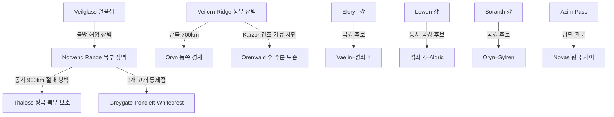

# Elucia 자연 국경 체계

## 원전 인용 증명

### [필독 1] brainstorm_2026-04-21_worldview_expansion.md:176 (발언 5)
> "이게 내가 그린맵, 내가 보는방향에서 좌측이 서구중세문명 ... 하늘색이 강인데, 보시다시피 좌측은 강이 많고 풍요로움"
— 발언 5, brainstorm_2026-04-21_worldview_expansion.md:176 (강이 자연 국경의 핵심임을 직접 확인)

### [필독 2] mountain_ranges_2026-04-22.md:50–59
> "Norvend Range (노르벤드 산맥) — 주맥 1 / 동서 주행, 대륙 북부 횡단 / ~900 km / 역할: 북부 한기 차단, 서쪽 강 발원지, 북쪽 Veilglass 방향 접근 장벽"
— mountain_ranges_2026-04-22.md:50–59

### [필독 3] mountain_ranges_2026-04-22.md:80–92
> "Veilorn Ridge (그레이베일 릉) — 주맥 2 / 남북 주행, 대륙 동쪽 경계 / ~700 km / 역할: Karzor 방향 건조 기류 차단, Orenwald 숲 수분 보존, 동부 경계"
— mountain_ranges_2026-04-22.md:80–92

### [필독 4] rivers_major_2026-04-22.md:53–58
> 6대 하천 (Eloryn·Auravel·Lowen·Mornwell·Soranth·Duskway) 목록 — 각 하천의 왕국 통과 경로 확인
— rivers_major_2026-04-22.md:53–58

### [필독 5] political_divisions.md:22
> "아짐 관문 / Azim Pass / 두 대륙 연결 육로"
— political_divisions.md:22

### [필독 6] FAILURES.md:91 (FAIL-003)
> "Bash 도구 안에서 `cd` 금지. 모든 경로는 절대경로로."
— FAILURES.md:91

### [필독 7] _shared_briefing.md:86–90 (Q-CORE 구조)
> "수정 1·2, 마왕, 첫 번째 신 등은 기록된 역사·전설 층위에서 모호하게 등장. 구조적 진실 직접 서술 금지."
— _shared_briefing.md:87–90

---

## 요약

Elucia 의 자연 국경은 **산맥 4개 유형·강 6개·숲 경계** 가 주요 소재다. 가장 강력한 자연 방벽은 북부의 Norvend Range (동서 900km) 와 동쪽의 Veilorn Ridge (남북 700km) 다. 강은 국경 기능을 하되 수운 가치도 겸하므로 분쟁 요인이 되기도 한다.

---

## 1. 산맥·구릉 자연 국경

| 지형명 | 방향 | 국경 기능 | 관련 왕국 |
|-------|------|---------|---------|
| **Norvend Range** | 동서 900km | 북부 절대 장벽 · Thaloss 북쪽 경계 | Thaloss (북방 방어) |
| **Veilorn Ridge** | 남북 700km | 동부 경계 · Karzor 차단 | Oryn (동쪽 경계) |
| **Morncliff Spine** | 북서 해안 350km | 서부 해안 절벽 방어선 | Moran (서쪽 방어) |
| **Loravel Rim** | 서남 구릉 200km | Ceren 내부 지구 분리 | Ceren (내부 경계) |
| **Duskfell Range** | 남동 구릉 300km | Novas 동쪽 완충 | Novas (동부 방어) |
| **Silvan Brow** | 서해안 삼림 220km | Ilaris 내부 숲·평야 분리 | Ilaris (내부 구분) |
| **Aurion Divide** | 중부 구릉 280km | 성좌국 동쪽 완충 | 성좌국 (동쪽 경계) |

---

## 2. 강 자연 국경

| 하천명 | 국경 기능 구간 | 관련 왕국 경계 | 강도 |
|-------|------------|------------|------|
| **Eloryn 강** | 상류: Thaloss·Vaelin 방향 / 중류: 성좌국 내부 / 하류: 성좌국·Ilaris | Vaelin–성좌국 경계 후보 (추정) | **중** |
| **Auravel 강** | 중류: 성좌국·Sylren | 성좌국–Ceren 경계 후보 (추정) | **중** |
| **Lowen 강** | 동서 전 구간: 성좌국·Aldric | 성좌국–Aldric 북쪽 경계 후보 (추정) | **강** (동서 수운 활용) |
| **Mornwell 강** | 하류: Moran 왕국 내부 | Moran·Vaelin 서쪽 경계 후보 (추정) | **중** |
| **Soranth 강** | Oryn·Sylren 경계 구간 | Oryn–Sylren 동부 경계 후보 (추정) | **중** |
| **Duskway 강** | 하류: Novas 남부 | Novas 남쪽 방어선 (추정) | **약** |

> 전부 **(추정)** · 실제 조약 국경선은 Wave 3 Diplomat 확정

---

## 3. 숲 경계

| 숲 이름 | 국경 기능 | 관련 왕국 |
|-------|---------|---------|
| **Silvan** (서해안 숲) | Ilaris 서쪽 평야·해안 구분 완충 | Ilaris 내부 |
| **Orenwald** (동부 숲) | Oryn과 Karzor 방향 완충 — Veilorn Ridge 서쪽 삼림 벨트 | Oryn 동쪽 |

---

## 4. 대륙 전체 자연 국경 배치도

---

## 5. 고개 (Pass) — 자연 장벽의 통제점

| 고개명 | 고도 (추정) | 위치 | 통제 왕국 | 전략 가치 |
|-------|-----------|------|---------|---------|
| **Greygate Pass** | ~1,600m | Norvend 서쪽 1/3 | Thaloss | Vaelin·Moran 접근 주통로 |
| **Ironcleft Pass** | ~2,100m | Norvend 중앙 | Thaloss | 군사 요충 · 겨울 폐쇄 |
| **Whitecrest Saddle** | ~1,900m | Norvend 동쪽 | Thaloss | Maerith 접근로 |
| **Azim Pass** | (미확정) | 대륙 남단 | Novas | 동서 대륙 연결 유일 육로 |

---

## 6. 해안선 자연 경계

| 구역 | 특성 | 통제 왕국 |
|------|------|---------|
| 북부 해안 (Veil Sea) | 암초·몬스터·접근 불가 — 자연 방벽 최강 | — (무인 해역) |
| 서부 해안 | Moran·Ilaris·Ceren·Aldric 접안 | 각 왕국 |
| 남동 해안 | Novas·Duskway 하구 | Novas |
| 남부 Azim Narrows | Karzor 방향 좁은 수로 | Novas 방향 |

---

## 대표님 미확정 사항

- 강 경계선의 어느 쪽 안(岸)이 어느 왕국 영역인지 (좌안/우안 협약)
- 고개 3개 통행세의 국가 간 협약 내용
- Azim Pass 의 Novas–Karzor (Sabin 자치구) 공동 관리 여부

---

## 다음 Wave 의존 포인트

- **Diplomat (Wave 3)**: 강 국경 분쟁 지역 확정·고개 통행 조약 내용
- **Historian (Wave 3)**: 현재 자연 국경이 역사적으로 어떻게 확정됐는지
- **Road-Engineer (Wave 2)**: 고개·강 국경을 활용한 도로망 설계
- `borders_disputed_2026-04-22.md` 와 함께 읽을 것

<!-- auto-generated-related:start -->
## 🔗 관련 (auto-generated)

> `scripts/obsidian/build_backlinks.py` 로 자동 생성. 수정 금지 — 다음 실행 시 덮어쓰여집니다.

### ⬆️ 상위

- [[../../../../MOC]] — wiki 루트
- [[../MOC]] — Elucia 허브

### 🗳️ 형제 정치 문서

- [[autonomous_capitals_central_island_2026-04-22]]
- [[borders_disputed_2026-04-22]]
- [[continent_administration_2026-04-22]]
- [[empire_papal_territories_2026-04-22]]

<!-- auto-generated-related:end -->
