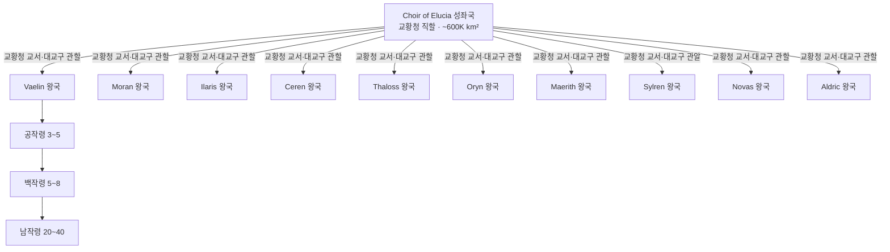

# Elucia 대륙 행정 층위 체계

## 원전 인용 증명

### [필독 1] brainstorm_2026-04-21_worldview_expansion.md:176 (발언 5)
> "이게 내가 그린맵, 내가 보는방향에서 좌측이 서구중세문명, 우측이 이슬람과비슷한 문명 하늘색이 강인데, 보시다시피 좌측은 강이 많고 풍요로움, 우측은 강도별로없고 줄기도 짧아서 물이귀하고 사막이 많음, 하단 주황식은 이어진길이다. , 북쪽은 얼음섬, 중간에 작은섬이있고 빨간색 점이 항구(북쪽얼음섬으로가는 유일한길, 나머지는 갈수가없다. 대륙윗쪽에서는 좌우 모두 물길이 너무험하고 작은 암초가 많아서 불가능, 몬스터도 많음. 이 섬을 놓고 자주싸운다. 좌우대륙이. 보라색점은 좌측대륙에서 가장큰 제국이고, 나머지는 작은 왕국으로 이루어짐"

### [필독 2] political_divisions.md:13
> 대표님 지시: *"좌측대륙은 1개의 교황청이있는 제국, 나머지 왕국 10개, 우측은 한개의 수도와 나머지의 직할자치구 14개"*

### [필독 3] political_divisions.md:47–62
> "엘루시아 성좌국 (수도 소라리스) / Choir of Elucia / 교황청 보유 · 대륙 최대 권력 · 보라 심볼" + 10 왕국 목록 (Vaelin·Moran·Ilaris·Ceren·Thaloss·Oryn·Maerith·Sylren·Novas·Aldric)

### [필독 4] brainstorm_2026-04-21_worldview_expansion.md:3013–3015 (발언 50)
> "노예시장이 활발한 이유는 지형이 험하고 혹독한 지역이 많아 인적이 없는 지역이 많아서 타종족이 숨어살고있는경우가 많은 타종족비율이 서쪽 25%동쪽75%임"

### [필독 5] FAILURES.md:91 (FAIL-003)
> "Bash 도구 안에서 `cd` 금지. 모든 경로는 절대경로로."

### [필독 6] _shared_briefing.md:87–90 (Q-CORE 확정)
> "Q-CORE 1·2·3 확정 사실 (2026-04-22 세션 #4) — 월드 산출물 반영 의무" + "수정 1·2, 마왕, 첫 번째 신, 황금기, 할배 등은 기록된 역사·전설 층위에서 모호하게 등장"

### [필독 7] game_setting_complete_2026-04-21.md:64–87 (세계관 철학 3조)
> "가. 불완전성 원칙 — 모든 존재는 완벽하지 않다. / 나. 나이트 인격체 원칙 / 다. 영혼 평등 원칙 — 우주적존재, 신, 인간 모두 별다를게없다는거다 능력이 다를뿐"

---

## 요약

Elucia 는 **중세 유럽식 봉건 계층 구조** 를 갖는 서쪽 대륙이다. 최상위에 교황청을 보유한 **Choir of Elucia (성좌국)** 가 종교적·외교적 권위를 행사하며, 그 아래 10 왕국이 각자 봉건 층위 (공작령→백작령→남작령→기사령→장원) 를 운영한다. 총 면적 ~2.8M km² 중 Elucia 가 약 12/26 단위를 담당한다.

---

## 1. 행정 층위 전체 도해

---

## 2. 행정 층위 5단계 정의

| 층위 | 명칭 (영문) | 면적 기준 (추정) | 지배자 칭호 | 군사 단위 | 비고 |
|------|------------|----------------|------------|---------|------|
| **1** | **성좌국 / 왕국** | 50K~600K km² | 교황 (Pontifex) / 왕 (Rex) | 왕국군 전체 | 최상위 |
| **2** | **공작령** (Duchy) | 15K~60K km² | 공작 (Duke) | 기사단 + 보병 2,000~8,000 | 왕의 직속 봉신 |
| **3** | **백작령** (County) | 3K~12K km² | 백작 (Count/Earl) | 기병대 + 보병 500~2,000 | 공작의 봉신 |
| **4** | **남작령** (Barony) | 300~2,000 km² | 남작 (Baron) | 기사 5~20 + 민병 100~500 | 백작의 봉신 |
| **5** | **기사령·장원** (Manor) | 20~300 km² | 기사 (Knight) / 기사 없는 자유 촌 | 민병 10~50 | 최하위 봉건 단위 |

---

## 3. 성좌국 특수 층위

성좌국은 **봉건 + 교회** 이중 행정을 운용한다.

| 교회 층위 | 명칭 | 관할 | 세속 층위 대응 |
|---------|------|------|-------------|
| 교황 | Pontifex | 대륙 전체 교회 | 성좌국 군주 겸임 |
| 추기경 | Cardinal | 대교구 (4구역) | 대공작급 권한 |
| 대주교 | Archbishop | 교구 (12개) | 공작급 권한 |
| 주교 | Bishop | 소교구 (50+) | 백작급 권한 |
| 사제 | Priest | 본당 | 남작·기사급 |

**이중 과세 구조**: 세속 봉건세 + 성좌세 (교황청 분세). 평민이 이중으로 부담.

---

## 4. 10 왕국 분류 (스케일)

발언 5 "보라색 점 = 가장 큰 제국 / 나머지는 작은 왕국" 에 따라, 성좌국을 대왕국급으로 규정하고 10 왕국을 3 군으로 분류한다.

| 군 | 해당 왕국 | 면적 (추정) | 특성 |
|----|---------|-----------|------|
| **대왕국** | Thaloss, Moran, Vaelin | 200~300K km² | 북부 대국 · 군사력·인구 상위 |
| **중왕국** | Ilaris, Oryn, Maerith, Sylren | 100~150K km² | 중부·동부 중견 |
| **소왕국** | Ceren, Novas, Aldric | 50~80K km² | 지형 제약 소국 · 외교 의존 |

---

## 5. 행정 구역 계층 수치 요약

| 항목 | 성좌국 | 대왕국 (1개 기준) | 중왕국 (1개) | 소왕국 (1개) |
|------|-------|-----------------|------------|------------|
| 공작령 수 | 6~8 | 5~7 | 4~5 | 3 |
| 백작령 수 | 30~50 | 20~35 | 12~20 | 6~10 |
| 남작령 수 | 150~250 | 80~150 | 50~90 | 25~50 |
| 기사령·장원 | 600~1,000 | 300~600 | 200~400 | 100~200 |

---

## 6. 타종족 분포와 행정 공백지 (발언 50 반영)

> 발언 50 원문: *"타종족비율이 서쪽 25%동쪽75%임"*

Elucia (서쪽) 내 타종족 25% 는 주로 아래 **행정 공백지** 에 숨어 존재한다. 이 공백지들은 봉건 행정의 실질적 관할 밖이다.

| 공백 유형 | 위치 | 타종족 은신 가능성 |
|---------|------|-----------------|
| 북부 산맥 심부 | Norvend Range 중심부 | **높음** — Thaloss 산악·드워프 가능 |
| 동부 숲 깊이 | Orenwald·Silvan 밀림 | **높음** — 엘프 |
| 서남 습지 | Loravel Wetlands | **중간** — 숨기 쉬운 갈대 |
| 남서 호수 섬 | Lonwyn Basin 소도 | **중간** |
| 대륙 주변 소도 | 해안 소섬 던전 지대 | **높음** — 발언 5 "숨은 보스" |

---

## 대표님 미확정 사항

- **성좌국과 10 왕국의 봉건 종속 관계**: 10 왕국이 성좌국에 명목 종속인지, 실질 독립국인지 (중세 신성로마제국식인지 프랑스 왕국식인지)
- **공작령 세습 vs 임명**: 봉건 가문 세습이 기본인지, 성좌국이 임명하는지
- **인구 수치**: 각 층위별 인구 (생략 가능, Wave 4 Kingdom-Detailer 가 상세화)
- **세금·무역 관세 체계**: Wave 2 Economist 산출물 의존

---

## 다음 Wave 의존 포인트

- **Historian (Wave 3)**: 현재 행정 층위 형성 역사 — 성좌국이 어떻게 대륙 최대 권력이 되었는지
- **Diplomat (Wave 3)**: 왕국 간 봉건 종속·동맹·갈등 구조
- **Kingdom-Detailer × 12 (Wave 4)**: 각 왕국 공작령·백작령 상세 인물·가문·사건
- **Chronicler (Wave 5)**: 행정 층위 변천사 인-월드 문헌화
