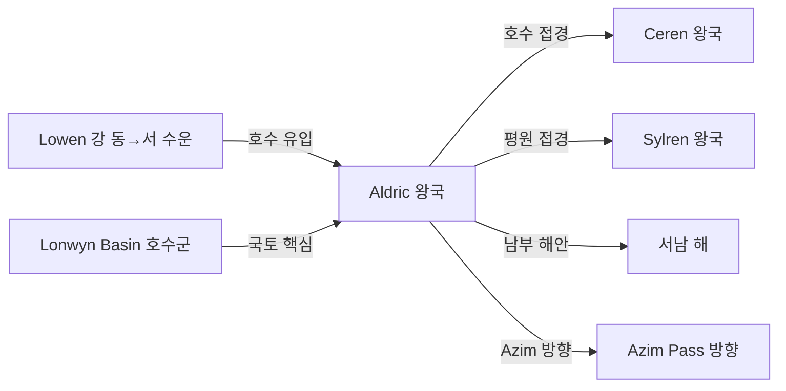

# Aldric 왕국 — 내부 공작령·백작령 체계

## 원전 인용 증명

### [필독 1] political_divisions.md:62
> "알드릭 / Aldric / 남서 호수"
— political_divisions.md:62 (위치 확정)

### [필독 2] political_divisions.md:116
> "Lonwyn / 론윈 / 남서 호수 / 알드릭 왕국"
— political_divisions.md:116 (Aldric 소속 권역 Lonwyn 확정)

### [필독 3] brainstorm_2026-04-21_worldview_expansion.md:176 (발언 5)
> "좌측은 강이 많고 풍요로움"
— 발언 5, brainstorm_2026-04-21_worldview_expansion.md:176

### [필독 4] rivers_major_2026-04-22.md:55
> "Lowen River (로웬 강) / ~800 km / Aurion Divide 서쪽 구릉 / Lonwyn Basin (호수 유입) / 동→서 / 성좌국·Aldric / 내륙 수운의 동서 축"
— rivers_major_2026-04-22.md:55 (Aldric 핵심 수계 확정)

### [필독 5] rivers_major_2026-04-22.md:86
> "Lowen 호수군 섬들: Lonwyn Basin 내 소도(小島)들. 접근이 어려워 타종족 은신 지형으로 언급 가능"
— rivers_major_2026-04-22.md:86

### [필독 6] brainstorm_2026-04-21_worldview_expansion.md:304 (발언 8)
> "타종족은 주변 작은 섬들이나 대륙의 가장자리의 밀림이나 숲, 사막한가운데서 숨어서 생활한다."
— 발언 8, brainstorm_2026-04-21_worldview_expansion.md:304

### [필독 7] FAILURES.md:56 (FAIL-002)
> "빈 자리는 '[대표님 결정 대기]' 마커 유지. AI가 '합리적 추론'으로 채우지 말 것."
— FAILURES.md:68

---

## 요약

**Aldric** 은 Elucia 남서 호수 지대에 위치하는 **소왕국** (추정 50~70K km²) 이다. Lonwyn 권역을 단독 보유하며, Lonwyn Basin 호수군이 국토의 핵심이다. Lowen 강 (동서 수운 축) 이 성좌국에서 Aldric 으로 흘러들어 Lonwyn Basin 에 합류한다. 호수 내 소도들이 타종족 은신 지형으로 추정된다. 남서 위치 특성상 Azim Pass 방향 육로 교역과 서해 무역을 모두 이용할 수 있다.

---

## 1. 왕국 기본 정보

| 항목 | 내용 |
|------|------|
| 영문명 | Kingdom of Aldric |
| 위치 | 남서 호수 (Lonwyn 권역) |
| 규모 분류 | **소왕국** (추정) |
| 면적 | ~50~70K km² (추정) |
| 왕도 | (대표님 미확정 · Wave 4 확정 · 호수가 도시 추정) |
| 접경 | 북 성좌국·Ceren / 동 Sylren·Novas / 남 남해·Azim 방향 / 서 서해 |
| 주요 지형 | Lonwyn Basin 호수군 · Lowen 강 · 서남 해안 |

---

## 2. 내부 공작령 3개 (작업 가설)

| # | 공작령명 | 위치 | 면적 (추정) | 핵심 자원 | 특성 |
|---|---------|------|-----------|---------|------|
| 1 | **Duchy of Lonwynshire** | Lonwyn Basin 북부 · 왕도 | ~22K km² | 호수 어업·염전·수운 | 왕도·호수 행정 중심 (추정) |
| 2 | **Duchy of Lowenmere** | Lowen 강 하류 유입부 | ~18K km² | 수운·내륙 교역 | 동서 수운 관문 (추정) |
| 3 | **Duchy of Coastfen** | 서남 해안 · Ceren 접경 | ~15K km² | 해안 어업·소금 | 서해 출구 (추정) |

---

## 3. 백작령 구성

| 공작령 | 배속 백작령 수 (추정) |
|-------|-------------------|
| Lonwynshire | 4~5 |
| Lowenmere | 3~4 |
| Coastfen | 2~3 |
| **합계** | **9~12** |

---

## 4. 호수 소도와 타종족 은신 (발언 8 + rivers_major 반영)

Lonwyn Basin 의 접근 어려운 소도들은 **발언 8** "대륙 가장자리" 에 준하는 은신 지형이다.

| 지형 | 은신 가능 종족 | 가능성 |
|------|------------|------|
| Lonwyn Basin 소도 | 미정 | 중간 — 접근 어려움 특성 |

> **(추정)** · 대표님 확정 전까지 작업 가설

---

## 5. 지형·국경 특성

**자연 국경**:
- 북부: Lowen 강 — 성좌국·Ceren 경계 후보 (추정)
- 동부: 평원 경계 — Sylren 방향 인공 경계
- 서부·남부: 해안선

---

## 6. 남작령 스케일

- 추정 총 남작령: 30~45개
- 호수 남작령: 어업권·수상 수운세 기반

---

## 대표님 미확정 사항

- 왕도 위치 (호수가 도시 추정)
- 왕가·군주 이름
- Lonwyn 호수 소도 타종족 은신 여부
- Lowen 강 수운 통행세 성좌국 협약 구조

---

## 다음 Wave 의존 포인트

- **Economist (Wave 2)**: Lowen 강 동서 수운 경제 상세
- **Historian (Wave 3)**: 성좌국 Loranthas 공작령과의 Lowen 강 수운권 분쟁사 (추정)
- **Diplomatist (Wave 3)**: 소왕국으로서 성좌국·Ceren 에 낀 외교 구조
- **Kingdom-Detailer (aldric, Wave 4)**: 호수 도시·어업·수상 교역 상세
