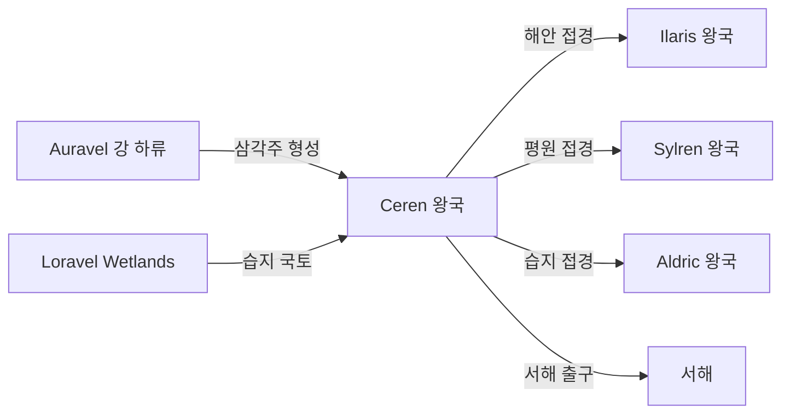

# Ceren 왕국 — 내부 공작령·백작령 체계

## 원전 인용 증명

### [필독 1] political_divisions.md:56
> "세렌 / Ceren / 서남 습지"
— political_divisions.md:56 (위치 확정)

### [필독 2] political_divisions.md:111
> "Loravel / 로라벨 / 서남 습지·호수 / 세렌 왕국"
— political_divisions.md:111 (Ceren 소속 권역 확정)

### [필독 3] brainstorm_2026-04-21_worldview_expansion.md:176 (발언 5)
> "좌측은 강이 많고 풍요로움"
— 발언 5, brainstorm_2026-04-21_worldview_expansion.md:176

### [필독 4] rivers_major_2026-04-22.md:54
> "Auravel River (오라벨 강) / ~950 km / Norvend 중앙 Ironcleft 남쪽 / Loravel Delta / 북→남 / 성좌국·Sylren·Ceren"
— rivers_major_2026-04-22.md:54 (Ceren 통과 대하천 확정)

### [필독 5] brainstorm_2026-04-21_worldview_expansion.md:304 (발언 8)
> "타종족은 주변 작은 섬들이나 대륙의 가장자리의 밀림이나 숲, 사막한가운데서 숨어서 생활한다."
— 발언 8 (Loravel 습지 = 타종족 은신 가능 지형)

### [필독 6] FAILURES.md:162–169 (FAIL-006)
> "대표님의 한국어 중의적 표현은 자의 해석 금지."
— FAILURES.md:166

### [필독 7] game_setting_complete_2026-04-21.md:64–69
> "가. 불완전성 원칙 — 모든 존재는 완벽하지 않다."
— game_setting_complete_2026-04-21.md:64–69

---

## 요약

**Ceren** 은 Elucia 서남 습지 지대에 위치하는 **소왕국** (추정 50~75K km²) 이다. Loravel 권역 전체가 Ceren 영역이며, Auravel 강 하구 삼각주·갈대 습지·Loravel Wetlands 가 국토의 절반 이상을 차지한다. 습지 특성상 농업보다 어업·어소금·이탄 채취가 주 산업이다. 행정 공백 습지 깊숙이 타종족 은신 공동체 가능성이 있다.

---

## 1. 왕국 기본 정보

| 항목 | 내용 |
|------|------|
| 영문명 | Kingdom of Ceren |
| 위치 | 서남 습지 (Loravel 권역) |
| 규모 분류 | **소왕국** (추정) |
| 면적 | ~50~75K km² (추정) |
| 왕도 | (대표님 미확정 · Wave 4 확정) |
| 접경 | 북 Ilaris·성좌국 / 동 Sylren / 남 Aldric·남해 / 서 서해 |
| 주요 지형 | Loravel Wetlands · Auravel 강 하류·삼각주 · 서남 해안 |

---

## 2. 내부 공작령 3개 (작업 가설)

| # | 공작령명 | 위치 | 면적 (추정) | 핵심 자원 | 특성 |
|---|---------|------|-----------|---------|------|
| 1 | **Duchy of Loravale** | Auravel 강 중류 · 습지 북부 | ~20K km² | 이탄·갈대·어업 | 왕도 인근 · 습지 행정 (추정) |
| 2 | **Duchy of Deltawatch** | Auravel 강 하구 삼각주 | ~15K km² | 어업·소금·하구 항구 | 서해 출구 관문 (추정) |
| 3 | **Duchy of Lorenfen** | 습지 남부 · Aldric 접경 | ~18K km² | 수초·가축·목초지 | 남부 비교적 건조 지구 (추정) |

---

## 3. 백작령 구성

| 공작령 | 배속 백작령 수 (추정) |
|-------|-------------------|
| Loravale | 5~6 |
| Deltawatch | 3~4 |
| Lorenfen | 4~5 |
| **합계** | **12~15** |

---

## 4. 습지 행정의 특수성

Ceren 는 습지·수로 지형으로 인해 일반 봉건 행정이 어렵다. 특수 제도 가설:

| 특수 구조 | 내용 | 근거 |
|---------|------|------|
| **수로 남작령** | 육지 대신 수로망 기준 영역 설정 | 습지 특성 (추정) |
| **어업 조합 공인** | 백작 아래 어부 조합이 실질 행정 보조 | 농업 불가 지역 대안 (추정) |
| **겨울 동결 예외** | 동절기 수로 결빙 시 영역 재설정 | 기후 (추정) |

---

## 5. 지형·국경 특성

**자연 국경**:
- 북부: Auravel 강 중류 — Ilaris·성좌국 경계 (추정)
- 동부: 평원 경계선 — Sylren 과 개방 접경 (추정)
- 남부: 습지 남단·소구릉 — Aldric 접경 (추정)
- 서부: 서해안 삼각주 해안선

---

## 6. 남작령 스케일

- 추정 총 남작령: 30~50개
- 수로 남작령 다수 (육지 남작령보다 수상 기반 영역)

---

## 대표님 미확정 사항

- 왕도 위치 (습지 안 고지 도시? 삼각주 항구? 추정 불가)
- 왕가 이름·군주
- 습지 타종족 은신 여부·종류
- 소왕국으로서 성좌국 종속도

---

## 다음 Wave 의존 포인트

- **Toponymist (Wave 2)**: 수로·습지 지명 체계화
- **Historian (Wave 3)**: 습지 왕국 형성사 (언제 습지가 왕국 영역이 됐는지)
- **Economist (Wave 2)**: 이탄·어업·어소금 경제 체계
- **Kingdom-Detailer (ceren, Wave 4)**: 수로 남작령·어부 조합·왕도 상세

<!-- auto-generated-related:start -->
## 🔗 관련 (auto-generated)

> `scripts/obsidian/build_backlinks.py` 로 자동 생성. 수정 금지 — 다음 실행 시 덮어쓰여집니다.

### ⬆️ 상위

- [[../../../../MOC]] — wiki 루트
- [[../MOC]] — Elucia 허브

### 🗳️ 형제 정치 문서

- [[autonomous_capitals_central_island_2026-04-22]]
- [[borders_disputed_2026-04-22]]
- [[borders_natural_2026-04-22]]
- [[continent_administration_2026-04-22]]

<!-- auto-generated-related:end -->
