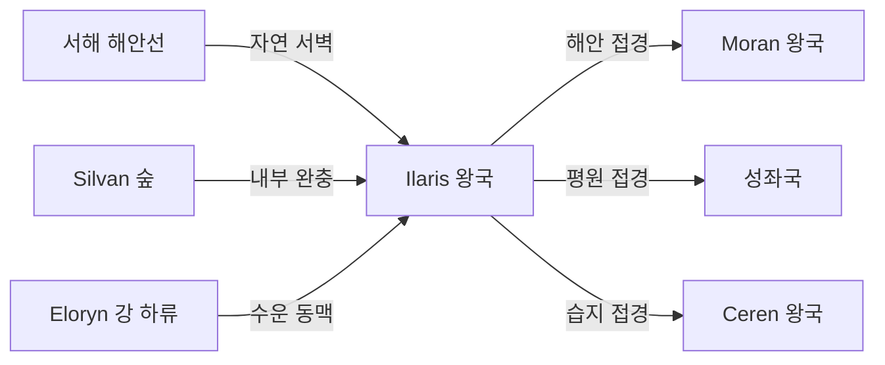

# Ilaris 왕국 — 내부 공작령·백작령 체계

## 원전 인용 증명

### [필독 1] political_divisions.md:55
> "일라리스 / Ilaris / 서해안"
— political_divisions.md:55 (위치 확정)

### [필독 2] political_divisions.md:110
> "Silvan / 실반 / 서해안 숲 / 일라리스 왕국"
— political_divisions.md:110 (Ilaris 소속 권역 확정 · Silvan 숲 확정)

### [필독 3] brainstorm_2026-04-21_worldview_expansion.md:176 (발언 5)
> "좌측은 강이 많고 풍요로움"
— 발언 5, brainstorm_2026-04-21_worldview_expansion.md:176

### [필독 4] brainstorm_2026-04-21_worldview_expansion.md:304 (발언 8)
> "타종족은 주변 작은 섬들이나 대륙의 가장자리의 밀림이나 숲, 사막한가운데서 숨어서 생활한다."
— 발언 8, brainstorm_2026-04-21_worldview_expansion.md:304 (Silvan 숲 = 타종족 은신지 직결)

### [필독 5] rivers_major_2026-04-22.md:53
> "Eloryn River / 서해안 Mirevane Bay / Vaelin·성좌국·Ilaris"
— rivers_major_2026-04-22.md:53 (Ilaris 경유 확정)

### [필독 6] FAILURES.md:163–169 (FAIL-006)
> "대표님의 한국어 중의적 표현은 자의 해석 금지 · 질문 큐에 올리거나 최소 보수 해석."
— FAILURES.md:166–167

### [필독 7] _shared_briefing.md:75–83
> "네이밍 세트 B 확정 (계승 의무) — 기존 지명: Silvan (서해안 숲)"
— _shared_briefing.md:82

---

## 요약

**Ilaris** 는 Elucia 서해안 지대에 위치하는 **중왕국** (추정 100~140K km²) 이다. Silvan 권역을 단독 보유하며, 대륙 서쪽 해안선을 따라 남북으로 길게 뻗은 지형이다. Silvan 서해안 숲이 내륙과 해안 사이 완충대를 형성한다. Eloryn 강 하류가 하구에서 합류하며 상업 항구를 받쳐준다. **발언 8** 에 따라 Silvan 숲 내부는 Elucia 서쪽 타종족 은신지의 핵심으로 추정된다.

---

## 1. 왕국 기본 정보

| 항목 | 내용 |
|------|------|
| 영문명 | Kingdom of Ilaris |
| 위치 | 서해안 (Silvan 권역) |
| 규모 분류 | **중왕국** (추정) |
| 면적 | ~100~140K km² (추정) |
| 왕도 | (대표님 미확정 · Wave 4 확정) |
| 접경 | 북 Moran / 동 성좌국 / 남 Ceren / 서 서해 |
| 주요 지형 | Silvan 서해안 숲 · Eloryn 강 하류 · 해안선 |

---

## 2. 내부 공작령 4개 (작업 가설)

| # | 공작령명 | 위치 | 면적 (추정) | 핵심 자원 | 특성 |
|---|---------|------|-----------|---------|------|
| 1 | **Duchy of Silvanreach** | Silvan 숲 북부·왕도 인근 | ~35K km² | 목재·수지·교역 | 왕도 공작령 (추정) |
| 2 | **Duchy of Mirevane Coast** | Eloryn 강 하구 · 항구 지구 | ~25K km² | 항구·어업·무역 | 성좌국 Mirevane 공작령과 접경 (추정) |
| 3 | **Duchy of Deepsilvan** | Silvan 숲 내부 | ~30K km² | 목재·사냥·약초 | 타종족 은신 지형 완충 · 삼림 행정 (추정) |
| 4 | **Duchy of Westshore** | 남부 해안 · Ceren 접경 | ~25K km² | 어업·소금·해산물 | 남부 방어 (추정) |

---

## 3. 백작령 구성

| 공작령 | 배속 백작령 수 (추정) |
|-------|-------------------|
| Silvanreach | 5~7 |
| Mirevane Coast | 4~5 |
| Deepsilvan | 3~4 |
| Westshore | 3~4 |
| **합계** | **15~20** |

---

## 4. Silvan 숲과 타종족 은신 (발언 8 직접 적용)

> 발언 8 원문: *"타종족은 주변 작은 섬들이나 대륙의 가장자리의 밀림이나 숲, 사막한가운데서 숨어서 생활한다."*

Silvan 서해안 숲은 **"대륙 가장자리의 숲"** 에 직접 해당하는 지형이다.

| 타종족 은신 가능성 | 지형 | 현황 |
|----------------|------|------|
| **엘프** 가능성 | Deepsilvan 숲 내부 | 높음 (발언 8 + outline Ch.15 "엘프의 숲") |
| 혼혈 인간 | Silvanreach 숲 경계 도시 하층 | outline Ch.07 "반쪽 엘프와의 스침" 무대 후보 (추정) |

> 이 은신 구조는 **(추정)** 이며 대표님 확정 전까지 작업 가설 상태.

---

## 5. 지형·국경 특성

---

## 6. 남작령 스케일

- 추정 총 남작령: 55~80개
- 특이 남작령: Deepsilvan 숲 내 삼림 남작령 — 벌목 통제·사냥세 기반

---

## 대표님 미확정 사항

- 왕도 위치·이름 (해안 도시 가능성 높음, 추정)
- 왕가·군주 이름
- Silvan 숲 내 타종족 은신 공식 인지 여부 (모르는 척? 묵인?)
- Ch.07 "반쪽 엘프" 무대가 Ilaris 인지 확인 대기

---

## 다음 Wave 의존 포인트

- **Toponymist (Wave 2)**: Silvan 숲 내 지명·마을·항구 체계화
- **Historian (Wave 3)**: Silvan 숲 관리 역사·타종족 박해 전선
- **Diplomat (Wave 3)**: 성좌국 대교구 Mirevane 공작령과의 관할권 중첩 분쟁 (추정)
- **Kingdom-Detailer (ilaris, Wave 4)**: 삼림 공작령·항구 도시·타종족 은신 지형 상세

<!-- auto-generated-related:start -->
## 🔗 관련 (auto-generated)

> `scripts/obsidian/build_backlinks.py` 로 자동 생성. 수정 금지 — 다음 실행 시 덮어쓰여집니다.

### ⬆️ 상위

- [[../../../../MOC]] — wiki 루트
- [[../MOC]] — Elucia 허브

### 🗳️ 형제 정치 문서

- [[autonomous_capitals_central_island_2026-04-22]]
- [[borders_disputed_2026-04-22]]
- [[borders_natural_2026-04-22]]
- [[continent_administration_2026-04-22]]

<!-- auto-generated-related:end -->
