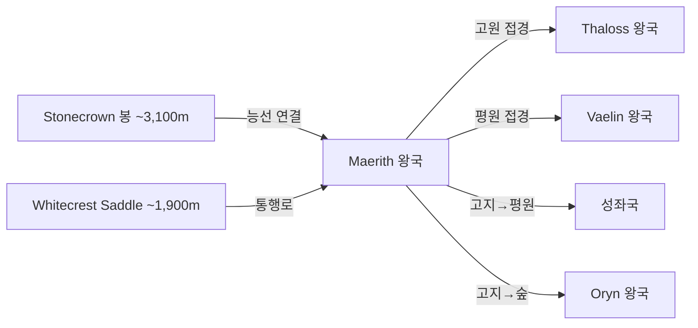

# Maerith 왕국 — 내부 공작령·백작령 체계

## 원전 인용 증명

### [필독 1] political_divisions.md:59
> "마에리스 / Maerith / 북동 고지"
— political_divisions.md:59 (위치 확정)

### [필독 2] political_divisions.md:108
> "Auryn / 오린 (지역) / 북동 고지 / 마에리스 왕국"
— political_divisions.md:108 (Maerith 권역 Auryn 확정)

### [필독 3] brainstorm_2026-04-21_worldview_expansion.md:176 (발언 5)
> "좌측은 강이 많고 풍요로움"
— 발언 5, brainstorm_2026-04-21_worldview_expansion.md:176

### [필독 4] mountain_ranges_2026-04-22.md:68
> "Stonecrown / ~3,100m / 동쪽 끝봉 / Maerith 고원과 연결"
— mountain_ranges_2026-04-22.md:68 (Maerith·Thaloss 연결 확정)

### [필독 5] mountain_ranges_2026-04-22.md:76
> "Whitecrest Saddle / ~1,900m / Norvend 동쪽 / Thaloss ↔ Maerith"
— mountain_ranges_2026-04-22.md:76 (Maerith 접근 고개 확정)

### [필독 6] FAILURES.md:56–70 (FAIL-002)
> "빈 자리는 '[대표님 결정 대기]' 마커 유지."
— FAILURES.md:68

### [필독 7] game_setting_complete_2026-04-21.md:71–78 (나이트 인격체 원칙)
> "나이트는 언제나 한결같다. 착해졌다 나빠졌다 하면안됨."
— game_setting_complete_2026-04-21.md:74

---

## 요약

**Maerith** 는 Elucia 북동 고지 지대에 위치하는 **중왕국** (추정 105~140K km²) 이다. Auryn 권역을 단독 보유하며, Norvend Range 동쪽 봉 Stonecrown 과 연결되는 고원 지형이다. Whitecrest Saddle 을 통해 Thaloss 와 연결되며, 동쪽으로는 Veilorn Ridge 와 Oryn 왕국을 바라본다. 고원 특성상 목축·광물·방목이 주 산업이다.

---

## 1. 왕국 기본 정보

| 항목 | 내용 |
|------|------|
| 영문명 | Kingdom of Maerith |
| 위치 | 북동 고지 (Auryn 권역) |
| 규모 분류 | **중왕국** (추정) |
| 면적 | ~105~140K km² (추정) |
| 왕도 | (대표님 미확정 · Wave 4 확정) |
| 접경 | 북서 Thaloss (Whitecrest Saddle) / 서 Vaelin / 남 성좌국·Oryn | 
| 주요 지형 | 북동 고원·구릉 · Stonecrown 연결 능선 · Auryn 고지 |

---

## 2. 내부 공작령 4개 (작업 가설)

| # | 공작령명 | 위치 | 면적 (추정) | 핵심 자원 | 특성 |
|---|---------|------|-----------|---------|------|
| 1 | **Duchy of Aurynseat** | 고원 중심 · 왕도 인근 | ~35K km² | 목축·양모·고원 농업 | 왕도 공작령 (추정) |
| 2 | **Duchy of Crestwatch** | Whitecrest Saddle 남측 | ~30K km² | 통행세·군사 | Thaloss 접경 관문 수비 (추정) |
| 3 | **Duchy of Greycliff** | 고지 동쪽 · Oryn 방향 | ~28K km² | 목재·수렵 | 동부 삼림 접경 (추정) |
| 4 | **Duchy of Northmere** | 고원 북부 · Norvend 접경 | ~32K km² | 광물·철광 | 산악 광업 (추정) |

---

## 3. 백작령 구성

| 공작령 | 배속 백작령 수 (추정) |
|-------|-------------------|
| Aurynseat | 5~6 |
| Crestwatch | 4~5 |
| Greycliff | 4~5 |
| Northmere | 4~5 |
| **합계** | **17~21** |

---

## 4. 지형·국경 특성

**자연 국경**:
- 북서부: Norvend Range 동쪽 끝 능선 — 사실상 Thaloss 경계
- 서부·남부: 고원→평원 경사 — Vaelin·성좌국 방향 개방
- 동부: 고지→Orenwald 진입부 — Oryn 방향 접경

---

## 5. 남작령 스케일

- 추정 총 남작령: 65~95개
- 고원 목축 남작령: 방목세·양모세 기반

---

## 대표님 미확정 사항

- 왕도 위치 (고원 도시 추정)
- 왕가·군주 이름
- 고원 문화 특성 (폐쇄적 산악 문화 vs 교역 개방)
- Whitecrest Saddle 통행료 Thaloss 와 분쟁 여부

---

## 다음 Wave 의존 포인트

- **Toponymist (Wave 2)**: 고원 지명·고지 마을 체계화
- **Historian (Wave 3)**: Thaloss 와 Maerith 간 산악 경계 분쟁사
- **Culturalist (Wave 2)**: 고원 문화 = Thaloss 광산 문화와 어떻게 차별화되는지
- **Kingdom-Detailer (maerith, Wave 4)**: 고원 공작령·목축 경제 상세
