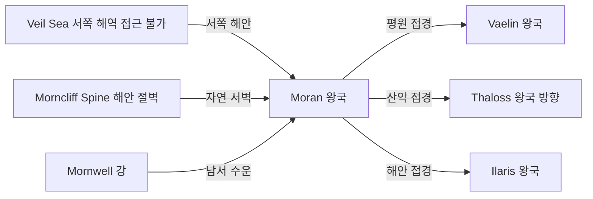

# Moran 왕국 — 내부 공작령·백작령 체계

## 원전 인용 증명

### [필독 1] political_divisions.md:54
> "모란 / Moran / 북서"
— political_divisions.md:54 (위치 확정)

### [필독 2] political_divisions.md:109
> "Havren / 하브렌 / 북서 해안 / 모란·바엘린 왕국"
— political_divisions.md:109 (Moran 소속 권역 확정)

### [필독 3] brainstorm_2026-04-21_worldview_expansion.md:176 (발언 5)
> "좌측은 강이 많고 풍요로움"
— 발언 5, brainstorm_2026-04-21_worldview_expansion.md:176

### [필독 4] mountain_ranges_2026-04-22.md:99
> "Morncliff Spine (모른클리프 릉) / 북서 해안 구릉 / ~350 km / ~1,100m / Moran·Vaelin (Havren 권역)"
— mountain_ranges_2026-04-22.md:99

### [필독 5] rivers_major_2026-04-22.md:56
> "Mornwell River (모른웰 강) / ~650 km / Morncliff Spine 동사면 / 북서 해안 Moran 항구 인근 / 북→남서 / Moran·Vaelin"
— rivers_major_2026-04-22.md:56

### [필독 6] FAILURES.md:91 (FAIL-003)
> "Bash 도구 안에서 `cd` 금지. 모든 경로는 절대경로로."
— FAILURES.md:91

### [필독 7] _shared_briefing.md:77–83 (네이밍 세트 B)
> "신규 지명은 이 계열 어감 계승 (라틴·게르만·켈트 혼합)"
— _shared_briefing.md:82–83

---

## 요약

**Moran** 은 Elucia 북서부 해안 지대에 위치하는 **대왕국** (추정 220~280K km²) 이다. Havren 권역을 Vaelin 과 공유하되, Moran 은 해안 쪽에 집중한다. Morncliff Spine 해안 절벽이 서쪽 방어선이며, Mornwell 강이 내륙 수운 축이다. 북서 해안 항구를 통한 해양 무역이 핵심 경제 기반이다.

---

## 1. 왕국 기본 정보

| 항목 | 내용 |
|------|------|
| 영문명 | Kingdom of Moran |
| 위치 | 북서 해안 (Havren 권역) |
| 규모 분류 | **대왕국** (추정) |
| 면적 | ~220~280K km² (추정) |
| 왕도 | (대표님 미확정 · Wave 4 확정) |
| 접경 | 북 Thaloss·Norvend 방향 / 동 Vaelin / 남 성좌국·Ilaris / 서 서해 |
| 주요 지형 | 해안 절벽·항구 · Morncliff Spine · Mornwell 강 |

---

## 2. 내부 공작령 5개 (작업 가설)

| # | 공작령명 | 위치 | 면적 (추정) | 핵심 자원 | 특성 |
|---|---------|------|-----------|---------|------|
| 1 | **Duchy of Havenport** | 왕도 해안 항구 인근 | ~55K km² | 해운·무역·조선 | 왕도·최대 항구 공작령 (추정) |
| 2 | **Duchy of Morncliff** | 해안 절벽 릉 따라 북부 | ~50K km² | 어업·해안 방어 | 해안 방위 공작령 (추정) |
| 3 | **Duchy of Wellmere** | Mornwell 강 중류 내륙 | ~45K km² | 농업·목재 | 내륙 곡창 (추정) |
| 4 | **Duchy of Spineback** | Morncliff 릉 내측 구릉 | ~40K km² | 광물·석재 | 채광·건재 공급 (추정) |
| 5 | **Duchy of Aldenmere** | 남부 · Vaelin·Ilaris 접경 완충 | ~40K km² | 농업·통행세 | 남부 방어 완충 (추정) |

---

## 3. 백작령 구성

| 공작령 | 배속 백작령 수 (추정) |
|-------|-------------------|
| Havenport | 6~8 |
| Morncliff | 5~6 |
| Wellmere | 5~7 |
| Spineback | 4~5 |
| Aldenmere | 4~5 |
| **합계** | **24~31** |

---

## 4. 지형·국경 특성

**자연 국경**:
- 서부: Morncliff Spine + 서해안 절벽 — 자연 방벽
- 북부: Norvend Range 서쪽 끝 Veldgar Horn — 사실상 방벽
- 동부: 평원 개방 경계 — Vaelin 과 인공 경계
- 남부: 해안선 + Mornwell 강 하류 — Ilaris 접경

---

## 5. 남작령 스케일

- 추정 총 남작령: 90~140개
- 해안 남작령들: 항구·어업 세수 기반
- 내륙 남작령들: 농업·목재 세수 기반

---

## 대표님 미확정 사항

- 왕도 위치·이름 (항구도시 가능성 높음, 추정)
- 왕가 이름·현재 군주
- 공작령 공식 이름·가문
- 해양 세력으로서의 함대 규모

---

## 다음 Wave 의존 포인트

- **Toponymist (Wave 2)**: 항구·공작령 이름 체계화
- **Historian (Wave 3)**: Moran 해양 세력 발전사·Ilaris 와의 해안 경쟁
- **Diplomat (Wave 3)**: Vaelin 과의 Havren 권역 공동 이해·해양 동맹
- **Kingdom-Detailer (moran, Wave 4)**: 항구 도시·해군·어촌 상세
