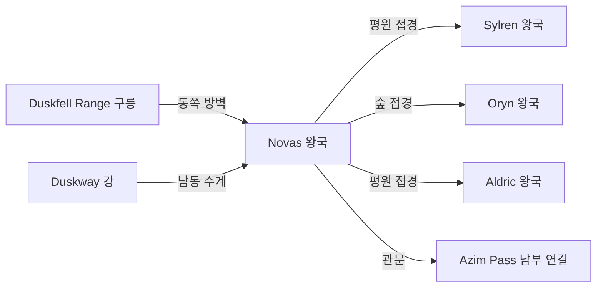

# Novas 왕국 — 내부 공작령·백작령 체계

## 원전 인용 증명

### [필독 1] political_divisions.md:61
> "노바스 / Novas / 남동 국경"
— political_divisions.md:61 (위치 확정)

### [필독 2] political_divisions.md:115
> "Duskmoor / 더스크무어 / 남동 국경 구릉 / 노바스 왕국"
— political_divisions.md:115 (Novas 소속 권역 Duskmoor 확정)

### [필독 3] brainstorm_2026-04-21_worldview_expansion.md:176 (발언 5)
> "하단 주황식은 이어진길이다."
— 발언 5, brainstorm_2026-04-21_worldview_expansion.md:176 (Azim Pass 방향 연결 확인)

### [필독 4] rivers_major_2026-04-22.md:58
> "Duskway River (더스크웨이 강) / ~500 km / Duskfell Range 서쪽 / 남동 해안 Novas / Azim Pass 방향의 마지막 수계 역할"
— rivers_major_2026-04-22.md:58 (Novas 핵심 하천 확정)

### [필독 5] mountain_ranges_2026-04-22.md:102
> "Duskfell Range (더스크펠 릉) / 남동 구릉 / ~300 km / ~800m / Novas (Duskmoor 권역)"
— mountain_ranges_2026-04-22.md:102

### [필독 6] political_divisions.md:22
> "아짐 관문 / Azim Pass / 두 대륙 연결 육로"
— political_divisions.md:22 (Novas 왕국 남쪽 Azim Pass 연결)

### [필독 7] FAILURES.md:150–169 (FAIL-006)
> "대표님 원문에서 '서쪽'이 두 번 등장 → '두 번째 = 동쪽 오타' 자의 추정. 발언 48에서 원본 의도 확정."
— FAILURES.md:156 (자의 추정 금지 재확인)

---

## 요약

**Novas** 는 Elucia 남동 국경 지대에 위치하는 **소왕국** (추정 55~75K km²) 이다. Duskmoor 권역을 단독 보유하며, Duskfell Range 구릉과 Duskway 강이 지형 골격이다. 가장 중요한 지정학적 특성은 **Azim Pass 접근 제어** 다 — Novas 남부가 Azim Pass (두 대륙 연결 육로) 로 이어지기 때문에, 이 왕국은 동서 대륙 간 육로 교역의 최후 관문 역할을 한다.

---

## 1. 왕국 기본 정보

| 항목 | 내용 |
|------|------|
| 영문명 | Kingdom of Novas |
| 위치 | 남동 국경 (Duskmoor 권역) |
| 규모 분류 | **소왕국** (추정) |
| 면적 | ~55~75K km² (추정) |
| 왕도 | (대표님 미확정 · Wave 4 확정) |
| 접경 | 북 Sylren·Oryn / 서 Aldric / 남 Azim Pass / 동 Karzor 방향·Veilorn Ridge |
| 주요 지형 | Duskfell Range 구릉 · Duskway 강 · Azim Pass 관문 |

---

## 2. 내부 공작령 3개 (작업 가설)

| # | 공작령명 | 위치 | 면적 (추정) | 핵심 자원 | 특성 |
|---|---------|------|-----------|---------|------|
| 1 | **Duchy of Duskwatch** | Duskfell Range 서쪽 · 왕도 | ~22K km² | 통행세·관문 세수 | 왕도·Azim Pass 관문 제어 (추정) |
| 2 | **Duchy of Moorfield** | 남동 구릉 평원 | ~20K km² | 구릉 목축·흑요석 | 남부 방어 (추정) |
| 3 | **Duchy of Azimfront** | Azim Pass 진입부 직전 | ~18K km² | 통행세·군사 요충 | 관문 직전 최전선 (추정) |

---

## 3. 백작령 구성

| 공작령 | 배속 백작령 수 (추정) |
|-------|-------------------|
| Duskwatch | 4~5 |
| Moorfield | 3~4 |
| Azimfront | 3~4 |
| **합계** | **10~13** |

---

## 4. Azim Pass 와의 관계 (핵심 지정학)

> 발언 5 원문: *"하단 주황식은 이어진길이다"* — 두 대륙 연결 육로

Novas 왕국 남부는 Azim Pass 의 **Elucia 쪽 진입부** 를 통제한다.

| 전략 이점 | 설명 |
|---------|------|
| 통행세 독점 | 두 대륙 간 모든 육로 교역에 통행세 부과 가능 |
| 군사 관문 | Karzor 방향 침입 1차 차단선 |
| 외교 협상력 | Pass 봉쇄 위협으로 양 대륙 모두에 협상력 |
| 위험 노출 | 동시에 가장 먼저 공격 받는 위치 |

---

## 5. 지형·국경 특성

---

## 6. 남작령 스케일

- 추정 총 남작령: 30~50개
- 관문 남작령: Azim Pass 진입로 통행세 복합 수비

---

## 대표님 미확정 사항

- 왕도 위치 (관문 도시? 구릉 도시?)
- 왕가·군주 이름
- Azim Pass 통행세 성좌국·Karzor 와의 협약 구조
- Karzor 동쪽 Sabin 자치구와의 관계 (접경 지점)

---

## 다음 Wave 의존 포인트

- **Road-Engineer (Wave 2)**: Azim Pass 도로·통행 제도 상세
- **Diplomat (Wave 3)**: Karzor 와의 통행 협약·전쟁 위협
- **Historian (Wave 3)**: Azim Pass 지배권 분쟁사
- **Kingdom-Detailer (novas, Wave 4)**: 관문 도시·통행세 체계·수비대 상세

<!-- auto-generated-related:start -->
## 🔗 관련 (auto-generated)

> `scripts/obsidian/build_backlinks.py` 로 자동 생성. 수정 금지 — 다음 실행 시 덮어쓰여집니다.

### ⬆️ 상위

- [[../../../../MOC]] — wiki 루트
- [[../MOC]] — Elucia 허브

### 🗳️ 형제 정치 문서

- [[autonomous_capitals_central_island_2026-04-22]]
- [[borders_disputed_2026-04-22]]
- [[borders_natural_2026-04-22]]
- [[continent_administration_2026-04-22]]

<!-- auto-generated-related:end -->
