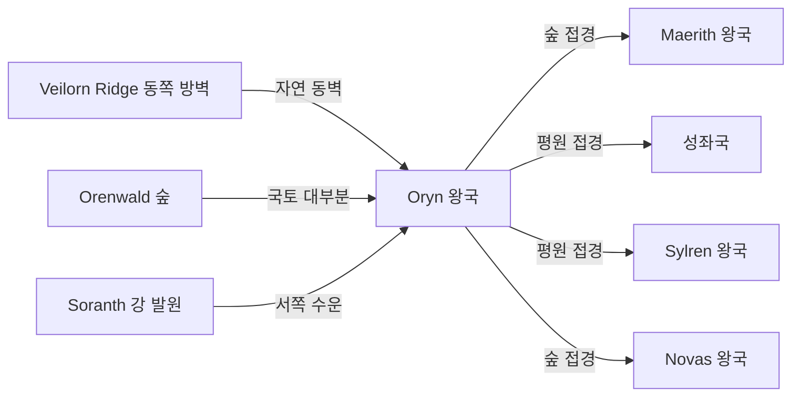

# Oryn 왕국 — 내부 공작령·백작령 체계

## 원전 인용 증명

### [필독 1] political_divisions.md:58
> "오린 / Oryn / 동부 숲"
— political_divisions.md:58 (위치 확정)

### [필독 2] political_divisions.md:113
> "Orenwald / 오렌왈드 / 동부 숲 / 오린 왕국"
— political_divisions.md:113 (Oryn 단독 권역 Orenwald 확정)

### [필독 3] brainstorm_2026-04-21_worldview_expansion.md:304 (발언 8)
> "타종족은 주변 작은 섬들이나 대륙의 가장자리의 밀림이나 숲, 사막한가운데서 숨어서 생활한다."
— 발언 8, brainstorm_2026-04-21_worldview_expansion.md:304

### [필독 4] mountain_ranges_2026-04-22.md:80–92
> "Veilorn Ridge (그레이베일 릉) — 주맥 2 / 남북 주행, 대륙 동쪽 경계 / ~700 km / Oryn 왕국(Orenwald 권역) 동쪽 경계 / 역할: Karzor 방향 건조 기류 차단, Orenwald 숲 수분 보존, 동부 경계"
— mountain_ranges_2026-04-22.md:80–92

### [필독 5] rivers_major_2026-04-22.md:57
> "Soranth River (소란스 강) / ~750 km / Veilorn Ridge 서사면 / Oryn 경유 / Orenwald 숲의 수원"
— rivers_major_2026-04-22.md:57

### [필독 6] mountain_ranges_2026-04-22.md:144
> "Veilorn Ridge 동쪽 협곡 중 하나에 '어느 시대에도 인간이 정착하지 못한 골짜기'가 있다는 Oryn 왕국 어부 전승이 있다."
— mountain_ranges_2026-04-22.md:144

### [필독 7] FAILURES.md:91 (FAIL-003)
> "cd 금지. 절대경로만."
— FAILURES.md:91

---

## 요약

**Oryn** 은 Elucia 동부 숲 지대에 위치하는 **중왕국** (추정 110~145K km²) 이다. Orenwald 권역을 단독 보유하며, Veilorn Ridge 가 동쪽 경계이자 자연 장벽이다. Orenwald 는 Elucia 최대 동부 삼림으로, Karzor 와의 경계 역할을 한다. 발언 8 에 따라 삼림 내부는 타종족 주요 은신지로 추정된다. Soranth 강이 왕국 수계의 핵심이다.

---

## 1. 왕국 기본 정보

| 항목 | 내용 |
|------|------|
| 영문명 | Kingdom of Oryn |
| 위치 | 동부 숲 (Orenwald 권역) |
| 규모 분류 | **중왕국** (추정) |
| 면적 | ~110~145K km² (추정) |
| 왕도 | (대표님 미확정 · Wave 4 확정) |
| 접경 | 북 Maerith / 서 성좌국·Sylren / 남 Novas / 동 Veilorn Ridge (Karzor 방향) |
| 주요 지형 | Orenwald 동부 숲 · Veilorn Ridge · Soranth 강 |

---

## 2. 내부 공작령 4개 (작업 가설)

| # | 공작령명 | 위치 | 면적 (추정) | 핵심 자원 | 특성 |
|---|---------|------|-----------|---------|------|
| 1 | **Duchy of Orenwarden** | Orenwald 숲 북부 · 왕도 인근 | ~35K km² | 목재·수지·사냥 | 왕도 공작령 · 삼림 행정 중심 (추정) |
| 2 | **Duchy of Veilorn March** | Veilorn Ridge 서사면 국경 지대 | ~30K km² | 군사·통행 통제 | 동부 경계 방위 공작령 (추정) |
| 3 | **Duchy of Soranmere** | Soranth 강 상류 유역 | ~28K km² | 목재 수운·어업 | 수운 관리 (추정) |
| 4 | **Duchy of Deepwald** | Orenwald 숲 남부 · 깊은 내부 | ~32K km² | 삼림·약초·사냥 | 행정 취약 · 타종족 은신 지형 (추정) |

---

## 3. 백작령 구성

| 공작령 | 배속 백작령 수 (추정) |
|-------|-------------------|
| Orenwarden | 5~7 |
| Veilorn March | 4~5 |
| Soranmere | 4~5 |
| Deepwald | 3~4 |
| **합계** | **16~21** |

---

## 4. Orenwald 숲과 타종족 은신 (발언 8 직접 적용)

| 타종족 은신 가능성 | 근거 |
|----------------|------|
| **높음** — 엘프 가능성 | 발언 8 "대륙 가장자리의 숲" + outline Ch.15 "엘프의 숲" 무대 후보 |
| **높음** — 드워프 가능성 | Veilorn Ridge 협곡 = "어느 시대에도 정착 못한 골짜기" 전승 |
| **중간** — 기타 종족 | 깊은 삼림 특성 |

> 전부 **(추정)** · 대표님 확정 전 작업 가설

---

## 5. 지형·국경 특성

**자연 국경**:
- 동부: Veilorn Ridge — 절대 자연 경계 (Karzor 방향 차단)
- 북부·남부: 숲 경계 — Maerith·Novas 와 삼림 분쟁 가능성 (추정)
- 서부: 평원 진입부 — 성좌국·Sylren 과 개방 접경

---

## 6. 남작령 스케일

- 추정 총 남작령: 60~90개
- 삼림 남작령: 벌목권·수렵권 기반 세수

---

## 대표님 미확정 사항

- 왕도 위치 (숲 경계 도시? 강가 도시? 추정 불가)
- 왕가·군주 이름
- Orenwald 내 타종족 공식 인지 여부·관리 정책
- outline Ch.15 "엘프의 숲" 이 Orenwald 인지 Silvan 인지

---

## 다음 Wave 의존 포인트

- **Toponymist (Wave 2)**: Orenwald 내 지명·마을 체계화
- **Historian (Wave 3)**: Veilorn Ridge 경계 형성사·타종족 박해 역사
- **Diplomat (Wave 3)**: Karzor 와의 Veilorn Ridge 너머 긴장 관계
- **Kingdom-Detailer (oryn, Wave 4)**: 삼림 공작령·타종족 은신지 상세
