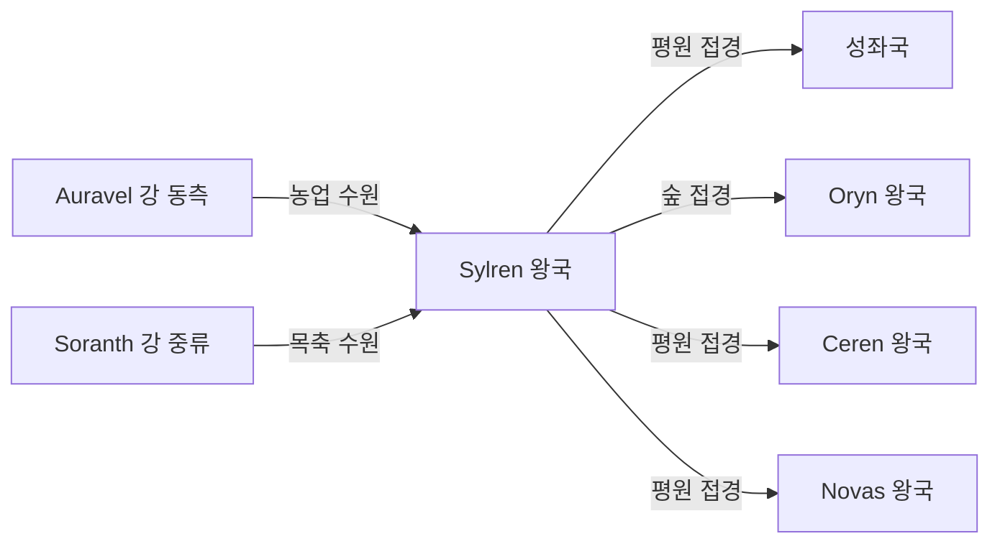

# Sylren 왕국 — 내부 공작령·백작령 체계

## 원전 인용 증명

### [필독 1] political_divisions.md:60
> "실렌 / Sylren / 남중앙"
— political_divisions.md:60 (위치 확정)

### [필독 2] political_divisions.md:114
> "Soranth / 소란스 / 남중앙 평원 / 실렌 왕국"
— political_divisions.md:114 (Sylren 소속 권역 Soranth 확정)

### [필독 3] brainstorm_2026-04-21_worldview_expansion.md:176 (발언 5)
> "좌측은 강이 많고 풍요로움"
— 발언 5, brainstorm_2026-04-21_worldview_expansion.md:176

### [필독 4] rivers_major_2026-04-22.md:54
> "Auravel River / ~950 km / 성좌국·Sylren·Ceren"
— rivers_major_2026-04-22.md:54 (Sylren 통과 확정)

### [필독 5] rivers_major_2026-04-22.md:57
> "Soranth River / ~750 km / Veilorn Ridge 서사면 / Oryn·Sylren·Novas"
— rivers_major_2026-04-22.md:57 (Sylren 통과 확인)

### [필독 6] brainstorm_2026-04-21_worldview_expansion.md:2900–2903 (발언 47 관련)
> "서쪽 대평원 축산: Elucia 중앙·남부 (Aurion·Soranth·Lonwyn) 대규모 목축"
— brainstorm_2026-04-21_worldview_expansion.md:2902 (Soranth = 축산 확정)

### [필독 7] FAILURES.md:91
> "cd 금지. 절대경로만."
— FAILURES.md:91

---

## 요약

**Sylren** 은 Elucia 남중앙 평원 지대에 위치하는 **중왕국** (추정 120~150K km²) 이다. Soranth 권역을 단독 보유하며, Auravel 강과 Soranth 강이 교차하는 풍요로운 평원이다. 서쪽 대평원 축산 지대(발언 47 반영)의 핵심 왕국으로, 대규모 목축·곡물 생산이 주 산업이다. 성좌국 남쪽에 위치해 교황청 행정 영향이 강하다.

---

## 1. 왕국 기본 정보

| 항목 | 내용 |
|------|------|
| 영문명 | Kingdom of Sylren |
| 위치 | 남중앙 평원 (Soranth 권역) |
| 규모 분류 | **중왕국** (추정) |
| 면적 | ~120~150K km² (추정) |
| 왕도 | (대표님 미확정 · Wave 4 확정) |
| 접경 | 북 성좌국 / 동 Oryn / 남 Novas / 서 Ceren |
| 주요 지형 | Soranth 남중앙 평원 · Auravel·Soranth 강 교차 |

---

## 2. 내부 공작령 5개 (작업 가설)

| # | 공작령명 | 위치 | 면적 (추정) | 핵심 자원 | 특성 |
|---|---------|------|-----------|---------|------|
| 1 | **Duchy of Soranthmere** | 평원 중심 · Soranth 강 중류 | ~30K km² | 곡물·목축 | 왕도 공작령 (추정) |
| 2 | **Duchy of Auravale** | Auravel 강 동쪽 유역 | ~28K km² | 관개 농업 | 성좌국 방향 완충 (추정) |
| 3 | **Duchy of Herdsland** | 남중앙 대초원 | ~32K km² | 양모·목축·말 | 대규모 목축 지구 (추정) |
| 4 | **Duchy of Forestmark** | 동부 · Oryn 접경 삼림 | ~22K km² | 목재·수렵 | 동부 방어 (추정) |
| 5 | **Duchy of Southvale** | 남부 · Novas 접경 | ~20K km² | 농업·통행세 | 남부 완충 (추정) |

---

## 3. 백작령 구성

| 공작령 | 배속 백작령 수 (추정) |
|-------|-------------------|
| Soranthmere | 5~7 |
| Auravale | 5~6 |
| Herdsland | 5~6 |
| Forestmark | 4~5 |
| Southvale | 3~4 |
| **합계** | **22~28** |

---

## 4. 지형·국경 특성

**자연 국경**:
- 북부: Auravel 강 — 성좌국 경계 후보 (추정)
- 동부: Soranth 강 — Oryn 방향 경계 후보 (추정)
- 서부·남부: 평원 개방 경계 — Ceren·Novas 와 인공 경계

---

## 5. 남작령 스케일

- 추정 총 남작령: 80~115개
- 목축 남작령: 방목지 세수 기반 (대형 남작령 다수)

---

## 대표님 미확정 사항

- 왕도 위치·이름
- 왕가·군주 이름
- 서쪽 대평원 축산에서 Sylren 의 비중 (성좌국 보다 큰가?)

---

## 다음 Wave 의존 포인트

- **Economist (Wave 2)**: 서쪽 축산 경제 상세 (발언 47 반영)
- **Historian (Wave 3)**: 성좌국 남부 완충국으로서의 역사
- **Diplomatist (Wave 3)**: 성좌국 성좌세 납부 vs 자립 요구 긴장
- **Kingdom-Detailer (sylren, Wave 4)**: 목축 공작령·대형 농장·왕도 상세
