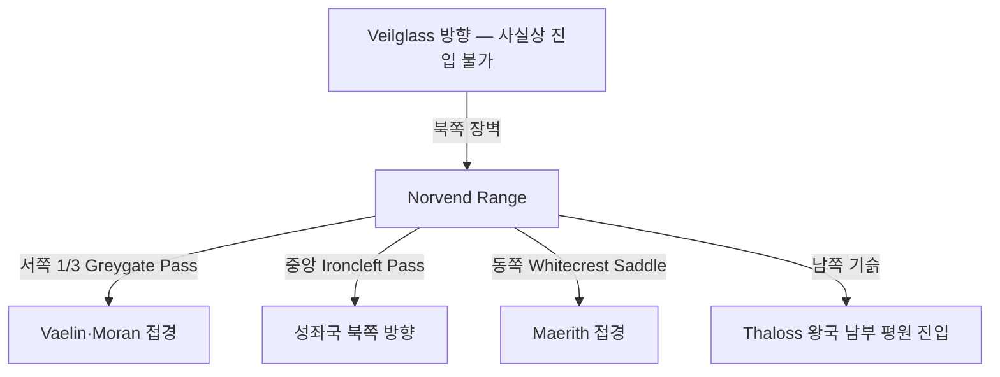

# Thaloss 왕국 — 내부 공작령·백작령 체계

## 원전 인용 증명

### [필독 1] political_divisions.md:57
> "탈로스 / Thaloss / 북부 산맥"
— political_divisions.md:57 (위치 확정)

### [필독 2] political_divisions.md:107
> "Norvend / 노르벤드 / 북부 산맥 너머 / 탈로스 왕국"
— political_divisions.md:107 (Thaloss 단독 권역 Norvend 확정)

### [필독 3] mountain_ranges_2026-04-22.md:50–77
> "Norvend Range (노르벤드 산맥) — 주맥 1 / 동서 주행, 대륙 북부 횡단 / ~900 km / 최고봉 Icehelm Peak ~4,200m / Thaloss 왕국(Norvend 권역) 북부 / 역할: 북부 한기 차단, 서쪽 강 발원지, 북쪽 Veilglass 방향 접근 장벽"
— mountain_ranges_2026-04-22.md:50–59

### [필독 4] mountain_ranges_2026-04-22.md:74
> "Greygate Pass / ~1,600m / Norvend 서쪽 1/3 / Thaloss ↔ Vaelin·Moran 주요 통로"
— mountain_ranges_2026-04-22.md:74

### [필독 5] mountain_ranges_2026-04-22.md:143–144 (전설 단서)
> "Norvend 최고봉 Icehelm 은 '태초에 하늘과 땅이 충돌한 자리'라는 전설이 Thaloss 민간에 전해진다. 산기슭 드워프 구전(현재 은신 중)은 이를 '태초의 응집이 남긴 마지막 기둥'이라 부른다고 전해지나, 공식 교회 기록은 없다."
— mountain_ranges_2026-04-22.md:143–144

### [필독 6] FAILURES.md:56–70 (FAIL-002)
> "빈 자리는 '[대표님 결정 대기]' 마커 유지."
— FAILURES.md:68

### [필독 7] _shared_briefing.md:61–66 (Q-CORE 간접 단서 원칙)
> "구조적 진실 직접 서술 금지. 엘프·용족 구전, 양심파 교회 필사본 등에 파편 단서만 허용"
— _shared_briefing.md:63–66

---

## 요약

**Thaloss** 는 Elucia 북부 산맥 지대에 위치하는 **대왕국** (추정 220~280K km²) 이다. Norvend 권역을 단독 보유하며, Norvend Range 전체를 직접 통제하는 유일한 왕국이다. 고개 통행세·광물 채굴·군사 방어가 경제 기반이다. 드워프가 산맥 깊은 곳에 은신 중이라는 전설이 민간에 퍼져 있으나 공식적으로는 부정된다. Greygate Pass 가 Vaelin·Moran 과의 유일한 실용 교통로다.

---

## 1. 왕국 기본 정보

| 항목 | 내용 |
|------|------|
| 영문명 | Kingdom of Thaloss |
| 위치 | 북부 산맥 (Norvend 권역) |
| 규모 분류 | **대왕국** (추정) |
| 면적 | ~220~280K km² (추정 · 산악 지형 포함) |
| 왕도 | (대표님 미확정 · Wave 4 확정 · 산악 고지 도시 추정) |
| 접경 | 북 Norvend·Veilglass 방향 / 서 Moran·Vaelin / 남 성좌국·Maerith | 
| 주요 지형 | Norvend Range 전체 · Greygate/Ironcleft/Whitecrest 고개 3개 |

---

## 2. 내부 공작령 6개 (작업 가설)

| # | 공작령명 | 위치 | 면적 (추정) | 핵심 자원 | 특성 |
|---|---------|------|-----------|---------|------|
| 1 | **Duchy of Icehelm** | Norvend 중심부 · 최고봉 인근 | ~45K km² | 희귀 광석·성지 | 왕실 직할 · 최고봉 성지 수호 (추정) |
| 2 | **Duchy of Greygate** | Greygate Pass 통제 구역 | ~40K km² | 통행세·군사 방어 | 서쪽 관문 · 최중요 전략 거점 (추정) |
| 3 | **Duchy of Ironcleft** | Ironcleft Pass 통제 구역 | ~38K km² | 통행세·철광·군사 | 중앙 관문 · 겨울 폐쇄 (추정) |
| 4 | **Duchy of Whitecrest** | Whitecrest Saddle 통제 · 동부 | ~35K km² | 통행세·구리 | 동쪽 관문 · Maerith 접경 (추정) |
| 5 | **Duchy of Stonecrown** | Norvend 동쪽 끝 봉 · 고원 지대 | ~40K km² | 석재·목재 | 고원 목축 · 드워프 전설 지대 (추정) |
| 6 | **Duchy of Southveld** | Norvend 남쪽 기슭 평원 진입부 | ~45K km² | 농업·목축 | 산맥 남쪽 유일 농업 지구 (추정) |

---

## 3. 백작령 구성

| 공작령 | 배속 백작령 수 (추정) |
|-------|-------------------|
| Icehelm | 4~5 |
| Greygate | 5~7 |
| Ironcleft | 4~6 |
| Whitecrest | 4~5 |
| Stonecrown | 4~5 |
| Southveld | 5~7 |
| **합계** | **26~35** |

---

## 4. 지형·국경 특성

**자연 국경**:
- 북부: Norvend Range 북사면 + Veilglass 방향 해안 = 절대 방벽
- 서부·동부: 고개 통제권이 곧 국경 (Greygate·Ironcleft·Whitecrest)
- 남부: 산맥 남쪽 기슭 — 성좌국·Vaelin 과 평원 접경 (개방)

---

## 5. 드워프 은신 전설 (Q-CORE 간접 단서)

> *구조적 진실 직접 서술 금지. 인-월드 전설·구전만.*

- Thaloss 민간: Icehelm Peak = "태초에 하늘과 땅이 충돌한 자리" (mountain_ranges 문서 원전)
- 드워프 구전 전달: "태초의 응집이 남긴 마지막 기둥" — 공식 교회 기록 없음
- Stonecrown 공작령 내 **"누구도 정착 못한 광산 구역"** 전설 (추정 · 드워프 은신지 후보 — 대표님 미확정)

---

## 6. 남작령 스케일

- 추정 총 남작령: 90~130개
- 고개 수비 남작령: 통행세·군사 복합 기능
- 광산 남작령: 채굴 세수 기반

---

## 대표님 미확정 사항

- 왕도 위치 (고개 도시? 남쪽 기슭 평원 도시? 추정 불가)
- 왕가·군주 이름
- 드워프 은신 공식 인지 여부
- 고개 3개 통행세 독점 여부·성좌국과의 협약

---

## 다음 Wave 의존 포인트

- **Toponymist (Wave 2)**: 고개·봉우리·광산 지명 체계화
- **Historian (Wave 3)**: Thaloss 고개 통제권 역사·광산 왕국 발전사
- **Diplomat (Wave 3)**: Vaelin·Moran 과의 Greygate Pass 통행세 협약
- **Kingdom-Detailer (thaloss, Wave 4)**: 고개 도시·광산·드워프 전설 상세
