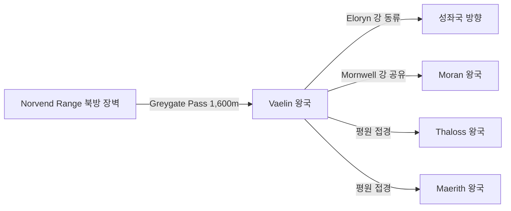

# Vaelin 왕국 — 내부 공작령·백작령 체계

## 원전 인용 증명

### [필독 1] political_divisions.md:53
> "바엘린 / Vaelin / 북부 평원"
— political_divisions.md:53 (위치 확정)

### [필독 2] political_divisions.md:109
> "Havren / 하브렌 / 북서 해안 / 모란·바엘린 왕국"
— political_divisions.md:109 (Vaelin 소속 권역 확정)

### [필독 3] brainstorm_2026-04-21_worldview_expansion.md:176 (발언 5)
> "좌측은 강이 많고 풍요로움 ... 보라색점은 좌측대륙에서 가장큰 제국이고, 나머지는 작은 왕국으로 이루어짐"
— 발언 5, brainstorm_2026-04-21_worldview_expansion.md:176

### [필독 4] mountain_ranges_2026-04-22.md:74
> "Greygate Pass / ~1,600m / Norvend 서쪽 1/3 / Thaloss ↔ Vaelin·Moran 주요 통로"
— mountain_ranges_2026-04-22.md:74 (Vaelin 과 직접 연결 고개 확정)

### [필독 5] rivers_major_2026-04-22.md:53
> "Eloryn River (엘로린 강) / ~1,100 km / Norvend 서쪽 사면 Greygate 인근 / 서해안 Mirevane Bay / 북→남서 / Vaelin·성좌국·Ilaris"
— rivers_major_2026-04-22.md:53 (Vaelin 통과 대하천 확정)

### [필독 6] FAILURES.md:56 (FAIL-002)
> "빈 자리는 '[대표님 결정 대기]' 마커 유지. AI가 '합리적 추론'으로 채우지 말 것."
— FAILURES.md:68

### [필독 7] game_setting_complete_2026-04-21.md:81–83 (영혼 평등 원칙)
> "다. 영혼 평등 원칙 — 우주적존재, 신, 인간 모두 별다를게없다는거다 능력이 다를뿐"
— game_setting_complete_2026-04-21.md:81–83

---

## 요약

**Vaelin** 은 Elucia 북부 평원 지대에 위치하는 **대왕국** (추정 200~270K km²) 이다. Havren 권역을 기반으로 하며, Norvend Range 남쪽 사면과 Greygate Pass 를 통한 북부 관문 역할을 겸한다. Eloryn 강 상류가 왕국 동부를 관통해 성좌국으로 이어진다. 북부 평원의 광활한 경작지와 초원이 경제 기반이다.

---

## 1. 왕국 기본 정보

| 항목 | 내용 |
|------|------|
| 영문명 | Kingdom of Vaelin |
| 위치 | 북부 평원 (Havren 권역) |
| 규모 분류 | **대왕국** (추정) |
| 면적 | ~200~270K km² (추정) |
| 왕도 | (대표님 미확정 · Wave 4 확정) |
| 접경 | 북 Thaloss / 서 Moran / 남 성좌국 / 동 Maerith |
| 주요 지형 | 북부 평원·초원 · Eloryn 강 상류 · Norvend 남쪽 기슭 |

---

## 2. 내부 공작령 5개 (작업 가설)

| # | 공작령명 | 위치 | 면적 (추정) | 핵심 자원 | 특성 |
|---|---------|------|-----------|---------|------|
| 1 | **Duchy of Vaelmark** | 왕도 인근 중앙 평원 | ~50K km² | 곡물·기병 | 왕실 직할 공작령 (추정) |
| 2 | **Duchy of Greyford** | Greygate Pass 남부 진입로 | ~40K km² | 통행세·군사 | 북방 관문 수비 공작령 (추정) |
| 3 | **Duchy of Mornhaven** | Mornwell 강 상류 · Moran 접경 | ~45K km² | 목축·양모 | 서부 방위 (추정) |
| 4 | **Duchy of Elorfeld** | Eloryn 강 상류 유역 | ~40K km² | 농업·수운 | 성좌국 방향 관문 (추정) |
| 5 | **Duchy of Plainwatch** | 북부 대초원 동쪽 | ~45K km² | 방목·말 | 기병 공급 기지 (추정) |

---

## 3. 백작령 구성 (공작령별)

| 공작령 | 배속 백작령 수 (추정) |
|-------|-------------------|
| Vaelmark | 6~8 |
| Greyford | 4~5 |
| Mornhaven | 5~6 |
| Elorfeld | 5~6 |
| Plainwatch | 4~5 |
| **합계** | **24~30** |

---

## 4. 지형·국경 특성

**자연 국경**:
- 북부: Norvend Range 남쪽 기슭 — 자연 방벽
- 동부: Eloryn 강 상류 — Maerith 방향 경계 후보 (추정)
- 서부: Mornwell 강 — Moran 과 공유 수계 (경계 분쟁 가능성, 추정)
- 남부: 평원 개방 경계 — 성좌국 직할지와 맞닿음 (인공 경계, 추정)

---

## 5. 남작령 스케일

- Wave 4 Kingdom-Detailer 담당 영역
- 추정 총 남작령: 80~130개
- 특이 남작령: Greygate Pass 진입로 수비 남작령들 — 통행세 기반 경제 (추정)

---

## 대표님 미확정 사항

- 왕도 위치·이름
- 왕가 이름·현재 군주
- 공작령 공식 이름·가문
- 성좌국 성좌세 납부 여부·규모

---

## 다음 Wave 의존 포인트

- **Toponymist (Wave 2)**: 공작령·왕도 이름 세계관 체계화
- **Historian (Wave 3)**: Vaelin 왕국 건국사·Greygate Pass 지배권 분쟁
- **Diplomat (Wave 3)**: Moran·Thaloss 와의 북부 동맹 구조
- **Kingdom-Detailer (vaelin, Wave 4)**: 공작령 상세·왕가·기사단·도시
