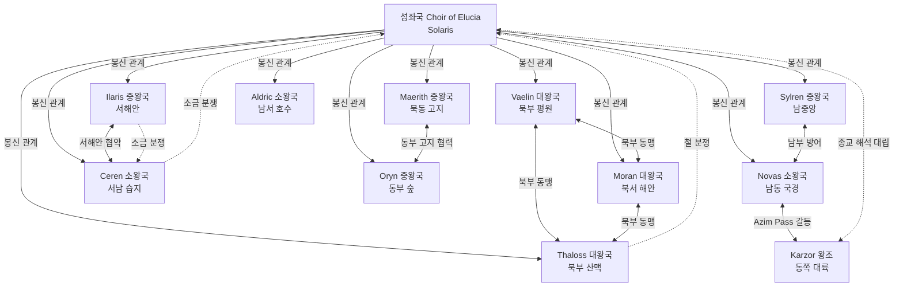

# Elucia 외교 관계 인덱스 (Wave 3 Diplomat)

> **이 파일은 네비게이션 인덱스 전용이다. 내용 서술 금지.**
> 각 관계의 상세 내용은 아래 링크 파일을 참조할 것.

---

## 원전 인용 증명

### [필독 1] brainstorm_2026-04-21_worldview_expansion.md:261 (발언 7)
> "좌우 대륙은 같은 신을 믿지만 서로 해석을 달리한다. 서로 적대적이긴하나 하나의 목표는 지성이있는 타 종족 몰살로 오로지 인류를 위한 행성을 목표로한다."
— 발언 7, brainstorm_2026-04-21_worldview_expansion.md:261 (종교 해석 차이 = 외교 갈등 핵심 원인)

### [필독 2] brainstorm_2026-04-21_worldview_expansion.md:3013-3026 (발언 50)
> "노예시장이 활발한 이유는 지형이 험하고 혹독한 지역이 많아 인적이 없는 지역이 많아서 타종족이 숨어살고있는경우가 많은 타종족비율이 서쪽 25%동쪽75%임"
— 발언 50, brainstorm_2026-04-21_worldview_expansion.md:3013 (동서 대륙 갈등 = 타종족 75/25 분포)

### [필독 3] political_divisions.md:43-62 (11 정치단위 확정)
> "엘루시아 성좌국 (수도 소라리스) / Choir of Elucia ... 바엘린 / Vaelin / 북부 평원 ... 알드릭 / Aldric / 남서 호수"
— political_divisions.md:43-62 (11 정치단위 변경 금지 확인)

---

## 관계 파일 전체 목록

### A. 관계 전체 프레임

| 파일 | 주제 |
|------|------|
| `00_overview.md` (이 파일) | 인덱스·전체 관계도 개관 |
| `power_hierarchy_2026-04-22.md` | 권력 서열 (성좌국 정점·대왕국 3·중왕국 4·소왕국 3) |
| `religious_division_orthodox_territory_2026-04-22.md` | 양심파 교회 세력 지역 분포 |
| `religious_division_corrupt_territory_2026-04-22.md` | 타락한 교회 세력 지역 분포 |
| `sphere_of_influence_solaris_2026-04-22.md` | 성좌국 영향권 구조 |

### B. 동맹 (`alliances/`)

| 파일 | 동맹 |
|------|------|
| `alliance_northern_league_2026-04-22.md` | 북부 3국 동맹 (Vaelin·Moran·Thaloss) |
| `alliance_silvan_pact_2026-04-22.md` | 서해안 협약 (Ilaris·Ceren) |
| `alliance_southern_frontier_2026-04-22.md` | 남부 국경 방어 협약 (Novas·Sylren) |
| `alliance_papal_vassal_chain_2026-04-22.md` | 성좌국 봉신 관계망 (전 왕국 대상) |
| `alliance_maerith_oryn_highland_2026-04-22.md` | 동부 고지 협력 (Maerith·Oryn) |

### C. 분쟁 (`conflicts/`)

**무역 갈등 (Economist 7건)**

| 파일 | 갈등 |
|------|------|
| `conflict_salt_price_dispute_2026-04-22.md` | Ceren 소금 가격 분쟁 (★★★) |
| `conflict_iron_supply_tension_2026-04-22.md` | Thaloss 철 공급 긴장 (★★★) |
| `conflict_via_imperialis_toll_2026-04-22.md` | Via Imperialis 통행세 (★★) |
| `conflict_azim_pass_toll_2026-04-22.md` | Azim Pass 통행세 · Novas ↔ Karzor (★★) |
| `conflict_timber_rights_2026-04-22.md` | Silvan·Orenwald 목재권 (★) |
| `conflict_lonwyn_fishing_rights_2026-04-22.md` | Lonwyn 어업권 (★) |
| `conflict_magic_licensing_2026-04-22.md` | 마법 무허가 단속 (★) |

**국경 분쟁**

| 파일 | 분쟁 |
|------|------|
| `border_dispute_greygate_pass_2026-04-22.md` | Greygate 고개 통행세 (Thaloss vs Vaelin·Moran) |
| `border_dispute_eloryn_river_2026-04-22.md` | Eloryn 강 어업권·관개권 (Vaelin vs 성좌국) |
| `border_dispute_soranth_forest_2026-04-22.md` | Soranth 강 수운·벌목권 (Oryn vs Sylren) |
| `border_dispute_aldric_lake_islands_2026-04-22.md` | Lonwyn 호수 소도 귀속 (Aldric vs Ceren) |

**역사적 적대**

| 파일 | 적대 관계 |
|------|---------|
| `historical_enmity_elucia_karzor_nomen_2026-04-22.md` | 동서 대륙 Nomen 쟁탈 역사 |
| `historical_enmity_thaloss_vaelin_greygate_2026-04-22.md` | Thaloss·Vaelin 세대 간 고개 분쟁 |
| `historical_enmity_solaris_hegemony_resistance_2026-04-22.md` | 성좌국 패권 vs 왕국 저항 역사 |

### D. 혼인 동맹 (`marriage_ties/`)

| 파일 | 혼인 관계 |
|------|---------|
| `marriage_vaelin_moran_2026-04-22.md` | Vaelin·Moran 왕실 혼인 (북부 대동맹 강화) |
| `marriage_solaris_thaloss_2026-04-22.md` | 성좌국·Thaloss 혼인 (철 독점 봉인) |
| `marriage_ilaris_ceren_2026-04-22.md` | Ilaris·Ceren 혼인 (서해안 동맹 강화) |
| `marriage_sylren_aldric_2026-04-22.md` | Sylren·Aldric 혼인 (남부 소왕국 생존 협약) |
| `marriage_novas_karzor_sabin_2026-04-22.md` | Novas·Karzor(Sabin) 혼인 (Azim Pass 외교 완충) |

### E. 무역 협정 (`trade_treaties/`)

| 파일 | 협정 |
|------|------|
| `treaty_salt_iron_exchange_2026-04-22.md` | Ceren 소금 ↔ Thaloss 철 교환 협정 |
| `treaty_via_imperialis_charter_2026-04-22.md` | Via Imperialis 성좌국 도로 헌장 |
| `treaty_nomen_island_trading_rights_2026-04-22.md` | Nomen 섬 교역권 현 상태 협약 |
| `treaty_silvan_timber_quota_2026-04-22.md` | Silvan 목재 쿼터 협정 |
| `treaty_azim_pass_transit_2026-04-22.md` | Azim Pass 통행 기본 협약 |

### F. 대륙 간 관계 (`intercontinental/`)

| 파일 | 주제 |
|------|------|
| `karzor_relations_overview_2026-04-22.md` | 동쪽 대륙 Karzor 와의 전반 관계 |
| `azim_pass_diplomacy_2026-04-22.md` | Azim Pass 통제 협정 (75/25 타종족 분포 갈등) |
| `nomen_neutral_zone_2026-04-22.md` | 중간 섬 Nomen 양대륙 쟁탈 역사 |

---

## 전체 관계 개관 다이어그램

---

## 핵심 외교 축 요약

| 축 | 성격 | 주요 당사자 |
|----|------|-----------|
| **성좌국 봉신 관계** | 구조적 지배 | 성좌국 vs 10 왕국 전체 |
| **북부 3국 동맹** | 군사·경제 협력 | Vaelin·Moran·Thaloss |
| **소금·철 갈등** | 자원 레버리지 경쟁 | Ceren·Thaloss·성좌국 |
| **서해안 동맹** | 해상 협력 | Ilaris·Ceren |
| **Azim Pass 긴장** | 대륙 간 통행 분쟁 | Novas·Karzor(Sabin) |
| **동서 종교 냉전** | 신 해석 차이 | 성좌국·Karzor 왕조 |
| **Nomen 쟁탈전** | 자원·통상로 확보 | 동서 대륙 전체 |

---

*인덱스 생성: 2026-04-22 · Wave3-Diplomat · naberal_game*
