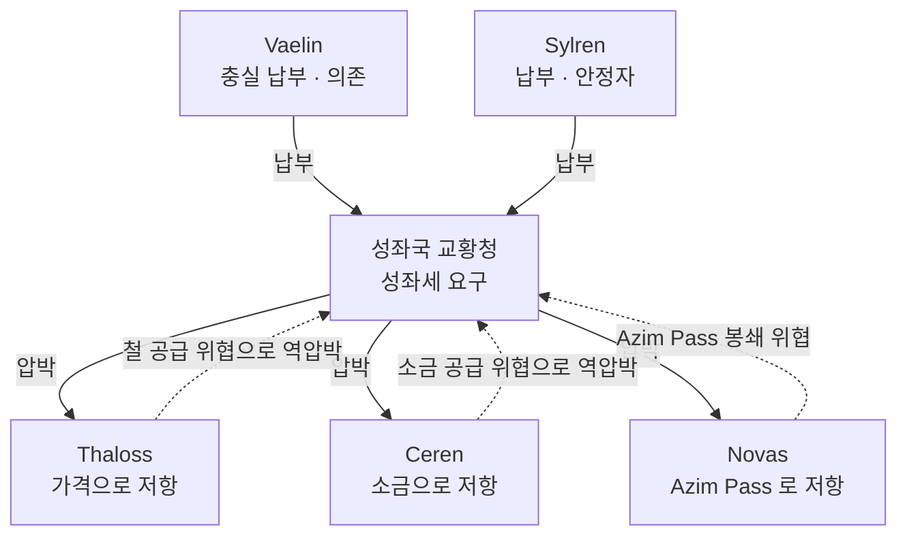

# 성좌국 봉신 관계망 (Papal Vassal Chain)

## 원전 인용 증명

### [필독 1] political_divisions.md:46-48
> "엘루시아 성좌국 (수도 소라리스) / Choir of Elucia / 교황청 보유 · 대륙 최대 권력 · 보라 심볼"
— 성좌국 = 대륙 최대 권력 확정

### [필독 2] brainstorm_2026-04-21_worldview_expansion.md:2776-2795 (발언 46)
> "어느마을이나 교회가있다."
— 발언 46 (봉신 관계 = 교회망을 통해 마을까지 침투)

### [필독 3] wiki/design/worldbuilding/elucia/culture/religious_schism_orthodox_vs_corrupt_2026-04-22.md:70-95
> "왕위 축성: 신임 국왕은 반드시 교황의 축성을 받아야 정통성 인정 ... 이단 선언권: 어느 왕국이든 이단으로 선언 → 왕위 파문 가능"
— sphere_of_influence (봉신 강제 기제 확인)

### [필독 4] brainstorm_2026-04-21_worldview_expansion.md:261 (발언 7)
> "좌우 대륙은 같은 신을 믿지만 서로 해석을 달리한다."
— 공통 신앙 = 봉신 관계 이데올로기 기반

### [필독 5] game_setting_complete_2026-04-21.md:136-140
> "최초 (첫 번째 신 시대): 선의의 조직 / 현재 (타락한 신 시대): 나태한 신이 교회를 타락시켜 절대 권력"
— 봉신 관계는 원래 신앙 공동체였으나 타락하여 지배 구조로 전락

### [필독 6] _shared_briefing.md:62-64 (Q-CORE 반영)
> "공식 신학·제국 역사서는 왜곡된 버전 유지 (악의 시초·타락한 악마 등)"
— 봉신 관계 공식 서사도 왜곡된 역사 기반

### [필독 7] .claude/failures/FAILURES.md
> FAIL-002: (추정) 표기 의무
— 전체 적용

---

## 요약

성좌국 봉신 관계망은 Elucia 10 왕국 전체를 교황청의 종교 권위 아래 묶는 **피라미드형 충성 구조**다. 표면상 신앙 공동체이나 실제로는 왕위 인정권·이단 선언권·Via Imperialis 통행세·대주교 임명권을 통해 경제·정치·군사를 동시에 통제하는 정교한 지배 체계다. 각 왕국은 공식적으로는 "자발적 봉신" 을 자처하나, 이탈 시 이단 선언 + 타 왕국 연합 응징 가능성 때문에 사실상 강제 복속 구조다.

---

## 1. 봉신 의무 체계 (추정)

| 의무 | 내용 | 불이행 시 결과 |
|------|------|-------------|
| **성좌세 납부** | 왕국 세수의 일정 비율 교황청 납부 | 교역 제재 + 이단 경고 |
| **왕위 축성 요청** | 신임 왕은 교황 공인 의례 필수 | 왕위 정통성 부정 → 타 왕국 왕위 주장 가능 |
| **징병 교구 참여** | 성전(聖戰) 선포 시 병력 제공 | 파문 위협 |
| **대주교 영접** | 성좌국 파견 대주교 왕국 내 활동 보장 | 교회 서비스 차단 |

---

## 2. 왕국별 봉신 충성도 (추정)

| 왕국 | 성좌세 납부율 | 봉신 충성도 | 특이 사항 |
|------|------------|-----------|---------|
| Vaelin | 90%+ | 최고 | 평야 곡물·인구 = 성좌국 의존 |
| Sylren | 85% | 높음 | 남부 안정자 역할 유지 |
| Moran | 75% | 중간 | 해군력 = 독립 카드 |
| Maerith | 70% | 중간 | 험지 = 실질 감시 약함 |
| Ilaris | 70% | 중간 | 항구 수익으로 일부 완충 |
| Oryn | 65% | 중간 | 삼림 = 은신 공간 · 실질 감시 약 |
| Aldric | 60% | 중간-낮음 | 변경 소왕국 · 호수 방어선 |
| Ceren | 55% | 낮음 | 소금 레버리지로 저항 |
| Novas | 50% | 낮음 | Azim Pass 카드로 저항 |
| Thaloss | 45% | 최저 | 철 레버리지 + 북부 동맹 방패 |

---

## 3. 성좌세 납부 갈등 구조

---

## 4. 파문 위협 — 최후 수단

교황청이 왕국을 이단 선언할 경우:
1. 해당 왕국 국왕 파문 선언
2. 타 왕국 국왕들에게 "성전" 참여 요청
3. 파문 왕국 내 교회 서비스 (성인식·장례·혼례) 중단
4. 성좌국 환전 거부 → 해당 왕국 화폐 가치 폭락

> **단, 실제 파문 발동은 드물다 (추정)**: 파문 대상이 북부 3국 대왕국일 경우 성좌국 자신도 군사적 반격 위험 부담. 실제로는 협상 도구로만 사용 (추정).

---

## 서사적 활용

- **Ch.12~18 주인공 이단 선언**: 교황청이 주인공에게 이단 선언 → 모든 봉신 왕국이 공적으로 추격 의무
- **Act 2 도주**: 성좌국 봉신 관계망이 주인공 은신처를 좁히는 그물 구조
- **Act 3 B**: 봉신 관계망 붕괴 = Elucia 기존 체제 해체의 전제 조건

---

## 대표님 미확정 사항

- 성좌세 납부 역사 중 가장 큰 갈등 사건 (Thaloss 가 세금 납부 거부한 적 있는가?)
- 파문 발동 최후 사례 역사
- 봉신 협약 서면 문서 존재 형태 (조약서? 교황 칙서? 구두 전통?)

## 다음 Wave 의존

- **Wave 3 Historian**: 봉신 관계 결성 역사 + 주요 파문 사례
- **Wave 4 Kingdom-Detailer × 12**: 각 왕국 시각의 봉신 수용·저항 서술

<!-- auto-generated-related:start -->
## 🔗 관련 (auto-generated)

> `scripts/obsidian/build_backlinks.py` 로 자동 생성. 수정 금지 — 다음 실행 시 덮어쓰여집니다.

### ⬆️ 상위

- [[../../../../../MOC]] — wiki 루트
- [[../../MOC]] — Elucia 허브

<!-- auto-generated-related:end -->
