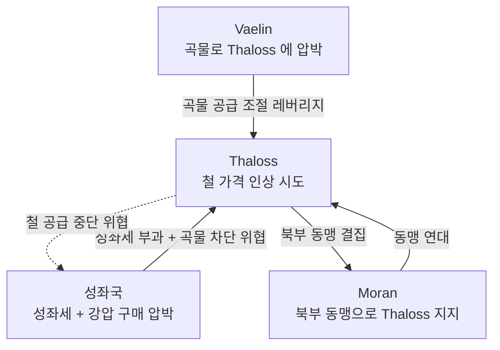

# Thaloss 철 공급 긴장 (Iron Supply Tension)

## 원전 인용 증명

### [필독 1] wiki/design/worldbuilding/elucia/economy/trade_networks_continental_2026-04-22.md:108-116
> "철광 / Thaloss / 전역 / Thaloss 가격 인상 vs 성좌국 강압 구매"
— trade_networks (Thaloss 철 = 대륙 전역 갈등 핵심 확인)

### [필독 2] wiki/design/worldbuilding/elucia/economy/trade_networks_continental_2026-04-22.md:78-83
> "TH[Thaloss 철·구리] → Via Imperialis → SO[Solaris 성좌국] / SO → 밀·보리 반대급부 → TH"
— trade_networks (철·곡물 교환 기본 구조 확인)

### [필독 3] political_divisions.md:55 (Thaloss 위치)
> "탈로스 / Thaloss / 북부 산맥 (Norvend)"
— political_divisions.md (Norvend 산맥 = 철 광산 지대 확정)

### [필독 4] wiki/design/worldbuilding/elucia/relations/power_hierarchy_2026-04-22.md
> "Thaloss / 철·구리 광산 독점 / 철 공급 레버리지로 반독립적 태도 / 1위 (자원 최강)"
— power_hierarchy (Thaloss = 성좌국 영향권 내 최저 복종도)

### [필독 5] brainstorm_2026-04-21_worldview_expansion.md:2776 (발언 46)
> "서쪽은 징병제"
— 발언 46 (철 = 군사력 기반 · 대규모 병기 제조 의존)

### [필독 6] _shared_briefing.md:85-89
> "불완전성 — 모든 것은 불완전하다"
— 철 독점도 Maerith 산맥 소광맥 개발 시 약화 가능

### [필독 7] .claude/failures/FAILURES.md
> FAIL-002: (추정) 표기 의무
— 전체 적용

---

## 요약

Thaloss 왕국은 Norvend 북부 산맥의 **철·구리 광산 독점** 을 통해 Elucia 전역의 무기·농기구·건설재 공급을 좌우한다. 성좌국이 군사력을 유지하려면 Thaloss 의 철이 필수적이며, 이 의존 구조가 Thaloss 에 "대왕국 중 가장 반독립적 태도" 를 가능케 한다. 갈등의 핵심은 **성좌국이 철 가격을 성좌세로 상쇄하려 하는 반면, Thaloss 는 시장 가격 적용을 요구** 한다는 데 있다.

---

## 1. 철 공급 구조

| 항목 | 내용 |
|------|------|
| **주요 광산** | Norvend 산맥 Greymount·Ironspine 광맥 (추정·대표님 미확정) |
| **연간 생산량** | 미정 |
| **주요 수요처** | 성좌국 (무기·갑옷) · Vaelin·Moran (병기) · 전역 농기구 |
| **가격 결정** | 현재 Thaloss 왕실 직할 가격 vs 성좌국 강압 구매 갈등 중 |

---

## 2. 분쟁 당사자 및 입장

| 당사자 | 입장 | 레버리지 |
|--------|------|---------|
| **Thaloss** | 시장 가격 자율 결정 + 성좌세 감면 | 철 공급 중단 위협 |
| **성좌국** | 성좌세 면제 대가 철 저가 공급 요구 | 곡물 공급 차단 + 이단 위협 (실행 어려움) |
| **Vaelin** | 철 안정 공급 필요 · 중재 시도 | 곡물 레버리지 (Thaloss 식량 공급) |
| **Moran** | 해군 함선 철재 필요 · Thaloss 지지 성향 | 북부 3국 동맹 내 연대 |

---

## 3. 갈등 메커니즘

---

## 4. 철 공급 관련 역사적 사건 (추정)

| 사건 | 시기 (추정) | 내용 |
|------|-----------|------|
| **제1차 철 봉쇄** | ~60년 전 | Thaloss, 성좌세 항의로 3개월 철 공급 중단 → 성좌국 군사 위기 |
| **중재 조약** | ~55년 전 | Vaelin 중재 · 철 가격 + 성좌세 연동 공식 (현재 적용 중) |
| **현재 갈등** | 최근 3년 | 물가 상승으로 기존 연동 공식 유효성 의문 · 재협상 교착 |

---

## 5. 서사적 활용

- **Act 1**: 기사 동료의 갑옷·무기 = Thaloss 철제 → 철 분쟁이 기사 신분 서사와 연결
- **Act 2**: 주인공 일행이 Thaloss 광산 인근 통과 시 철 공급 협상 중인 교황청 사절과 조우 가능
- **Act 3 A**: 성좌국이 Thaloss 를 이단 위협 + 곡물 차단 → 북부 3국 동맹 긴장 최고조

---

## 대표님 미확정 사항

- Norvend 광맥 공식 이름 (Greymount·Ironspine 은 작업 가설)
- 철 가격·성좌세 연동 공식의 구체 내용
- Thaloss 철 수출 금지 역사 사례 + 결과

## 다음 Wave 의존

- **Wave 4 Kingdom-Detailer (Thaloss)**: 광산 도시·야금 길드·철 교역 상세
- `treaty_salt_iron_exchange_2026-04-22.md`: 소금·철 교환 협정 연계
