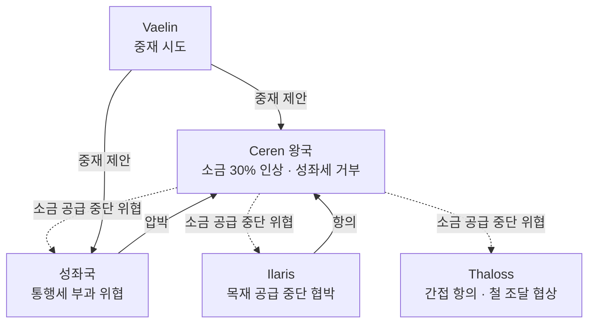

# Ceren 소금 가격 분쟁 (Salt Price Dispute)

## 원전 인용 증명

### [필독 1] wiki/design/worldbuilding/elucia/economy/mining_gems_and_salt_2026-04-22.md:90-96
> "Ceren 왕국은 규모나 군사력으로는 중간급 왕국이나, 소금 공급권 때문에 성좌국조차 함부로 다루지 못하는 특수 지위를 가진다 ... Ilaris 와의 긴장: 서해안 청어 절임을 위해 Ilaris 가 Ceren 소금을 반드시 구매해야 하는 구조 → 가격 협상 주기적 마찰"
— mining_gems_and_salt (소금 레버리지·가격 갈등 핵심 확인)

### [필독 2] wiki/design/worldbuilding/elucia/economy/trade_networks_continental_2026-04-22.md:108-116
> "소금 / Ceren / 전역 / Ceren 소금세 인상 시 전역 분노"
— trade_networks_continental (소금 갈등 = 대륙 전체 파급 확인)

### [필독 3] political_divisions.md:54 (Ceren 위치)
> "세렌 / Ceren / 서남 습지 (Loravel)"
— political_divisions.md (Loravel 습지 = 소금 산지 확정)

### [필독 4] wiki/design/worldbuilding/elucia/economy/mining_gems_and_salt_2026-04-22.md:96-103
> "소금세(鹽稅): 성좌국 교황청이 소금 통행세 부과를 시도하나 Ceren 이 저항 (추정)"
— mining_gems_and_salt (성좌국 vs Ceren 소금세 갈등 확인)

### [필독 5] brainstorm_2026-04-21_worldview_expansion.md:3013 (발언 50)
> "타종족비율이 서쪽 25%동쪽75%임"
— Ceren 습지 = 서쪽 타종족 은신지 포함 → 타종족 관할 분쟁과 연동

### [필독 6] _shared_briefing.md:85-89
> "불완전성 — 모든 것은 불완전하다"
— 소금 분쟁도 일시 타결·재발의 반복 구조

### [필독 7] .claude/failures/FAILURES.md
> FAIL-002: (추정) 표기 의무
— 전체 적용

---

## 요약

소금은 Elucia 경제에서 화폐에 준하는 전략 자원이며, 유일한 대규모 산지 Loravel 을 보유한 **Ceren 왕국** 이 이 자원을 레버리지로 대륙 정치에 과대한 영향력을 행사한다. 소금 가격을 둘러싼 Ceren 대 성좌국·Ilaris 의 갈등은 수십 년 주기로 재발하며, 현재도 **3차 소금세 분쟁** 이 교착 상태다(추정). 이 분쟁은 단순 경제 갈등을 넘어 "소왕국 하나가 패권 국가를 상대로 버틸 수 있는가" 라는 구조적 도전이다.

---

## 1. 분쟁 당사자 및 이해관계

| 당사자 | 입장 | 레버리지 |
|--------|------|---------|
| **Ceren** | 소금 가격 자율 결정권 주장 | Loravel 소금 독점 생산 |
| **성좌국** | 소금 통행세 부과 + 성좌세 납부 요구 | Via Imperialis 통행권 + 이단 선언 위협 |
| **Ilaris** | 저가 안정 공급 요구 | Ceren 에 목재 공급 중단 협박 가능 |
| **Thaloss** | 광부 식량 보존용 소금 안정 공급 요구 | 철 공급 조절로 간접 압박 |
| **Vaelin** | 군대 식량 보존용 소금 필요 | 정치적 중재자 역할 |
| **Aldric** | Coastfen 해염 자체 생산·자립 시도 | 서남 해안·Ceren 접경 해염 생산력 (소규모) |

---

## 2. 소금 분쟁 역사 (추정 · 작업 가설)

| 차수 | 시기 (추정) | 원인 | 결과 |
|------|-----------|------|------|
| **1차** | ~80년 전 | Ceren 소금세 20% 인상 | 성좌국 군사 위협 → Ceren 철회 |
| **2차** | ~40년 전 | 성좌국 소금 통행세 신설 시도 | Ceren·Ilaris 공동 저항 → 협상 타결 |
| **3차** (현재) | 최근 5년 | Ceren 소금 가격 30% 인상 + 성좌세 납부 거부 | 교착 상태 (추정) |

---

## 3. 현재 갈등 구조 (3차 분쟁)

---

## 3a. Aldric-Ceren 해염 축 (Q-FIX-8 세션 #5 확정)

Aldric 왕국 Duchy of Coastfen (현 Selyne 공작 관할) 의 해안에서 소규모 해염 생산이 이뤄진다. 기존 Ceren 독점 구조에 **균열** 을 내는 축으로, 4차 분쟁 잠재 요소다.

| 축 | 현황 |
|----|------|
| **Coastfen 해염 생산** | 서남 해안 연 ~3,000 톤 추정 · Ceren 연 ~50,000 톤 대비 6% 수준 |
| **Ceren 의 대응** | "해안 소금 역시 Ceren 독점 대상" 주장 · 통과세·어업권 연동 압박 |
| **Aldric 의 입장** | 국내 소비 자립 + 잉여분 해양 교역 · Ceren 독점 인정 거부 |
| **Selyne 공작의 역할** | 분쟁 실무 담당자 · 해안 수비대로 Ceren 세관 침입 방어 |
| **잠복 리스크** | Ceren 소금 가격 재인상 시 Aldric-Ilaris 대소금 동맹 가능성 |

### 서사 훅 (Rev.3)

- Act 2 외교 서브플롯: 주인공이 Aldric Coastfen 항구 통과 시 Ceren 세관원과 Selyne 수비대의 긴장 직접 목격 가능
- Act 3 A 경로: 소금 분쟁 타결 = 대륙 경제 질서 재편의 상징적 변곡점

---

## 4. 소금 밀수 문제

고가 소금에 따른 밀수 경제:
- **Novas 경유 Karzor 소금 밀수**: 동쪽 대륙 산 대안 소금이 Azim Pass 통해 유입 (추정)
- **해안 직거래**: 어부들이 Novas 산 소량 소금을 Ceren 경유 없이 직거래
- **결과**: 밀수 성공 시 Ceren 레버리지 약화 → Ceren 의 Novas 압박 구조

---

## 5. 집필 활용

> *"Ceren 의 소금 상인이 수레에 흰 자루를 가득 싣고 Via Imperialis 를 지나고 있었다. 위병이 통행세 장부를 들이밀었다. 상인은 표정 하나 변하지 않았다. 그가 팔려는 소금이 없으면 이 나라 군대는 겨울을 나지 못한다는 것을 둘 다 알고 있었다."*
— mining_gems_and_salt_2026-04-22.md 집필 예시 원문 재인용

---

## 대표님 미확정 사항

- 소금세 납부 방식 (현물세 vs 화폐세)
- Ceren 이 소금 독점권을 성좌국으로부터 공식 인정받은 조약 존재 여부
- 3차 분쟁의 타결 시나리오 (성좌국 양보? Ceren 절충안?)

## 다음 Wave 의존

- **Wave 4 Kingdom-Detailer (Ceren)**: Loravel 염전 지도·소금 상인 길드 상세
- `treaty_salt_iron_exchange_2026-04-22.md`: 소금·철 교환 협정과 연계
- `alliance_silvan_pact_2026-04-22.md`: Ilaris·Ceren 동맹 긴장과 연계
