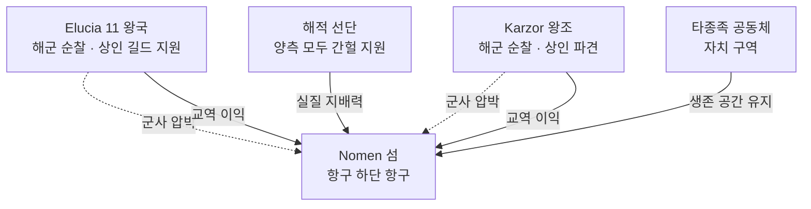

# 동서 대륙 Nomen 쟁탈 역사적 적대

## 원전 인용 증명

### [필독 1] brainstorm_2026-04-21_worldview_expansion.md:176 (발언 5)
> "이 섬을 놓고 자주싸운다. 좌우대륙이. ... 빨간색 점이 항구(북쪽얼음섬으로가는 유일한길, 나머지는 갈수가없다. 대륙윗쪽에서는 좌우 모두 물길이 너무험하고 작은 암초가 많아서 불가능, 몬스터도 많음."
— 발언 5 (Nomen 쟁탈전 = 대표님 직접 확정 원전)

### [필독 2] brainstorm_2026-04-21_worldview_expansion.md:237 (발언 6)
> "북쪽에는 초고대문명의 유산과 응축된 마석이 매우 많이 매장되어있어 동서대륙간 중앙 작은섬을 차지하려 전쟁중"
— 발언 6 (Nomen 쟁탈 원인 = 북쪽 자원 접근권)

### [필독 3] brainstorm_2026-04-21_worldview_expansion.md:261 (발언 7)
> "좌우 대륙은 같은 신을 믿지만 서로 해석을 달리한다. 서로 적대적이긴하나"
— 발언 7 (동서 대륙 = 공유 목표에도 불구 적대 기조)

### [필독 4] political_divisions.md:29-30
> "노멘 / Nomen / 항구 · 여러 종족 공생 · 해적 무법지 · 북쪽 유일 접근"
— political_divisions.md (Nomen 섬 성격 확정)

### [필독 5] _shared_briefing.md:62-64 (Q-CORE 반영)
> "수정 2 봉인지 ... 수정 2 = 태초 마왕이 마족 증식 위해 제작"
— Veilglass 봉인 관련 직접 서술 금지 · 공식 외교에서는 "응축된 마석 자원" 명분만

### [필독 6] brainstorm_2026-04-21_worldview_expansion.md:176 (발언 5 — 공생·무법)
> "중간에 빨간점이있는 섬은 여러종족이 현재는 어느정도 공생하며 살아감 ... 하지만 반 무법지대로, 자주싸움이 일어난다."
— 발언 5 (현재 Nomen 상태 확정)

### [필독 7] .claude/failures/FAILURES.md
> FAIL-002: (추정) 표기. FAIL-006: 발언 원문 축약 금지
— 전체 적용

---

## 요약

동서 대륙 간 Nomen 섬 쟁탈전은 Elucia 대륙의 가장 오래된 국제 분쟁이다(추정). 쟁탈의 표면적 이유는 **상업 허브 장악**이나, 실질 이유는 발언 6 이 확정한 바대로 **북쪽 Veilglass 얼음섬의 초고대문명 유산 + 응축된 마석** 에 대한 독점 접근권이다. 역사적으로 수차례 전면전과 점령·피점령이 반복되었으며, 현재는 어느 쪽도 완전 장악 못 한 **반무법지대 교착 상태**다.

---

## 1. 쟁탈 전쟁 역사 (추정 · 작업 가설)

| 차수 | 시기 (추정) | 승자 | 결과 |
|------|-----------|------|------|
| **제1차 Nomen 전쟁** | ~300년 전 | Elucia (추정) | 서쪽 단기 점령 → 해적 저항으로 철수 |
| **제2차 Nomen 전쟁** | ~200년 전 | Karzor (추정) | 동쪽 단기 점령 → Elucia 해군 반격 |
| **제3차 Nomen 전쟁** | ~80년 전 | 무승부 | 양측 동시 철수 · 중립 조약 (불안정) |
| **현재** | 진행 중 | — | 해적·상인·타종족 사실상 자치 |

*(전량 추정 · 대표님 미확정)*

---

## 2. 현재 Nomen 섬 교착 구조

---

## 3. Nomen 섬 전략 가치 3층

| 층위 | 내용 |
|------|------|
| **교역 허브** | 동서 상인 중립 만남 → 교역세 수입 |
| **Veilglass 접근** | 북쪽 유일 항로 기점 → 응축된 마석 접근권 |
| **타종족 공생 공간** | 유일한 공식 박해 없는 종족 혼합 공간 |

---

## 4. Q-CORE 반영 — Veilglass 진실 층위

> 공식 외교 문서: "Veilglass 에 응축된 마석과 초고대문명 유산이 있다"
>
> 실제 (Q-CORE 보호 · 직접 서술 금지): 엘프·용족 구전에는 "어느 얼음섬에 봉인된 것이 있다는 속설" 수준만 허용.
>
> 성좌국과 Karzor 왕조 모두 **"응축된 마석"** 명분만 공식 주장. 봉인된 것의 정체는 모름.

---

## 서사적 활용

- **발언 5·6 의 서사 엔진**: Nomen 쟁탈전 = 대륙 전체 갈등의 물리적 무대
- **Act 1 배경**: Nomen 섬의 해적·타종족 공생 = 주인공이 처음으로 "진짜 세계" 를 목격하는 공간 후보
- **Act 3 B 화합**: Nomen 섬 중립화 협정 = 화합의 상징 거점

---

## 대표님 미확정 사항

- Nomen 쟁탈 전쟁 차수·이름 확정 (전량 추정)
- 현재 Elucia·Karzor 어느 쪽이 Nomen 해군 우세인지
- Veilglass 관련 공식 외교 주장의 구체 문구

## 다음 Wave 의존

- `nomen_neutral_zone_2026-04-22.md` (intercontinental): Nomen 섬 대륙 간 협정 파일
- `karzor_relations_overview_2026-04-22.md`: 전반 동서 관계 큰 그림
