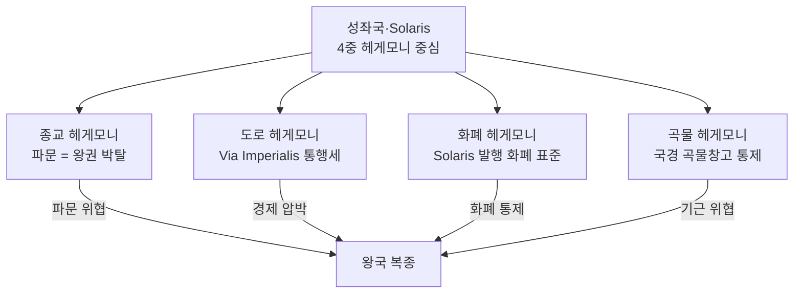

# 성좌국 패권 저항 역사 — Elucia 11 왕국 대(對) Solaris 헤게모니

## 원전 인용 증명

### [필독 1] brainstorm_2026-04-21_worldview_expansion.md:261 (발언 7)
> "좌우 대륙은 같은 신을 믿지만 서로 해석을 달리한다. 서로 적대적이긴하나"
— 발언 7 (종교 해석 갈등 = 헤게모니 저항의 이념적 뿌리)

### [필독 2] brainstorm_2026-04-21_worldview_expansion.md:350 (발언 9)
> "부패한 교단 (80~90% 다수, Solaris 중심) vs 양심 교단 (10~20% 소수, 국경 왕국 중심)"
— 발언 9 (헤게모니 저항 = 양심 교단 분포 왕국들에서 집중)

### [필독 3] brainstorm_2026-04-21_worldview_expansion.md:370 (발언 10)
> "성좌국은 종교 + 도로 + 화폐 + 곡물창고 4중 헤게모니로 11 왕국을 통제"
— 발언 10 (4중 헤게모니 = 저항의 대상 구조 직접 확정)

### [필독 4] wiki/design/worldbuilding/elucia/political/power_balance_2026-04-22.md (Wave 2)
> TIER 1 (Thaloss·Vaelin·Moran) = 부분 저항 가능 · TIER 3 (Ceren·Novas·Aldric) = 고위험 저항
— 왕국별 저항 가능성 구조

### [필독 5] wiki/design/worldbuilding/elucia/political/borders_disputed_2026-04-22.md:61
> "Eloryn 강 좌안·우안 분쟁 / Vaelin vs 성좌국 / 주기적 소규모 충돌 (추정)"
— borders_disputed (가장 순종적 봉신도 착취당함 = 헤게모니 구조적 탐욕)

### [필독 6] _shared_briefing.md:62-64 (Q-CORE 반영)
> "수정 1 = 태초 마왕이 해방용 덫으로 제작 ... 마왕 ≠ 할배"
— Q-CORE: 헤게모니 저항 서사는 "교단 부패"로만 서술, 신의 실체·봉인 관련 내용 금지

### [필독 7] .claude/failures/FAILURES.md
> FAIL-002: (추정) 표기 의무 · FAIL-006: 발언 원문 축약 금지
— 전체 적용

---

## 요약

성좌국(Choir of Elucia) 은 종교·도로·화폐·곡물창고 4중 헤게모니로 11 왕국을 수백 년간 지배해왔다(추정). 이에 대한 **왕국들의 저항 역사**는 크게 3파로 나뉜다: 무력 항쟁(역사적·현재 소멸), 신학 이단(양심 교단), 외교 동맹(북부 3국 등). 현재는 어느 왕국도 성좌국과 전면 대결을 선택하지 못하는 **공포에 기반한 복종** 상태이나, 양심 교단 성장이 저항의 불씨를 유지하고 있다.

---

## 1. 헤게모니 저항 역사 연표 (추정 · 작업 가설)

| 시기 (추정) | 사건 | 저항 주체 | 결과 |
|-----------|------|---------|------|
| **~500년 전** | 고대 왕국 연합 항쟁 | 복수 왕국 연합 | 성좌국 성전(聖戰) 선포 → 연합 해체, 성좌세 인상 |
| **~350년 전** | 북부 2국 독립 선언 | Thaloss·(구 왕국) | 교황청 파문 → 기근·고립 → 3년 후 굴복 |
| **~200년 전** | 양심 교단 최초 분파 | 익명 신학자 집단 | 이단 판결·처형, 지하 생존 |
| **~100년 전** | Novas 일시 불복종 | Novas 왕 | Azim Pass 통제권 빼앗길 위기 → 즉각 복종 |
| **~60년 전** | 철 봉쇄 저항 연동 사건 | Thaloss (소극) | 성좌국 개입 중재 → 결국 Thaloss 유리한 결과 (의존 재확인) |
| **현재** | 양심 교단 성장 · 북부 동맹 유지 | 소수 국경 왕국 | 표면 복종 + 수면하 저항 병행 |

*(전량 추정 · 대표님 미확정)*

---

## 2. 4중 헤게모니 — 저항 불가 구조

---

## 3. 왕국별 저항 양상 (추정)

| 왕국 | 저항 유형 | 강도 | 현재 상태 |
|------|---------|------|---------|
| **Thaloss** | 외교·경계 저항 | ★★★ | 북부 동맹 활용, Greygate 독립성 유지 |
| **Novas** | 지리 우위 활용 | ★★ | Azim Pass 통제권으로 간접 저항 |
| **Aldric** | 소극 불복종 | ★ | 국경 소도 분쟁에서 성좌국 중재 거부 |
| **Maerith** | 신학 이단 용인 | ★★ | 양심 교단 비공식 보호 (추정) |
| **Vaelin** | 형식 복종 | ★ | 가장 순종적이나 Eloryn 강 분쟁 = 내부 불만 |
| **Moran** | 형식 복종 | ★ | 북부 동맹 통해 집단 저항 위탁 |
| **Ilaris** | 경제 독립 추구 | ★★ | 항구 무역 수익으로 의존도 낮춤 |
| **Oryn** | 삼림 독립 | ★ | Orenwald 삼림 = 성좌국 접근 어려운 완충지 |
| **Sylren** | 순종 | ✗ | 성좌국 곡물 원조 의존 → 저항력 없음 |
| **Ceren** | 소극 불복종 | ★ | 소금 분쟁에서 성좌국 역할 거부 |

---

## 4. 양심 교단 — 이념적 저항의 핵

| 항목 | 내용 |
|------|------|
| 신학 차이 | "신의 뜻은 교단 독점이 아닌 개인 양심을 통해" (추정) |
| 분포 | 국경 왕국(Thaloss·Novas·Aldric) 20~30% |
| 성좌국 대응 | 이단 판결 + 이단 심문소 파견 (비정기) |
| 정치 연동 | 양심 교단 강세 왕국 = 성좌국 헤게모니 저항도 높음 (상관 관계, 추정) |

---

## 서사적 활용

- **주인공의 여정 = 저항 역사 재발견**: 각 왕국에서 이전 저항의 흔적(폐허·금서·숨겨진 사당) 목격
- **양심 교단 NPC**: 주인공에게 성좌국의 진실을 조각 조각 전달하는 정보 네트워크
- **Act 2 위기**: 성좌국의 새로운 헤게모니 강화책 → 왕국들이 분열할지 연대할지 선택
- **Act 3 B 화합**: 저항 역사 공유가 11 왕국 연대의 감정적 토대

---

## Q-CORE 반영

> 성좌국 헤게모니 = "교단 부패 + 정치 이익" 으로만 서술.
>
> 신의 실체, 봉인된 것의 정체, 수정 1/2 관련 내용은 이 파일에 일절 기록하지 않는다.
>
> 양심 교단의 신학 = "교단 독점 비판" 수준에서 멈춤. 신 자체의 진실은 Q-CORE 보호.

---

## 대표님 미확정 사항

- 고대 항쟁 왕국 연합 구성 (전량 추정)
- 북부 2국 독립 선언 시기·구체 사건 (추정)
- 양심 교단 최초 분파 인물 (Wave 3 Historian 담당)
- 현재 이단 심문소 활동 빈도

## 다음 Wave 의존

- `religious_division_orthodox_territory_2026-04-22.md`: 양심 교단 분포 연동
- `sphere_of_influence_solaris_2026-04-22.md`: 4중 헤게모니 상세
- **Wave 4 Kingdom-Detailer (Thaloss·Novas·Maerith)**: 저항 왕국 내부 정치 상세
