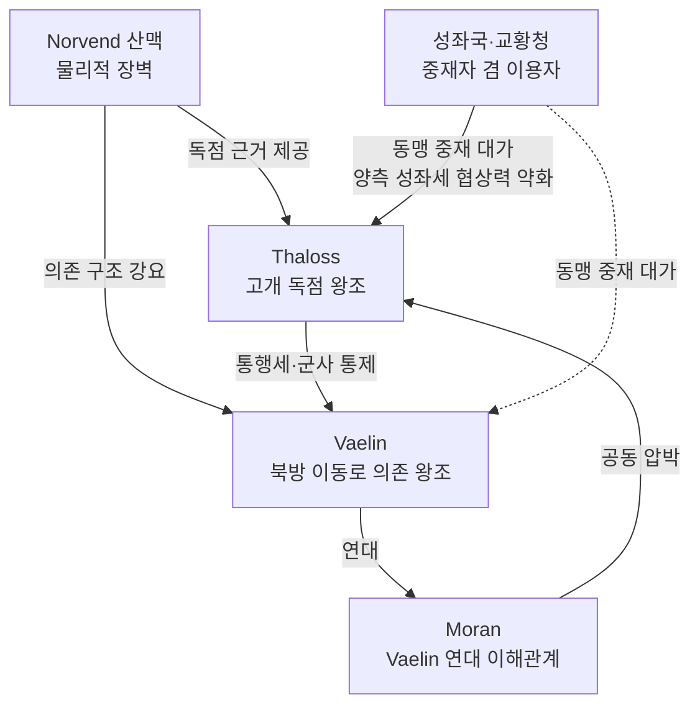

# Greygate 고개 역사적 적대 — Thaloss ↔ Vaelin 세대 간 원한

## 원전 인용 증명

### [필독 1] brainstorm_2026-04-21_worldview_expansion.md:176 (발언 5)
> "서쪽은 징병제가 발달한 중세 유럽 스타일 봉건국가들 ... 대규모 보병 · 기사 엘리트 장교"
— 발언 5 (서쪽 대륙 = 봉건 징병제 군사문화 → 고개 통제 = 왕국 생존 문제)

### [필독 2] wiki/design/worldbuilding/elucia/political/borders_disputed_2026-04-22.md:60
> "Greygate 관문 통행세 분쟁 / Norvend Greygate Pass 일대 / Thaloss vs Vaelin·Moran / 고개 통행세 독점 vs 자유 통행 요구 / 교황청 중재 조약 · 불안정 평화 (추정)"
— borders_disputed (현재 분쟁 기록 — 역사적 원한의 현대 표현)

### [필독 3] wiki/design/worldbuilding/elucia/political/borders_natural_2026-04-22.md (Wave 2 지리)
> Norvend 산맥 = Thaloss 와 Vaelin·Moran 사이 자연 경계 (Wave 2 Geographer 확인)
— 산맥 = 적대 구조의 물리적 원인

### [필독 4] political_divisions.md:107
> "Norvend / 노르벤드 / 북부 산맥 너머 / 탈로스 왕국"
— political_divisions.md (Norvend = Thaloss 북부 권역 확정)

### [필독 5] wiki/design/worldbuilding/elucia/political/power_balance_2026-04-22.md (Wave 2)
> Thaloss·Vaelin·Moran = TIER 1 3대 왕국, 성좌국 다음 서열
— 동급 대형국가 간 고개 독점 = 특히 치명

### [필독 6] .claude/failures/FAILURES.md
> FAIL-002: (추정) 표기 의무 · FAIL-006: 발언 원문 축약 금지
— 전체 적용

---

## 요약

Norvend 산맥의 **Greygate Pass** 를 Thaloss 가 수백 년간 단독 관할하면서, 북방 이동로를 공유해야 하는 Vaelin 과의 사이에 **세대를 건너온 원한(世代怨恨)**이 누적되었다(추정). 현재는 북부 3국 동맹 내에서 표면적으로 협력하면서도, 고개 통행세 문제가 터질 때마다 동맹 균열이 노출된다. 이 적대는 단순 이익 분쟁이 아니라 **왕조 자존심과 군사 열위(劣位) 에 대한 집단 기억**에서 비롯된다.

---

## 1. 역사적 원한 연표 (추정 · 작업 가설)

| 시기 (추정) | 사건 | 결과 |
|-----------|------|------|
| **~400년 전** | Norvend 산맥 최초 Thaloss 영역 확정 | Vaelin = 산맥 남쪽에 갇힘 |
| **~300년 전** | 제1차 Greygate 전쟁 (Vaelin 돌파 시도) | Thaloss 요새 방어 성공, Vaelin 다수 사상 |
| **~180년 전** | 제2차 Greygate 분쟁 (Vaelin·Moran 연합 압박) | 교황청 중재 → Vaelin 동맹국 감면 조항 획득 (불완전) |
| **~80년 전** | 철광 봉쇄와 연동, Thaloss 통행세 2배 인상 | Vaelin 곡물 대기근(추정) → 민중 감정 극도 악화 |
| **현재** | 북부 3국 동맹 체결 후 불안정 평화 | 통행세 분쟁 재점화 대기 상태 |

*(전량 추정 · 대표님 미확정)*

---

## 2. 원한 구조 분석

---

## 3. Vaelin 의 집단 기억 — 원한의 3층

| 층위 | 내용 |
|------|------|
| **군사 열위 기억** | 제1차 전쟁 참패 → "산맥을 못 넘는 왕국" 낙인 (추정) |
| **경제 종속 기억** | ~80년 전 대기근 = Thaloss 통행세 인상이 방아쇠 (추정) → 민중 스토리 내재 |
| **외교 굴욕 기억** | 교황청 중재에서 Vaelin 이 먼저 양보 요구받음 (추정) |

---

## 4. Thaloss 의 명분 — 정당화 서사

- **방어 비용 논리**: "산맥 요새 유지 비용(제설·보수·경비)은 Thaloss 만의 부담"
- **역사 우선권**: "Norvend 는 Thaloss 건국 이전부터 우리 선조의 땅"
- **자유 통행 = 안보 위협**: "고개 개방 = 북방 몬스터 침입로 개방과 동일"

---

## 5. 현재 동맹 내 균열 양상

| 상황 | Thaloss 태도 | Vaelin 태도 |
|------|------------|------------|
| 평시 | 동맹 형식 유지, 통행세 현상 유지 | 협력 제스처, 내부 불만 억제 |
| 위기 (외부 위협) | 동맹 적극 활용 | 고개 개방 조건부 협력 요구 |
| 통행세 협상 시 | "비용 보상" 원칙 고수 | "역사적 부채" 논리 반발 |
| Solaris 압박 시 | 3국 단결 > 고개 분쟁 우선 | 동일 (Solaris 위협이 더 큼) |

---

## 서사적 활용

- **Act 1**: 주인공이 Greygate 검문소 통과 → Vaelin 상인의 통행세 불만 직접 청취 → 북부 3국 동맹의 허약성 체감
- **Act 2**: Thaloss 왕가 내 강경파 vs 온건파 갈등 = 고개 개방 협상의 서사 무대
- **Act 3 A 붕괴**: Thaloss 가 통행세 극단적 인상 → 북부 동맹 해체 → 성좌국 개입 명분

---

## 대표님 미확정 사항

- Greygate 제1·2차 전쟁 공식 명칭 (전량 추정)
- 현재 동맹 내 통행세 감면 비율 정확 수치
- Moran 의 이 분쟁 개입 깊이

## 다음 Wave 의존

- `alliance_northern_league_2026-04-22.md`: 동맹 균열과 직접 연동
- `border_dispute_greygate_pass_2026-04-22.md`: 현재 분쟁 표현 파일
- **Wave 4 Kingdom-Detailer (Thaloss·Vaelin)**: 왕조 기억·요새 도시 상세
