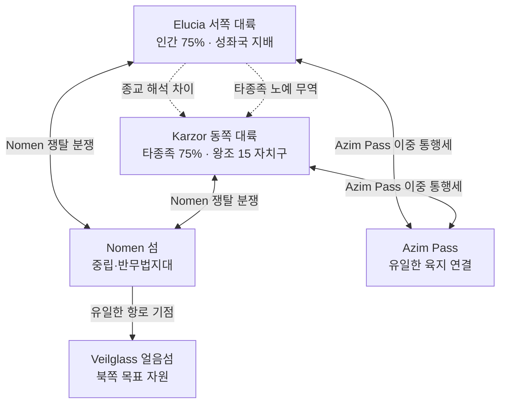

# Elucia–Karzor 동서 대륙 관계 전반 개요

## 원전 인용 증명

### [필독 1] brainstorm_2026-04-21_worldview_expansion.md:176 (발언 5)
> "이 섬을 놓고 자주싸운다. 좌우대륙이. ... 빨간색 점이 항구(북쪽얼음섬으로가는 유일한길, 나머지는 갈수가없다. 대륙윗쪽에서는 좌우 모두 물길이 너무험하고 작은 암초가 많아서 불가능, 몬스터도 많음."
— 발언 5 (동서 대륙 관계 = Nomen 쟁탈전 직접 확정)

### [필독 2] brainstorm_2026-04-21_worldview_expansion.md:237 (발언 6)
> "북쪽에는 초고대문명의 유산과 응축된 마석이 매우 많이 매장되어있어 동서대륙간 중앙 작은섬을 차지하려 전쟁중"
— 발언 6 (쟁탈 원인 = 북쪽 자원)

### [필독 3] brainstorm_2026-04-21_worldview_expansion.md:261 (발언 7)
> "좌우 대륙은 같은 신을 믿지만 서로 해석을 달리한다. 서로 적대적이긴하나"
— 발언 7 (종교 해석 차이 = 적대의 이념적 근거)

### [필독 4] brainstorm_2026-04-21_worldview_expansion.md:2801 (발언 49)
> "동쪽 대륙은 타종족이 75% ..."
— 발언 49 (동서 대륙 종족 구성 차이)

### [필독 5] brainstorm_2026-04-21_worldview_expansion.md:2830 (발언 50)
> "서쪽 대륙은 인간이 ... 25% 정도 타종족"
— 발언 50 (서쪽 대륙 종족 구성 확정)

### [필독 6] political_divisions.md:29-30
> "Karzor 왕조 / 동쪽 대륙 / 수도 Zarahim + 14 자치구 = 15 정치단위"
— political_divisions.md (Karzor 구조 확정)

### [필독 7] .claude/failures/FAILURES.md
> FAIL-002: (추정) 표기 의무 · FAIL-006: 발언 원문 축약 금지
— 전체 적용

---

## 요약

Elucia(서쪽 대륙) 와 Karzor(동쪽 대륙) 는 **같은 신을 믿으나 종교 해석이 다르고, 같은 자원(Veilglass 접근)을 원하지만 경로(Nomen 섬) 를 놓고 싸우는** 구조적 경쟁 관계다. 두 대륙은 교역을 완전히 단절하지 않은 채 Nomen 섬과 Azim Pass 를 통해 연결되어 있으며, 이 두 연결고리가 동시에 갈등의 핵심 무대다. 대륙 전체가 단일 전선이 아니라 **지역별로 상이한 온도의 긴장**을 유지한다.

---

## 1. 동서 대륙 관계 구조 전체도

---

## 2. 동서 대륙 비교 요약

| 항목 | Elucia (서쪽) | Karzor (동쪽) |
|------|------------|-------------|
| **인구 구성** | 인간 75% · 타종족 25% | 타종족 75% · 인간 25% |
| **정치 체제** | 성좌국 + 11 왕국 봉건 | Karzor 왕조 + 15 자치구 |
| **군사 방식** | 징병제 보병 · 기사 엘리트 | (추정) 다종족 혼성군 |
| **종교** | 같은 신 · 부패 교단 80~90% | 같은 신 · 동쪽 해석 (추정) |
| **Nomen 태도** | 군사 점령 시도 · 교역 지배 | 동일 |
| **Azim Pass** | Novas 북문 통제 | Sabin 자치구 남문 통제 |

---

## 3. 관계 5대 긴장 축

| 긴장 축 | 내용 | 강도 |
|---------|------|------|
| **Nomen 쟁탈** | 북쪽 자원 독점 접근 경쟁 | ★★★ |
| **Azim Pass 통행세** | 이중 징수 구조 분쟁 | ★★★ |
| **종교 해석 차이** | 신학 논쟁 → 외교 마찰 | ★★ |
| **타종족 정책** | 동쪽 = 타종족 다수 · 서쪽 = 박해 → 마찰 | ★★ |
| **노예 무역 루트** | Azim Pass 통과 노예 상단 묵인 | ★ (비공식) |

---

## 4. 평화 채널 현황

| 채널 | 상태 |
|------|------|
| Nomen 교역권 조약 | 명목 유지 · 실질 불안정 |
| Azim Pass 통행 협정 | 유지 · 이중 통행세 분쟁 중 |
| Novas-Karzor Sabin 혼인 협약 | 반공식 · 성좌국 비승인 |
| 성좌국-Karzor 종교 대화 | 단절 상태 (추정) |

---

## 서사적 활용

- 동서 대륙 전면 개방 = Act 3 대단원의 지정학 전제
- Karzor NPC = 서쪽 대륙 문화의 편견을 깨는 캐릭터 (타종족 다수 = 다른 세계관)
- Karzor 의 "동쪽 종교 해석" = 서쪽 부패 교단에 대한 대안 신학 단서

---

## Q-CORE 반영

> Karzor 측 Veilglass 관련 주장 = "응축된 마석 + 초고대문명 유산" 명분만 공식 기록.
> 봉인 내용물 정체는 이 파일에 기록하지 않는다.

---

## 대표님 미확정 사항

- Karzor 동쪽 종교 해석의 구체 내용 (추정)
- 타종족 75% 중 종족 분포 (Wave 4 Karzor 담당)
- 성좌국-Karzor 종교 대화 단절 경위

## 다음 Wave 의존

- `azim_pass_diplomacy_2026-04-22.md`: Azim Pass 외교 상세
- `nomen_neutral_zone_2026-04-22.md`: Nomen 중립화 상세
- **Wave 4 Karzor-Detailer**: 동쪽 대륙 15 자치구 내부 정치
