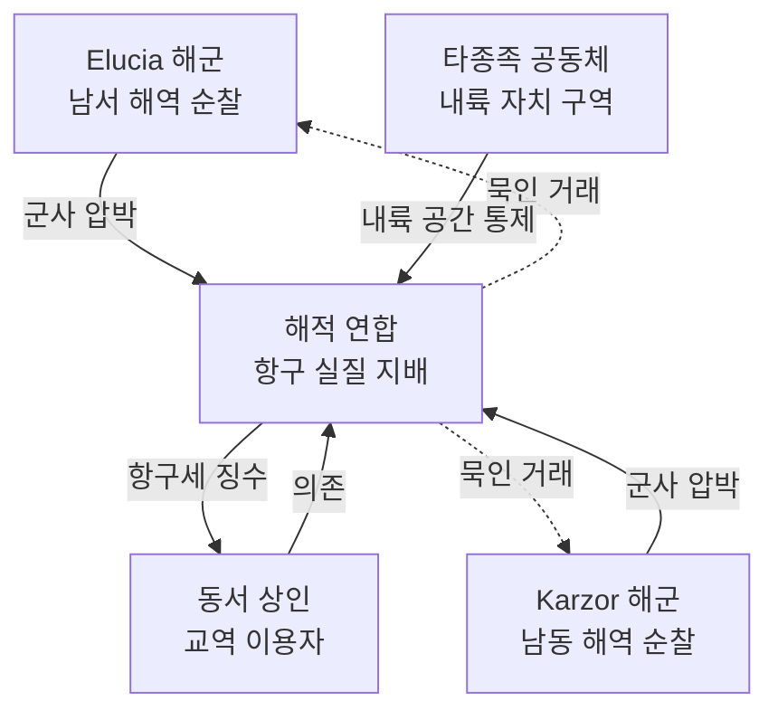

# Nomen 섬 중립 지대 — 동서 대륙 간 반공식 공존 체계

## 원전 인용 증명

### [필독 1] brainstorm_2026-04-21_worldview_expansion.md:176 (발언 5)
> "이 섬을 놓고 자주싸운다. 좌우대륙이. ... 빨간색 점이 항구(북쪽얼음섬으로가는 유일한길, 나머지는 갈수가없다. 대륙윗쪽에서는 좌우 모두 물길이 너무험하고 작은 암초가 많아서 불가능, 몬스터도 많음."
— 발언 5 (Nomen 쟁탈전 + Veilglass 접근 유일 경로 직접 확정)

### [필독 2] brainstorm_2026-04-21_worldview_expansion.md:176 (발언 5 추가)
> "중간에 빨간점이있는 섬은 여러종족이 현재는 어느정도 공생하며 살아감 ... 하지만 반 무법지대로, 자주싸움이 일어난다."
— 발언 5 (Nomen 현재 상태 = 공생 + 반무법지대 직접 확정)

### [필독 3] brainstorm_2026-04-21_worldview_expansion.md:237 (발언 6)
> "북쪽에는 초고대문명의 유산과 응축된 마석이 매우 많이 매장되어있어 동서대륙간 중앙 작은섬을 차지하려 전쟁중"
— 발언 6 (쟁탈 원인 = 북쪽 자원 접근)

### [필독 4] political_divisions.md:29-30
> "노멘 / Nomen / 항구 · 여러 종족 공생 · 해적 무법지 · 북쪽 유일 접근"
— political_divisions.md (Nomen 성격 4항목 모두 확정)

### [필독 5] wiki/design/worldbuilding/elucia/relations/conflicts/historical_enmity_elucia_karzor_nomen_2026-04-22.md
> 제3차 Nomen 전쟁 후 중립 조약 체결 · 현재 교착 유지
— historical_enmity (이 파일의 역사적 배경)

### [필독 6] _shared_briefing.md:62-64 (Q-CORE)
> 수정 2 봉인 관련 = 직접 서술 금지
— Q-CORE: Veilglass 내용물 = 이 파일에서도 "응축된 마석·초고대문명 유산" 명분만

### [필독 7] .claude/failures/FAILURES.md
> FAIL-002: (추정) 표기 의무 · FAIL-006: 발언 원문 축약 금지
— 전체 적용

---

## 요약

**Nomen 섬 중립 지대**는 제3차 Nomen 전쟁(추정) 이후 동서 대륙이 어느 쪽도 완전 장악하지 못한 채 **사실상 해적 연합·타종족 자치 공동체가 실질 관리하는 반공식 공존 체계**다. 공식 조약(Nomen 교역권 조약)은 중립 원칙을 명시하지만, 현장은 해군 충돌·해적 통제·타종족 자치가 혼재하는 무질서한 공존이다. 이 섬은 **동서 대륙 관계의 가장 불안정한 접점**이자, 동시에 **양 대륙이 필사적으로 포기 못 하는 전략 자산**이다.

---

## 1. Nomen 섬 현재 권력 지형

---

## 2. 중립 지대의 실질 기능

| 기능 | 공식 | 실질 |
|------|------|------|
| **교역 중립지** | 동서 상인 동등 접근 | 해적 연합이 통행세 실질 결정 |
| **Veilglass 출발항** | 양측 동등 탐험권 | 해적 호위 비용 = 사실상 접근 제한 |
| **타종족 공생 공간** | 공식 조항 없음 | 유일한 공식 박해 없는 다종족 공간 |
| **정보 교환** | 공식 채널 없음 | 양 대륙 첩보원·상인 비공식 접촉 |

---

## 3. 중립 지대 붕괴 시나리오 (추정)

| 시나리오 | 트리거 | 결과 |
|---------|------|------|
| **Elucia 점령** | 대규모 해군 투입 | Karzor 즉각 반격 → 전면 해전 |
| **Karzor 점령** | 동일 | Elucia 즉각 반격 |
| **해적 연합 붕괴** | 내부 분열 | 권력 공백 → 양측 경쟁 진입 |
| **타종족 반란** | 박해 격화 시 | Nomen 섬 = 타종족 독립 선언 |
| **Veilglass 자원 발견** | 탐험 대성공 | 쟁탈전 전면 재점화 |

---

## 4. 중립 지대의 서사 가능성

| 서사 요소 | 내용 |
|---------|------|
| **Act 1 도착** | 주인공이 처음 맞닥뜨리는 "진짜 세계" = 법도 정부도 없는 현실 |
| **해적 연합 NPC** | 동서 대륙 양쪽을 꿰뚫는 정보망 보유 |
| **타종족 공동체** | 서쪽 대륙 박해 피난민 집결 → 동서 종족 갈등의 현장 |
| **Act 3 B 화합** | Nomen 섬 진정한 중립화 = 동서 대륙 화합의 상징 거점 |

---

## Q-CORE 반영

> Veilglass 탐험 목적 = "초고대문명 유산·응축된 마석" 명분만 공식 기록.
> 봉인 내용물 = 이 파일에서 "엘프·용족 구전의 속설" 수준만 허용.
> 수정 1/2 정체는 기록하지 않는다.

---

## 대표님 미확정 사항

- Nomen 섬 규모·지형 상세 (Wave 4 지리 담당)
- 해적 연합 지도자 인물 설정
- 타종족 공동체 종족 구성

## 다음 Wave 의존

- `treaty_nomen_island_trading_rights_2026-04-22.md`: 공식 조약 연동
- `historical_enmity_elucia_karzor_nomen_2026-04-22.md`: 역사 배경 연동
- `karzor_relations_overview_2026-04-22.md`: 대륙 간 관계 전반
- **Wave 4 Karzor-Detailer + Nomen-Detailer**: 섬 내부 세력 구조 상세
